**Table of Contents**

1. [Graph View of Variants](#graph-view-of-variants)
2. [Variants](#variants)
   1. [*Whisky*](#whisky)
   2. [Last-mile "Code → Artifacts" Variants](#last-mile-code--artifacts-variants)
      1. [*Amethyst*](#amethyst)
      2. [*Proxima*](#proxima)
      3. [*Deceiver*](#deceiver)
      4. [*Spa*](#spa)
      5. [Imports-related Variants](#imports-related-variants)
         1. [*Pentagon*](#pentagon)
         2. [*Jasper*](#jasper)
         3. [*Dunkaroo*](#dunkaroo)
      6. [*Lima*](#lima)
      7. [*Drawer*](#drawer)
      8. [*Focus*](#focus)
      9. [*Vicinity*](#vicinity)
      10. [*Dane*](#dane)
      11. [*Appletini*](#appletini)
      12. [*Bottle*](#bottle)
      13. [*Coffee*](#coffee)
      14. [*Geek*](#geek)
   3. ["ICO Program Requirements → Code" Variants](#ico-program-requirements--code-variants)
      1. [*Pistachio*](#pistachio)
      2. [*Synergy*](#synergy)
      3. [*Hotel*](#hotel)
      4. [*En Route*](#en-route)
      5. [*Glider*](#glider)
      6. [*Yagami*](#yagami)
      7. [*Light*](#light)
      8. [*Omega*](#omega)
      9. [*Iridium*](#iridium)
      10. [*Onyx*](#onyx)
      11. [*Alex*](#alex)
      12. [*Ferrous*](#ferrous)
      13. [*Rotom*](#rotom)
      14. [*Jumper*](#jumper)
      15. [*Lychee*](#lychee)
      16. [*Nomad*](#nomad)
      17. [*Jester*](#jester)
      18. [*Jackal*](#jackal)
      19. [*Jericho*](#jericho)
      20. [*Aztec*](#aztec)
      21. [*Inca*](#inca)
      22. [*Serial*](#serial)
      23. [*Devious*](#devious)
      24. [*Gerald*](#gerald)
      25. [*Apiary*](#apiary)
      26. [*Lemon*](#lemon)
      27. [*Yuzu*](#yuzu)
      28. [*Peach*](#peach)
      29. [*Screech*](#screech)
      30. [*Paperclip*](#paperclip)
      31. [*Sabre*](#sabre)
      32. [*Tooth*](#tooth)
      33. [*Green*](#green)
      34. [*Monstera*](#monstera)
      35. [*Jambalaya*](#jambalaya)
      36. [*Pomegranate*](#pomegranate)
      37. [*Cupcake*](#cupcake)
      38. [*Lentil*](#lentil)
      39. [*Penny*](#penny)
          1. [`main.py`](#mainpy)
          2. [`formulas.py`](#formulaspy)
          3. [`constants.py`](#constantspy)
      40. [*Qita*](#qita)
          1. [`constants.py`](#constantspy-1)
   4. ["Software Requirements Specification → ICO Program Requirements" Choices](#software-requirements-specification--ico-program-requirements-choices)
      1. [*Scenic*](#scenic)
      2. [*Oscar*](#oscar)
      3. [*Mikey*](#mikey)
      4. [*Lazy*](#lazy)
      5. [*Constrained*](#constrained)
      6. [*Over-constrained*](#over-constrained)
      7. [*Visual*](#visual)
   5. [“Domain Knowledge → Software Requirements Specification” Choices](#domain-knowledge--software-requirements-specification-choices)
      1. [*Havana*](#havana)
      2. [*Moon*](#moon)
      3. [*Spike*](#spike)
      4. [*Lamp*](#lamp)
      5. [*Apple*](#apple)
         1. [*Apple V1*](#apple-v1)
         2. [*Apple V2*](#apple-v2)
      6. [*Otis*](#otis)
         1. [`models/__init__.py`](#models__init__py)
         2. [`models/point2d.py`](#modelspoint2dpy)
         3. [`main.py`](#mainpy-1)
         4. [`formulas.py`](#formulaspy-1)

## Graph View of Variants

```mermaid
flowchart LR
    whisky{{Whisky}}

    scenic -- { enable comment rendering at the code level } --> amethyst{{Amethyst}}
    amethyst -- { qualified imports } --> pentagon{{Pentagon}}
    pentagon -- { qualified imports (with alias) } --> jasper{{Jasper}}
    amethyst -- { explicit import list w/ comment } --> dunkaroo{{Dunkaroo}}
    amethyst -- { no unicode chars } --> proxima{{Proxima}}
    amethyst -- { explicit type annotations } --> deceiver{{Deceiver}}
    amethyst -- { render whole numbered floats as ints } --> spa{{Spa}}
    mikey -- { fill hole with math.pi } --> lima{{Lima}}
    lychee -- { Google DocString function comments } --> drawer{{Drawer}}
    lychee -- { minimize import scope } --> focus{{Focus}}
    jester -- { change all assertions into hard ones } --> vicinity{{Vicinity}}
    apiary -- { incl. type information in DocString } --> dane{{Dane}}
    dane -- { incl. Python-level type hints } --> appletini{{Appletini}}
    appletini -- { incl. basic program meta-information in header } --> bottle{{Bottle}}
    screech -- { incl. basic program meta-information in header } --> coffee{{Coffee}}
    pomegranate -- { incl. basic program meta-information in header } --> geek{{Geek}}

    amethyst -- { inline known values used exactly 1x from ICO → Code stage} --> pistachio{{Pistachio}}
    amethyst -- { inline known values used exactly 1x from SR → ICO PR stage } --> pistachio
    pistachio -- { partial evaluation } --> synergy{{Synergy}}
    moon -- { inline known values used exactly 1x } --> hotel{{Hotel}}
    hotel -- { partial evaluation } --> en_route{{En Route}}
    en_route -- { replace small float divisions with multiplications } --> glider{{Glider}}
    amethyst -- { inline all theoretical constants } --> yagami{{Yagami}}
    yagami -- { inline all constants } --> light{{Light}}
    amethyst -- { algebraic simplification } --> omega{{Omega}}
    omega -- { inline all constants used exactly 1x } --> light
    amethyst -- { all input variables are outputs too } --> iridium{{Iridium}}
    iridium -- { inline all constants } --> onyx{{Onyx}}
    onyx -- { all input variables are outputs too } --> ferrous{{Ferrous}}
    onyx -- { inline all constants } --> alex{{Alex}}
    synergy -- { all input variables are outputs too } --> alex
    light -- { all input variables are outputs too } --> ferrous
    onyx -- { rename input variables to __var__ } --> rotom{{Rotom}}
    yagami -- { all variables except outputs are not exported } --> rotom
    apple -- { separate groups of related variables with whitespace } --> jumper{{Jumper}}
    jumper -- { encapsulate intermediate calculation logic in a function } --> lychee{{Lychee}}
    constrained -- { encapsulate intermediate calculation logic in a function } --> nomad{{Nomad}}
    over_constrained -- { encapsulate intermediate calculation logic in a function } --> jester{{Jester}}
    jester -- { hard error on input value constraint violations } --> jackal{{Jackal}}
    lychee -- { guard script execution } --> jericho{{Jericho}}
    lychee -- { minimize scope of theoretical constants (preferring optional params) } --> aztec{{Aztec}}
    lychee -- { minimize scope of theoretical constants (preferring local vars) } --> inca{{Inca}}
    lychee -- { move theoretical constants to 1 class } --> serial{{Serial}}
    aztec -- { use theoretical const. constraints on optional params } --> devious{{Devious}}
    drawer -- { gen. description for `calc` } --> gerald{{Gerald}}
    gerald -- { add cxt info. to desc. of `calc` } --> apiary{{Apiary}}
    apiary -- { organizes code into sections } --> lemon{{Lemon}}
    lemon -- { incl. input verification code } --> yuzu{{Yuzu}}
    yuzu -- { incl. unit information in var. desc.s } --> peach{{Peach}}
    peach -- { incl. type information in var. desc.s } --> screech{{Screech}}
    yuzu -- { prominent code section headers } --> paperclip{{Paperclip}}
    jumper -- { split calculations into functions } --> sabre{{Sabre}}
    sabre -- { organize code into sections } --> tooth{{Tooth}}
    tooth -- { mark section breaks with comments } --> green{{Green}}
    green -- { guard script execution } --> monstera{{Monstera}}
    monstera -- { move core logic into a function } --> jambalaya{{Jambalaya}}
    geek -- { incl. input verification code } --> cupcake{{Cupcake}}
    cupcake -- { 2x incl. input verification code using a function } --> lentil{{Lentil}}
    lentil -- { move sections to separate files } --> penny{{Penny}}
    penny -- { mark constants file as a 'data file' } --> qita{{Qita}}

    whisky -- { theoretical constants are generic program constants } --> scenic{{Scenic}}
    amethyst -- { render unit info in variable descriptions } --> oscar{{Oscar}}
    oscar -- { replace π with hole } --> mikey{{Mikey}}
    amethyst -- { order instructions by dependency } --> lazy{{Lazy}}
    apple -- { add constraints on inputs } --> constrained{{Constrained}}
    constrained -- { add constraints on outputs } --> over_constrained{{Over-constrained}}
    scenic -- { variable renaming for readability } --> visual{{Visual}}
    penny -- { swap output variable from horizontal distance to landing position } --> otis{{Otis}}

    amethyst -- { specification choice: g = 9.7803 } --> havana{{Havana}}
    amethyst -- { specification choice: g = 0.1624 } --> moon{{Moon}}
    amethyst -- { new variable: flight time (t) } --> spike{{Spike}}
    spike -- { designate t as output variable } --> lamp{{Lamp}}
    lamp -- { new formula for d based on t } --> apple{{Apple}}
    spike -- { new formula for d based on t } --> apple
```



**Legend**:

* Nodes are variants.
* Edges are transformations from one variant to another.

## Variants

### *Whisky*

```python
from math import sin, cos

Θ = 3.1415926535 / 4
s = 17.0
d = 2.0 * s ** 2.0 * sin(Θ) * cos(Θ) / 9.8
```

Whisky is the “base” version of Projectile that has the following:

1. **Specification Choices**:
    1. Calculates the horizontal distance travelled of a projectile fired at $\theta{}\degree{}~($where $0 < \theta{} < \frac{\pi}{2}$$)$ from a position $(x,y)$ to a position $(x+d,y)$.
    2. Assumes **theoretical constant approximations**:
        1. Acceleration due to gravity constant is $9.8~m/s^2$ (gravity near Earth's surface), i.e., average approximation of $g$ to 2 decimal places.
        2. $\pi$ is approximated to 10 decimal places.
    3. Assumes **problem-specific constants**:
        1. Launch velocity: $s = 17~m/s$.
        2. Angle: $\theta = \frac{\pi}{4}~rad$.
    4. Uses formula: $d = \frac{2s^2 \sin{\theta} \cos{\theta}}{g}$.
2. **Software Requirements → ICO Program Requirements" Choices**:
    1. Naively extract a single linear system of equations from the problem description that calculates the outputs.
       1. **Unclear preference for formula selection.** Thought: prefers shortest expressions and is permitted to add intermediate variables as needed to break down complex expressions. This is demonstrated in the second variant of [Apple](#apple) that adds a new formula for `d` based on flight time `t` without `t` explicitly being a problem-specific or theoretical constant.
    2. Inlines specification-level theoretical constants (e.g., $g$, $\pi$).
    3. Tags specification-level problem-specific constants (e.g., launch velocity, angle) as **generic** program-level constants.
    4. Tags specification-level output variables as program-level **exports**.
    5. Drop specification-level variables that are not needed to calculate outputs.
    6. **Drops** all variable constraints.
3. **"ICO Program Requirements → Code" Choices**:
    1. Single-file layout, immediate mode (no, or minimal, functions), with single global scope.
        1. Export all variables (known, intermediate, unknown, e.g., `g`, `π`, `Θ`, `s`).
    2. Places all known values in variables at the top of the file, sorted alphabetically by descriptions, followed by all unknown variables, also sorted alphabetically by descriptions, up to dependencies.
4. **"Code → Artifacts" Choices**:
    1. Uses **Python** with Python-specific choices:
        1. Requires **snake_case** for variable names. Automated renaming policy:
            1. All lowercase.
            2. Spaces replaced with underscores.
            3. Non-alphanumeric characters (except underscores) removed.
            4. Duplicate symbols made unique by appending `_1`, `_2`, etc.
        2. Places **2 blank lines** before and after function definitions.
        3. Does **not** guard executable programs with: `if __name__ == "__main__":` blocks.
        4. For single-line blocks, always tries to inline rather than indent on a new line (e.g., `if c: x` instead of `if c:\n\tx`, similar for function definitions, class definitions, for loops, etc.).
        5. Prefers using single quotation marks for strings rather than double quotes.
    2. Permits **Unicode** characters for variable names where appropriate (e.g., `Θ` for launch angle). Up to discretion of programming language support as well.
    3. Uses **4 spaces** for indentation.
    4. Uses **soft line length limit of 80 characters** (up to **85** characters before hard line breaks).
    5. Performs all **imports** at the **top of the file**.
    6. **Does not render any comments** for **variable definitions**.
    7. **Does not render any comments for any** for **assignments**. This is not highlighted in this snippet, but if we had mutation, it could be more clear.
    8. Places all statement comments on the same line.
    9. Explicit imports list (e.g., `from math import sin, cos, pi`) with language-specific formatting (e.g., alphabetical order for Python), no wildcard imports (e.g., `from math import *`), and using local unqualified imports (i.e., into local namespace).
    10. Uses the basic **float** type for all floating-point numbers.
    11. By default, constraints are all soft (i.e., disableable [by passing `-O` to Python](https://docs.python.org/3/using/cmdline.html#cmdoption-O)).
    12. Policy for multi-line comments: use multi-line comment blocks if available.
    13. Policy for long comments: do not wrap.

### Last-mile "Code → Artifacts" Variants

#### *Amethyst*

```python
from math import sin, cos

g = 9.8  # Acceleration due to gravity to 2 decimal places
π = 3.1415926535  # Approximation of π to 10 decimal places
Θ = π / 4  # Launch angle
s = 17.0  # Launch velocity
d = 2.0 * s ** 2.0 * sin(Θ) * cos(Θ) / g  # Horizontal distance travelled by the projectile
```

Amethyst is an extension of [Scenic](#scenic) that enables generation of comments at the `code -> artifact` level, changing to **rendering non-empty comments** for all variable *definitions*.

#### *Proxima*

```python
from math import sin, cos

g = 9.8  # Acceleration due to gravity to 2 decimal places
pi = 3.1415926535  # Approximation of π to 10 decimal places
theta = pi / 4  # Launch angle
s = 17.0  # Launch velocity
d = 2.0 * s ** 2.0 * sin(theta) * cos(theta) / g  # Horizontal distance travelled by the projectile
```

Proxima is an extension of [Amethyst](#amethyst) but does not permit unicode characters, using a dictionary of unicode characters to their ASCII equivalents. When no equivalent exists, the unicode character is replaced with a (manually created) descriptive name in snake_case. When name collisions occur, the same `_1`, `_2`, etc. suffix policy is used to avoid collisions. What "ASCII" is would need be defined elsewhere.

#### *Deceiver*

```python
from math import sin, cos

g: float = 9.8  # Acceleration due to gravity to 2 decimal places
π: float = 3.1415926535  # Approximation of π to 10 decimal places
Θ: float = π / 4  # Launch angle
s: float = 17.0  # Launch velocity
d: float = 2.0 * s ** 2.0 * sin(Θ) * cos(Θ) / g  # Horizontal distance travelled by the projectile
```

Deceiver is an extension of [Amethyst](#amethyst) that adds type annotations to all variable definitions. Note that with Python, the majority of these are not as useful as in other languages and may be discarded. For example, if `s`' value were `17` instead of `17.0`, then the type annotation would not align with the type inferred by Python (an `int`):

```python
>>> a: float = 1
>>> type(a)
<class 'int'>
```

#### *Spa*

```python
from math import sin, cos

g = 9.8  # Acceleration due to gravity to 2 decimal places
π = 3.1415926535  # Approximation of π to 10 decimal places
Θ = π / 4  # Launch angle
s = 17  # Launch velocity
d = 2 * s ** 2 * sin(Θ) * cos(Θ) / g  # Horizontal distance travelled by the projectile
```

Spa is a variant of [Amethyst](#amethyst) that replaces whole numbered floats with integers. Note that this option is heavily tied to the language! This would not be allowed for Swift, which has a stricter type system.

#### Imports-related Variants

##### *Pentagon*


```python
import math

g = 9.8  # Acceleration due to gravity to 2 decimal places
π = 3.1415926535  # Approximation of π to 10 decimal places
Θ = π / 4  # Launch angle
s = 17.0  # Launch velocity
d = 2.0 * s ** 2.0 * math.sin(Θ) * math.cos(Θ) / g  # Horizontal distance travelled by the projectile
```

Pentagon is an extension of [Amethyst](#amethyst) that changes an explicit imports list to a single qualified import (i.e., `import math`), changing all uses of imported functions to be qualified (e.g., `math.sin`, `math.cos`).

##### *Jasper*

```python
import math as m

g = 9.8  # Acceleration due to gravity to 2 decimal places
π = 3.1415926535  # Approximation of π to 10 decimal places
Θ = π / 4  # Launch angle
s = 17.0  # Launch velocity
d = 2.0 * s ** 2.0 * m.sin(Θ) * m.cos(Θ) / g  # Horizontal distance travelled by the projectile
```

Jasper is an extension of [Pentagon](#pentagon) that qualifies imports with an alias.

##### *Dunkaroo*

```python
import math # sin, cos

g = 9.8  # Acceleration due to gravity to 2 decimal places
π = 3.1415926535  # Approximation of π to 10 decimal places
Θ = π / 4  # Launch angle
s = 17.0  # Launch velocity
d = 2.0 * s ** 2.0 * math.sin(Θ) * math.cos(Θ) / g  # Horizontal distance travelled by the projectile
```

Dunkaroo is an extension of [Amethyst](#amethyst) that lists imports in comments next to the `import` statement (where possible, restricting the import).

#### *Lima*

```python
from math import sin, cos, pi

g = 9.8  # Acceleration due to gravity near equator to 2 decimal places, m/s^2
π = pi  # Approximation of π to 10 decimal places, unitless (ratio of circumference to diameter)
Θ = π / 4  # Launch angle, rad
s = 17.0  # Launch velocity, m/s
d = 2.0 * s ** 2.0 * sin(Θ) * cos(Θ) / g  # Horizontal distance travelled by the projectile, m
```

Lima is an extension of [Mikey](#mikey) that replaces the "hole" for $\pi$ with the value of `math.pi`, allowing the code to compile.

Now, this particular `math.pi` was supposed to demonstrate how a developer would need to provide some ODE solver code snippet, however, this can also extend to operators and functions. For example, our current Python code uses the built-in `math` library's `sin` and `cos` functions, but a developer could replace these with their own implementations, or use a different library (e.g., `numpy` or [`approxmath`](https://github.com/brendanashworth/approxmath)).

#### *Drawer*

```python
from math import sin, cos

g = 9.8  # Acceleration due to gravity to 2 decimal places
π = 3.1415926535  # Approximation of π to 10 decimal places


def calc(s, Θ):
    """
    Args:
        s: Launch velocity
        Θ: Launch angle

    Returns:
        t: Flight time
        pl: Landing position
    """

    t = 2.0 * s * sin(Θ) / g  # Flight time
    d = s * t * cos(Θ)  # Horizontal distance travelled by the projectile
    return (t, d)


s = 17.0  # Launch velocity
Θ = π / 4  # Launch angle
t, d = calc(s, Θ)  # Flight time, Horizontal distance travelled by the projectile
```

Drawer is an extension of [Lychee](#lychee) that switches to [Google DocString](https://google.github.io/styleguide/pyguide.html) ([example](https://sphinxcontrib-napoleon.readthedocs.io/en/latest/example_google.html)) formatted function descriptions. This is a common Python convention.

#### *Focus*

```python

g = 9.8  # Acceleration due to gravity to 2 decimal places
π = 3.1415926535  # Approximation of π to 10 decimal places


def calc(s, Θ):
    from math import sin, cos
    # s: Launch velocity
    # Θ: Launch angle

    t = 2.0 * s * sin(Θ) / g  # Flight time
    d = s * t * cos(Θ)  # Horizontal distance travelled by the projectile
    return (t, d)


s = 17.0  # Launch velocity
Θ = π / 4  # Launch angle
t, d = calc(s, Θ)  # Flight time, Horizontal distance travelled by the projectile
```

Focus is an extension of [Lychee](#lychee) that minimizes the scope of imports by placing them inside functions that use them. For other languages, this might not be possible, however, fully qualified `import`-less references are possible (e.g., in the case of Java, `java.lang.Math.sin`, `java.lang.Math.cos`, etc.).

#### *Vicinity*

```python
from math import sin, cos

g = 9.8  # Acceleration due to gravity to 2 decimal places
π = 3.1415926535  # Approximation of π to 10 decimal places


def calc(s, Θ):
    # s: Launch velocity
    # Θ: Launch angle
    if s <= 0: raise ValueError("Launch velocity must be positive")
    if 0 >= Θ or Θ >= π / 2: raise ValueError("Launch angle must be between 0 and π/2")
    t = 2.0 * s * sin(Θ) / g  # Flight time
    if t <= 0: raise ValueError("Flight time calculation failed, t must be positive")
    d = s * t * cos(Θ)  # Horizontal distance travelled by the projectile
    if d <= 0: raise ValueError("Horizontal distance calculation failed, d must be positive")
    return (t, d)


s = 17.0  # Launch velocity
Θ = π / 4  # Launch angle
t, d = calc(s, Θ)  # Flight time, Horizontal distance travelled by the projectile
```

Vicinity is an extension of [Jester](#jester) that makes all constraint enforcement code throw hard errors on failure (i.e., not disableable).

#### *Dane*

```python
from math import sin, cos

g = 9.8  # Acceleration due to gravity to 2 decimal places
π = 3.1415926535  # Approximation of π to 10 decimal places


def calc(s, Θ):
    """Calculates a projectile's landing position and flight time given
    an initial launch velocity and launch angle of the projectile from
    a launcher on ground level.

    Args:
        s (float): Launch velocity
        Θ (float): Launch angle

    Returns:
        t  (float): Flight time
        pl (float): Landing position
    """

    t = 2.0 * s * sin(Θ) / g  # Flight time
    d = s * t * cos(Θ)  # Horizontal distance travelled by the projectile
    return (t, d)


s = 17.0  # Launch velocity
Θ = π / 4  # Launch angle
t, d = calc(s, Θ)  # Flight time, Horizontal distance travelled by the projectile
```

Dane is an extension of [Apiary](#apiary) that includes type information generated function comments.

#### *Appletini*

```python
from math import sin, cos

g: float = 9.8  # Acceleration due to gravity to 2 decimal places
π: float = 3.1415926535  # Approximation of π to 10 decimal places


def calc(s: float, Θ: float) -> tuple[float, float]:
    """Calculates a projectile's landing position and flight time given
    an initial launch velocity and launch angle of the projectile from
    a launcher on ground level.

    Args:
        s (float): Launch velocity
        Θ (float): Launch angle

    Returns:
        t  (float): Flight time
        pl (float): Landing position
    """

    t = 2.0 * s * sin(Θ) / g  # Flight time
    d = s * t * cos(Θ)  # Horizontal distance travelled by the projectile
    return (t, d)


s: float = 17.0  # Launch velocity
Θ: float = π / 4  # Launch angle
t, d = calc(s, Θ)  # Flight time, Horizontal distance travelled by the projectile
```

Appletini is an extension of [Dane](#dane) that includes type information in the Python code as well. Note that the last line does not include a type hint because Python does not support type hints on pattern-match-based variable binds.

#### *Bottle*

```python
"""PROJECTILE MOTION

Approximate simple projectile motion.
"""
__authors__ = ["Samuel J. Crawford", "Brooks MacLachlan", "W. Spencer Smith"]
__contact__ = "{craw.., machl.., smiths}@mcmaster.ca"
__date__ = "January 1st, 2019"
__license__ = "GPLv3-or-later"

from math import sin, cos

g: float = 9.8  # Acceleration due to gravity to 2 decimal places
π: float = 3.1415926535  # Approximation of π to 10 decimal places


def calc(s: float, Θ: float) -> tuple[float, float]:
    """Calculates a projectile's landing position and flight time given
    an initial launch velocity and launch angle of the projectile from
    a launcher on ground level.

    Args:
        s (float): Launch velocity
        Θ (float): Launch angle

    Returns:
        t  (float): Flight time
        pl (float): Landing position
    """

    t = 2.0 * s * sin(Θ) / g  # Flight time
    d = s * t * cos(Θ)  # Horizontal distance travelled by the projectile
    return (t, d)


s: float = 17.0  # Launch velocity
Θ: float = π / 4  # Launch angle
t, d = calc(s, Θ)  # Flight time, Horizontal distance travelled by the projectile
```

Bottle is an extension of [Appletini](#appletini) that includes basic program meta-information in the file header.

#### *Coffee*

```python
"""PROJECTILE MOTION

Approximate simple projectile motion.
"""
__authors__ = ["Samuel J. Crawford", "Brooks MacLachlan", "W. Spencer Smith"]
__contact__ = "{craw.., machl.., smiths}@mcmaster.ca"
__date__ = "January 1st, 2019"
__license__ = "GPLv3-or-later"

# Imports
from math import sin, cos

# Constants
g = 9.8  # Acceleration due to gravity to 2 decimal places, m/s^2 (float)
π = 3.1415926535  # Approximation of π to 10 decimal places, unitless (ratio of circumference to diameter; float)

# Knowns ("inputs")
s = 17.0  # Launch velocity, m/s (float)
Θ = π / 4  # Launch angle, rad (float)

# Verify inputs
if s <= 0.0: raise ValueError("Velocity must be greater 0.0.")
if 0.0 >= Θ or Θ >= math.pi / 2.0: raise ValueError("Launch angle must be within (0, pi/2)")

# Calculations
t = 2.0 * s * sin(Θ) / 9.8  # Flight time, s (float)
d = s * t * cos(Θ)  # Horizontal distance travelled by the projectile, m (float)
```

Coffee is an extension of [Screen](#screech) that includes basic program meta-information in the file header.

#### *Geek*

```python
"""PROJECTILE MOTION

Approximate simple projectile motion.
"""
__authors__ = ["Samuel J. Crawford", "Brooks MacLachlan", "W. Spencer Smith"]
__contact__ = "{craw.., machl.., smiths}@mcmaster.ca"
__date__ = "January 1st, 2019"
__license__ = "GPLv3-or-later"

from math import sin, cos

#-------------------------------------------------------------------------------
# CONSTANTS
#-------------------------------------------------------------------------------

g = 9.8  # Acceleration due to gravity to 2 decimal places
π = 3.1415926535  # Approximation of π to 10 decimal places

#-------------------------------------------------------------------------------
# FORMULAS
#
# Using kinematic model of projectile motion assuming constant gravity, no air
# resistance, and point mass.
#
# Derived from <file://../SRS/Index.html#Sec:InstanceModels>.
#-------------------------------------------------------------------------------


# Calculates flight time
def flight_time(s, Θ):
    # s: Launch velocity
    # Θ: Launch angle
    #
    # Derived from <file://../SRS/Index.html#IM:flightDuration>.

    return 2.0 * s * sin(Θ) / g


# Calculates horizontal distance travelled by the projectile
def distance_travelled(s, Θ):
    # s: Launch velocity
    # Θ: Launch angle
    #
    # Derived from <file://../SRS/Index.html#IM:landingPos>.

    return s * t * cos(Θ)


#-------------------------------------------------------------------------------
# CORE LOGIC
#-------------------------------------------------------------------------------


def run_projectile():
    # Calculates the flight time and landing position of a projectile fired
    # given launch velocity and launch angle.
    #
    # Derived from <file://../SRS/Index.html>.

    #---------------------------------------------------------------------------
    # KNOWNS
    #---------------------------------------------------------------------------

    s = 17.0  # Launch velocity
    Θ = π / 4  # Launch angle

    #---------------------------------------------------------------------------
    # MAIN PROGRAM
    #---------------------------------------------------------------------------

    t = flight_time(s, Θ)
    d = distance_travelled(s, Θ)


if __name__ == '__main__':
    run_projectile()
```

Geek is an extension of [Pomegranate](#pomegranate) that includes basic program meta-information in the file header.

### "ICO Program Requirements → Code" Variants

#### *Pistachio*

```python
from math import sin, cos

Θ = 3.1415926535 / 4  # Launch angle
d = 2.0 * 17.0 ** 2.0 * sin(Θ) * cos(Θ) / 9.8  # Horizontal distance travelled by the projectile
```

Pistachio is an extension of [Amethyst](#amethyst) that inlines any known value whose symbol is only used once.

Pistachio may also be viewed as an extension of [Amethyst](#amethyst) that inlines any known value whose symbol is only used once from the "Software Requirements → ICO Program Requirements" Choices stage.

#### *Synergy*

```python
d = 29.489795918367346  # Horizontal distance travelled by the projectile
```

Synergy is an extension of [Pistachio](#pistachio) that performs partial evaluation. Note that $\theta$ disappears now because it is a statically known constant that can be partially evaluated in `d`, and so `d` no longer contains a reference to $\theta$ any longer, and thus [Pistachio](#pistachio)'s caching policy inlines it away.

#### *Hotel*

```python
from math import sin, cos

Θ = 3.1415926535 / 4  # Launch angle
d = 2.0 * 17.0 ** 2.0 * sin(Θ) * cos(Θ) / 0.0812  # Horizontal distance travelled by the projectile
```

Hotel is an extension of [Moon](#moon) that inlines any known value whose symbol is only used once.

#### *En Route*

```python
d = 1779.5566502463055
```

En Route is the residualized variant of [Hotel](#hotel). Note that when `g` is inlined, it inserts the raw 'small' value here. The final expression is as follows:

```python
import math
d = 2.0 * 17.0 ** 2 * math.sin(math.pi / 4) * math.cos(math.pi / 4) / 0.1624
```

#### *Glider*

```python
d = 1783.9391999999998
```

Glider is a variant of [En Route](#en-route) that, before any partial evaluation, for any small floating-point number (i.e., $<1$), replaces it with its reciprocal in the expression, changing division to multiplication. The final expression is as follows:

```python
import math
d = 2.0 * 17.0 ** 2 * math.sin(math.pi / 4) * math.cos(math.pi / 4) * 6.157635467980296
```

Note that this changes the final floating-point result slightly due to floating-point rounding error. The difference is very small, order of $10^{-12}$:

```python
>>> import math
>>> 2.0 * 17.0 ** 2 * math.sin(math.pi / 4) * math.cos(math.pi / 4) / 0.1624
1779.5566502463055
>>> 2.0 * 17.0 ** 2 * math.sin(math.pi / 4) * math.cos(math.pi / 4) * 6.157635467980296
1779.5566502463057
```

#### *Yagami*

```python
from math import sin, cos

Θ = 3.1415926535 / 4  # Launch angle
s = 17.0  # Launch velocity
d = 2.0 * s ** 2.0 * sin(Θ) * cos(Θ) / 9.8  # Horizontal distance travelled by the projectile
```

Yagami is an extension of [Amethyst](#amethyst) that inlines all theoretical constant values.

#### *Light*

```python
from math import sin, cos

d = 2.0 * 17.0 ** 2.0 * sin(3.1415926535 / 4) * cos(3.1415926535 / 4) / 9.8  # Horizontal distance travelled by the projectile
```

Light is an extension of [Yagami](#yagami) that inlines all constants, both theoretical and problem-specific.

Light may also be viewed as an extension of [Omega](#omega) that inlines all constants used exactly once.

#### *Omega*

```python
from math import sin, cos

g = 9.8  # Acceleration due to gravity to 2 decimal places
π = 3.1415926535  # Approximation of π to 10 decimal places
Θ = π / 4  # Launch angle
s = 17.0  # Launch velocity
d = s ** 2.0 * sin(2.0 * Θ) / g  # Horizontal distance travelled by the projectile
```

Omega is an extension of [Amethyst](#amethyst) that uses the trigonometric identity $2\sin{(a)}\cos{(a)}=\sin{(2a)}$ to simplify the expression for horizontal distance travelled. More generally, it performs any algebraic simplifications that do not change the semantics of the program. The only simplification performed in this snippet is the trigonometric one.

#### *Iridium*

```python
from math import sin, cos

g = 9.8  # Acceleration due to gravity to 2 decimal places
π = 3.1415926535  # Approximation of π to 10 decimal places
Θ = π / 4  # Launch angle
s = 17.0  # Launch velocity
d = 2.0 * s ** 2.0 * sin(Θ) * cos(Θ) / g  # Horizontal distance travelled by the projectile
```

Iridium is an extension of [Amethyst](#amethyst) that marks all specification-level input variables as program outputs **as well** (i.e., inputs are re-iterated in outputs). Note that the code is identical to Amethyst, but the specification of what is an output has changed. Those variables must be retained in the final artifact. [Onyx](#onyx) highlights the utility of being able to do this.

#### *Onyx*

```python
from math import sin, cos

Θ = 3.1415926535 / 4  # Launch angle
s = 17.0  # Launch velocity
d = 2.0 * s ** 2.0 * sin(Θ) * cos(Θ) / 9.8  # Horizontal distance travelled by the projectile
```

Onyx is a variant of [Iridium](#iridium) that inlines all constants, both theoretical and problem-specific, that are not explicitly marked as program inputs.

#### *Alex*

```python
from math import sin, cos

Θ = 0.785398163375  # Launch angle
s = 17.0  # Launch velocity
d = 29.489795918367346  # Horizontal distance travelled by the projectile
```

Alex is a residualized variant of [Onyx](#onyx).

Alex may also be viewed as a variant of [Synergy](#synergy) that exports all input variables as well.

#### *Ferrous*

```python
from math import sin, cos

Θ = 3.1415926535 / 4  # Launch angle
s = 17.0  # Launch velocity
d = 2.0 * 17.0 ** 2.0 * sin(3.1415926535 / 4) * cos(3.1415926535 / 4) / 9.8  # Horizontal distance travelled by the projectile
```

Ferrous is an extension of [Light](#light) that marks all specification-level input variables (knowns) as program outputs as well.

Ferrous may also be viewed as an extension of [Onyx](#onyx) that inlines all symbols used exactly once.

#### *Rotom*

```python
from math import sin, cos

__Θ__ = 3.1415926535 / 4  # Launch angle
__s__ = 17.0  # Launch velocity
d = 2.0 * __s__ ** 2.0 * sin(__Θ__) * cos(__Θ__) / 9.8  # Horizontal distance travelled by the projectile
```

Rotom is an extension of [Onyx](#onyx) replaces all input variable names with double-underscore wrapped versions.

Rotom may also be viewed as an extension of [Yagami](#yagami) that does not export any variable other than output variables by default. Note that this is only possible when the ICO problem is meant to be the "whole program" and not the structure of a function within a larger program.

#### *Jumper*

```python
from math import sin, cos

g = 9.8  # Acceleration due to gravity to 2 decimal places
π = 3.1415926535  # Approximation of π to 10 decimal places
Θ = π / 4  # Launch angle
s = 17.0  # Launch velocity

t = 2.0 * s * sin(Θ) / g  # Flight time
d = s * t * cos(Θ)  # Horizontal distance travelled by the projectile
```

Jumper is an extension of [Apple V1](#apple-v1) introduces white-space-based code separation between tagged groups of variables. Here, this only separates generic program constants from exports (as they were designated in [Whisky](#whisky)).

#### *Lychee*

```python
from math import sin, cos

g = 9.8  # Acceleration due to gravity to 2 decimal places
π = 3.1415926535  # Approximation of π to 10 decimal places


def calc(s, Θ):
    # s: Launch velocity
    # Θ: Launch angle

    t = 2.0 * s * sin(Θ) / g  # Flight time
    d = s * t * cos(Θ)  # Horizontal distance travelled by the projectile
    return (t, d)


s = 17.0  # Launch velocity
Θ = π / 4  # Launch angle
t, d = calc(s, Θ)  # Flight time, Horizontal distance travelled by the projectile
```

Lychee is an extension of [Jumper](#jumper) that introduces a function to encapsulate the core logic of the program, separating it from the known values. This is a false step towards modularization and reusability. Note that if this were in Java, `calc` would be a `public static` method of the main class, the constants would be `public static final` members, and the final steps after the function definition would be in the main method.

#### *Nomad*

```python
from math import sin, cos

g = 9.8  # Acceleration due to gravity to 2 decimal places
π = 3.1415926535  # Approximation of π to 10 decimal places


def calc(s, Θ):
    # s: Launch velocity
    # Θ: Launch angle
    assert s > 0, "Launch velocity must be positive"
    assert 0 < Θ < π / 2, "Launch angle must be between 0 and π/2"
    t = 2.0 * s * sin(Θ) / g  # Flight time
    d = s * t * cos(Θ)  # Horizontal distance travelled by the projectile
    return (t, d)


s = 17.0  # Launch velocity
Θ = π / 4  # Launch angle
t, d = calc(s, Θ)  # Flight time, Horizontal distance travelled by the projectile
```

Nomad is an extension of [Constrained](#constrained) that introduces a single-calculation-function structure similar to [Lychee](#lychee).

#### *Jester*

```python
from math import sin, cos

g = 9.8  # Acceleration due to gravity to 2 decimal places
π = 3.1415926535  # Approximation of π to 10 decimal places


def calc(s, Θ):
    # s: Launch velocity
    # Θ: Launch angle
    assert s > 0, "Launch velocity must be positive"
    assert 0 < Θ < π / 2, "Launch angle must be between 0 and π/2"
    t = 2.0 * s * sin(Θ) / g  # Flight time
    assert t > 0, "Flight time calculation failed, t must be positive"
    d = s * t * cos(Θ)  # Horizontal distance travelled by the projectile
    assert d > 0, "Horizontal distance calculation failed, d must be positive"
    return (t, d)


s = 17.0  # Launch velocity
Θ = π / 4  # Launch angle
t, d = calc(s, Θ)  # Flight time, Horizontal distance travelled by the projectile
```

Jester is an extension of [Over Constrained](#over-constrained) that introduces a single-calculation-function structure similar to [Lychee](#lychee) and [Nomad](#nomad).

#### *Jackal*

```python
from math import sin, cos

g = 9.8  # Acceleration due to gravity to 2 decimal places
π = 3.1415926535  # Approximation of π to 10 decimal places


def calc(s, Θ):
    # s: Launch velocity
    # Θ: Launch angle
    if s <= 0: raise ValueError("Launch velocity must be positive")
    if 0 >= Θ or Θ >= π / 2: raise ValueError("Launch angle must be between 0 and π/2")
    t = 2.0 * s * sin(Θ) / g  # Flight time
    assert t > 0, "Flight time calculation failed, t must be positive"
    d = s * t * cos(Θ)  # Horizontal distance travelled by the projectile
    assert d > 0, "Horizontal distance calculation failed, d must be positive"
    return (t, d)


s = 17.0  # Launch velocity
Θ = π / 4  # Launch angle
t, d = calc(s, Θ)  # Flight time, Horizontal distance travelled by the projectile
```

Jackal is an extension of [Jester](#jester) that switches to using hard errors for known value violations, leaving soft errors on unknown variable calculations.

#### *Jericho*

```python
from math import sin, cos

g = 9.8  # Acceleration due to gravity to 2 decimal places
π = 3.1415926535  # Approximation of π to 10 decimal places


def calc(s, Θ):
    # s: Launch velocity
    # Θ: Launch angle

    t = 2.0 * s * sin(Θ) / g  # Flight time
    d = s * t * cos(Θ)  # Horizontal distance travelled by the projectile
    return (t, d)


if __name__ == '__main__':
    s = 17.0  # Launch velocity
    Θ = π / 4  # Launch angle
    t, d = calc(s, Θ)  # Flight time, Horizontal distance travelled by the projectile
```

Jericho is a variant of [Lychee](#lychee) that guards script code execution (i.e., anything other than definitions) with the conventional block: `if __name__ == '__main__': ...`.

#### *Aztec*

```python
from math import sin, cos

π = 3.1415926535  # Approximation of π to 10 decimal places


def calc(s, Θ, g = 9.8):
    # s: Launch velocity
    # Θ: Launch angle
    # g: Acceleration due to gravity to 2 decimal places (optional)

    t = 2.0 * s * sin(Θ) / g  # Flight time
    d = s * t * cos(Θ)  # Horizontal distance travelled by the projectile
    return (t, d)


s = 17.0  # Launch velocity
Θ = π / 4  # Launch angle
t, d = calc(s, Θ)  # Flight time, Horizontal distance travelled by the projectile
```

Aztec is an extension of [Lychee](#lychee) that minimizes scope of theoretical constants, preferring optional parameters of the monolithic calculation function for constants only used in the function body.

#### *Inca*

```python
from math import sin, cos

π = 3.1415926535  # Approximation of π to 10 decimal places


def calc(s, Θ):
    # s: Launch velocity
    # Θ: Launch angle

    g = 9.8  # Acceleration due to gravity to 2 decimal places

    t = 2.0 * s * sin(Θ) / g  # Flight time
    d = s * t * cos(Θ)  # Horizontal distance travelled by the projectile
    return (t, d)


s = 17.0  # Launch velocity
Θ = π / 4  # Launch angle
t, d = calc(s, Θ)  # Flight time, Horizontal distance travelled by the projectile
```

Inca is an extension of [Lychee](#lychee) that minimizes scope of theoretical constants, preferring duplicated local variables where necessary.

#### *Serial*

```python
from math import sin, cos


class Constants:
    g = 9.8  # Acceleration due to gravity to 2 decimal places
    π = 3.1415926535  # Approximation of π to 10 decimal places


def calc(s, Θ, ):
    # s: Launch velocity
    # Θ: Launch angle

    t = 2.0 * s * sin(Θ) / Constants.g  # Flight time
    d = s * t * cos(Θ)  # Horizontal distance travelled by the projectile
    return (t, d)


s = 17.0  # Launch velocity
Θ = Constants.π / 4  # Launch angle
t, d = calc(s, Θ)  # Flight time, Horizontal distance travelled by the projectile
```

Serial is an extension of [Lychee](#lychee) that moves all theoretical constants to a single class, `Constants`, containing all in alphabetical order.

#### *Devious*

```python
from math import sin, cos

π = 3.1415926535  # Approximation of π to 10 decimal places


def calc(s, Θ, g = 9.8):
    # s: Launch velocity
    # Θ: Launch angle
    # g: Acceleration due to gravity to 2 decimal places (optional)
    assert g > 0.0, "Gravity must be strictly positive."

    t = 2.0 * s * sin(Θ) / g  # Flight time
    d = s * t * cos(Θ)  # Horizontal distance travelled by the projectile
    return (t, d)


s = 17.0  # Launch velocity
Θ = π / 4  # Launch angle
t, d = calc(s, Θ)  # Flight time, Horizontal distance travelled by the projectile
```

Devious is an extension of [Aztec](#aztec) that makes use of domain knowledge on gravity to impose an input constraint on the optional parameter.

#### *Gerald*

```python
from math import sin, cos

g = 9.8  # Acceleration due to gravity to 2 decimal places
π = 3.1415926535  # Approximation of π to 10 decimal places


def calc(s, Θ):
    """Calculates a projectile's landing position and flight time given an
    initial launch velocity and launch angle.

    Args:
        s: Launch velocity
        Θ: Launch angle

    Returns:
        t: Flight time
        pl: Landing position
    """

    t = 2.0 * s * sin(Θ) / g  # Flight time
    d = s * t * cos(Θ)  # Horizontal distance travelled by the projectile
    return (t, d)


s = 17.0  # Launch velocity
Θ = π / 4  # Launch angle
t, d = calc(s, Θ)  # Flight time, Horizontal distance travelled by the projectile
```

Gerald is an extension of [Drawer](#drawer) that builds a description for the calculation function. Note: Google DocString format dictates hard wrapping docstrings at character 72.

#### *Apiary*

```python
from math import sin, cos

g = 9.8  # Acceleration due to gravity to 2 decimal places
π = 3.1415926535  # Approximation of π to 10 decimal places


def calc(s, Θ):
    """Calculates a projectile's landing position and flight time given
    an initial launch velocity and launch angle of the projectile from
    a launcher on ground level.

    Args:
        s: Launch velocity
        Θ: Launch angle

    Returns:
        t: Flight time
        pl: Landing position
    """

    t = 2.0 * s * sin(Θ) / g  # Flight time
    d = s * t * cos(Θ)  # Horizontal distance travelled by the projectile
    return (t, d)


s = 17.0  # Launch velocity
Θ = π / 4  # Launch angle
t, d = calc(s, Θ)  # Flight time, Horizontal distance travelled by the projectile
```

Apiary is an extension of [Gerald](#gerald) that gives a bit more context information about the input variables to `calc`.

#### *Lemon*

```python
# Imports
from math import sin, cos

# Constants
g = 9.8  # Acceleration due to gravity to 2 decimal places
π = 3.1415926535  # Approximation of π to 10 decimal places

# Knowns
s = 17.0  # Launch velocity
Θ = π / 4  # Launch angle

# Calculations
t = 2.0 * s * sin(Θ) / g  # Flight time
d = s * t * cos(Θ)  # Horizontal distance travelled by the projectile
```

Lemon is an extension of [Jumper](#jumper) that organizes code into sections broken up by comment-based breaks and whitespace.

#### *Yuzu*

```python
# Imports
from math import sin, cos

# Constants
g = 9.8  # Acceleration due to gravity to 2 decimal places
π = 3.1415926535  # Approximation of π to 10 decimal places

# Knowns ("inputs")
s = 17.0  # Launch velocity
Θ = π / 4  # Launch angle

# Verify inputs
if s <= 0.0: raise ValueError("Velocity must be greater 0.0.")
if 0.0 >= Θ or Θ >= math.pi / 2.0: raise ValueError("Launch angle must be within (0, pi/2)")

# Calculations
t = 2.0 * s * sin(Θ) / g  # Flight time
d = s * t * cos(Θ)  # Horizontal distance travelled by the projectile
```

Yuzu is an extension of [Lemon](#lemon) that includes input-verification, despite them not being very useful in this program -- they're more like safeguards.

#### *Peach*

```python
# Imports
from math import sin, cos

# Constants
g = 9.8  # Acceleration due to gravity to 2 decimal places, m/s^2
π = 3.1415926535  # Approximation of π to 10 decimal places, unitless (ratio of circumference to diameter)

# Knowns ("inputs")
s = 17.0  # Launch velocity, m/s
Θ = π / 4  # Launch angle, rad

# Verify inputs
if s <= 0.0: raise ValueError("Velocity must be greater 0.0.")
if 0.0 >= Θ or Θ >= math.pi / 2.0: raise ValueError("Launch angle must be within (0, pi/2)")

# Calculations
t = 2.0 * s * sin(Θ) / g  # Flight time, s
d = s * t * cos(Θ)  # Horizontal distance travelled by the projectile, m
```

Peach is an extension of [Yuzu](#yuzu) that includes unit information in generated variable descriptions.

#### *Screech*

```python
# Imports
from math import sin, cos

# Constants
g = 9.8  # Acceleration due to gravity to 2 decimal places, m/s^2 (float)
π = 3.1415926535  # Approximation of π to 10 decimal places, unitless (ratio of circumference to diameter; float)

# Knowns ("inputs")
s = 17.0  # Launch velocity, m/s (float)
Θ = π / 4  # Launch angle, rad (float)

# Verify inputs
if s <= 0.0: raise ValueError("Velocity must be greater 0.0.")
if 0.0 >= Θ or Θ >= math.pi / 2.0: raise ValueError("Launch angle must be within (0, pi/2)")

# Calculations
t = 2.0 * s * sin(Θ) / 9.8  # Flight time, s (float)
d = s * t * cos(Θ)  # Horizontal distance travelled by the projectile, m (float)
```

Screech is an extension of [Peach](#peach) that adds type information in generated variable descriptions.

Note: There is a subtle but important thing here: this is an "ICO Prog. Req. → Code" level change, but it adds Python-level type information. How? That should be done by including the "code-type" that is then rendered into the Python-type.

#### *Paperclip*

```python

#-------------------------------------------------------------------------------
# IMPORTS
#-------------------------------------------------------------------------------

from math import sin, cos

#-------------------------------------------------------------------------------
# CONSTANTS
#-------------------------------------------------------------------------------

g = 9.8  # Acceleration due to gravity to 2 decimal places
π = 3.1415926535  # Approximation of π to 10 decimal places

#-------------------------------------------------------------------------------
# KNOWNS ("INPUTS")
#-------------------------------------------------------------------------------

s = 17.0  # Launch velocity
Θ = π / 4  # Launch angle

#-------------------------------------------------------------------------------
# VERIFY INPUTS
#-------------------------------------------------------------------------------
if s <= 0.0: raise ValueError("Velocity must be greater 0.0.")
if 0.0 >= Θ or Θ >= math.pi / 2.0: raise ValueError("Launch angle must be within (0, pi/2)")

#-------------------------------------------------------------------------------
# CALCULATIONS
#-------------------------------------------------------------------------------
t = 2.0 * s * sin(Θ) / 9.8  # Flight time
d = s * t * cos(Θ)  # Horizontal distance travelled by the projectile
```

Paperclip is an extension of [Yuzu](#yuzu) that uses more prominent comment to break sections.

#### *Sabre*

```python
from math import sin, cos

g = 9.8  # Acceleration due to gravity to 2 decimal places
π = 3.1415926535  # Approximation of π to 10 decimal places
s = 17.0  # Launch velocity
Θ = π / 4  # Launch angle


# Calculates flight time
def flight_time(s, Θ):
    # s: Launch velocity
    # Θ: Launch angle

    return 2.0 * s * sin(Θ) / g


# Calculates horizontal distance travelled by the projectile
def distance_travelled(s, Θ):
    # s: Launch velocity
    # Θ: Launch angle

    return s * t * cos(Θ)


t = flight_time(s, Θ)
d = distance_travelled(s, Θ)
```

Sabre is an extension of [Jumper](#jumper) that moves calculation expressions into reusable functions.

#### *Tooth*

```python
from math import sin, cos

g = 9.8  # Acceleration due to gravity to 2 decimal places
π = 3.1415926535  # Approximation of π to 10 decimal places


# Calculates flight time
def flight_time(s, Θ):
    # s: Launch velocity
    # Θ: Launch angle

    return 2.0 * s * sin(Θ) / g


# Calculates horizontal distance travelled by the projectile
def distance_travelled(s, Θ):
    # s: Launch velocity
    # Θ: Launch angle

    return s * t * cos(Θ)

s = 17.0  # Launch velocity
Θ = π / 4  # Launch angle

t = flight_time(s, Θ)
d = distance_travelled(s, Θ)
```

Tooth is an extension of [Sabre](#sabre) that organizes code by sections: theoretical constants, calculators, knowns, core logic/main program.

#### *Green*

```python
from math import sin, cos

#-------------------------------------------------------------------------------
# CONSTANTS
#-------------------------------------------------------------------------------

g = 9.8  # Acceleration due to gravity to 2 decimal places
π = 3.1415926535  # Approximation of π to 10 decimal places

#-------------------------------------------------------------------------------
# FORMULAS
#-------------------------------------------------------------------------------


# Calculates flight time
def flight_time(s, Θ):
    # s: Launch velocity
    # Θ: Launch angle

    return 2.0 * s * sin(Θ) / g


# Calculates horizontal distance travelled by the projectile
def distance_travelled(s, Θ):
    # s: Launch velocity
    # Θ: Launch angle

    return s * t * cos(Θ)


#-------------------------------------------------------------------------------
# KNOWNS
#-------------------------------------------------------------------------------

s = 17.0  # Launch velocity
Θ = π / 4  # Launch angle

#-------------------------------------------------------------------------------
# MAIN PROGRAM
#-------------------------------------------------------------------------------

t = flight_time(s, Θ)
d = distance_travelled(s, Θ)
```

Green is an extension of [Tooth](#tooth) that adds comments to clearly differentiate the sections of code.

#### *Monstera*

```python
from math import sin, cos

#-------------------------------------------------------------------------------
# CONSTANTS
#-------------------------------------------------------------------------------

g = 9.8  # Acceleration due to gravity to 2 decimal places
π = 3.1415926535  # Approximation of π to 10 decimal places

#-------------------------------------------------------------------------------
# FORMULAS
#-------------------------------------------------------------------------------


# Calculates flight time
def flight_time(s, Θ):
    # s: Launch velocity
    # Θ: Launch angle

    return 2.0 * s * sin(Θ) / g


# Calculates horizontal distance travelled by the projectile
def distance_travelled(s, Θ):
    # s: Launch velocity
    # Θ: Launch angle

    return s * t * cos(Θ)


if __name__ == '__main__':
    #---------------------------------------------------------------------------
    # KNOWNS
    #---------------------------------------------------------------------------

    s = 17.0  # Launch velocity
    Θ = π / 4  # Launch angle

    #---------------------------------------------------------------------------
    # MAIN PROGRAM
    #---------------------------------------------------------------------------

    t = flight_time(s, Θ)
    d = distance_travelled(s, Θ)
```

Monstera is an extension of [Green](#green) that guards the main program to ensure the program is only run if intended.

#### *Jambalaya*

```python
from math import sin, cos

#-------------------------------------------------------------------------------
# CONSTANTS
#-------------------------------------------------------------------------------

g = 9.8  # Acceleration due to gravity to 2 decimal places
π = 3.1415926535  # Approximation of π to 10 decimal places

#-------------------------------------------------------------------------------
# FORMULAS
#-------------------------------------------------------------------------------


# Calculates flight time
def flight_time(s, Θ):
    # s: Launch velocity
    # Θ: Launch angle

    return 2.0 * s * sin(Θ) / g


# Calculates horizontal distance travelled by the projectile
def distance_travelled(s, Θ):
    # s: Launch velocity
    # Θ: Launch angle

    return s * t * cos(Θ)


#-------------------------------------------------------------------------------
# CORE LOGIC
#-------------------------------------------------------------------------------


def run_projectile():
    #---------------------------------------------------------------------------
    # KNOWNS
    #---------------------------------------------------------------------------

    s = 17.0  # Launch velocity
    Θ = π / 4  # Launch angle

    #---------------------------------------------------------------------------
    # MAIN PROGRAM
    #---------------------------------------------------------------------------

    t = flight_time(s, Θ)
    d = distance_travelled(s, Θ)


if __name__ == '__main__':
    run_projectile()
```

Jambalaya is an extension of [Monstera](#monstera) that moves the main program to a function.

#### *Pomegranate*

```python
from math import sin, cos

#-------------------------------------------------------------------------------
# CONSTANTS
#-------------------------------------------------------------------------------

g = 9.8  # Acceleration due to gravity to 2 decimal places
π = 3.1415926535  # Approximation of π to 10 decimal places

#-------------------------------------------------------------------------------
# FORMULAS
#
# Using kinematic model of projectile motion assuming constant gravity, no air
# resistance, and point mass.
#
# Derived from <file://../SRS/Index.html#Sec:InstanceModels>.
#-------------------------------------------------------------------------------


# Calculates flight time
def flight_time(s, Θ):
    # s: Launch velocity
    # Θ: Launch angle
    #
    # Derived from <file://../SRS/Index.html#IM:flightDuration>.

    return 2.0 * s * sin(Θ) / g


# Calculates horizontal distance travelled by the projectile
def distance_travelled(s, Θ):
    # s: Launch velocity
    # Θ: Launch angle
    #
    # Derived from <file://../SRS/Index.html#IM:landingPos>.

    return s * t * cos(Θ)


#-------------------------------------------------------------------------------
# CORE LOGIC
#-------------------------------------------------------------------------------


def run_projectile():
    # Calculates the flight time and landing position of a projectile fired
    # given launch velocity and launch angle.
    #
    # Derived from <file://../SRS/Index.html>.

    #---------------------------------------------------------------------------
    # KNOWNS
    #---------------------------------------------------------------------------

    s = 17.0  # Launch velocity
    Θ = π / 4  # Launch angle

    #---------------------------------------------------------------------------
    # MAIN PROGRAM
    #---------------------------------------------------------------------------

    t = flight_time(s, Θ)
    d = distance_travelled(s, Θ)


if __name__ == '__main__':
    run_projectile()
```

Pomegranate is an extension of [Jambalaya](#jambalaya) that adds some basic background information to all functions, formulas, and the core program meaning.


#### *Cupcake*

```python
"""PROJECTILE MOTION

Approximate simple projectile motion.
"""
__authors__ = ["Samuel J. Crawford", "Brooks MacLachlan", "W. Spencer Smith"]
__contact__ = "{craw.., machl.., smiths}@mcmaster.ca"
__date__ = "January 1st, 2019"
__license__ = "GPLv3-or-later"

from math import sin, cos

#-------------------------------------------------------------------------------
# CONSTANTS
#-------------------------------------------------------------------------------

g = 9.8  # Acceleration due to gravity to 2 decimal places
π = 3.1415926535  # Approximation of π to 10 decimal places

#-------------------------------------------------------------------------------
# FORMULAS
#
# Using kinematic model of projectile motion assuming constant gravity, no air
# resistance, and point mass.
#
# Derived from <file://../SRS/Index.html#Sec:InstanceModels>.
#-------------------------------------------------------------------------------


# Calculates flight time
def flight_time(s, Θ):
    # s: Launch velocity
    # Θ: Launch angle
    #
    # Derived from <file://../SRS/Index.html#IM:flightDuration>.

    assert s > 0, "Launch velocity must be positive"
    assert 0 < Θ < π / 2, "Launch angle must be between 0 and π/2"

    return 2.0 * s * sin(Θ) / g


# Calculates horizontal distance travelled by the projectile
def distance_travelled(s, Θ):
    # s: Launch velocity
    # Θ: Launch angle
    #
    # Derived from <file://../SRS/Index.html#IM:landingPos>.

    assert s > 0, "Launch velocity must be positive"
    assert 0 < Θ < π / 2, "Launch angle must be between 0 and π/2"

    return s * t * cos(Θ)


#-------------------------------------------------------------------------------
# CORE LOGIC
#-------------------------------------------------------------------------------


def run_projectile():
    # Calculates the flight time and landing position of a projectile fired
    # given launch velocity and launch angle.
    #
    # Derived from <file://../SRS/Index.html>.

    #---------------------------------------------------------------------------
    # KNOWNS
    #---------------------------------------------------------------------------

    s = 17.0  # Launch velocity
    Θ = π / 4  # Launch angle

    #---------------------------------------------------------------------------
    # MAIN PROGRAM
    #---------------------------------------------------------------------------

    t = flight_time(s, Θ)
    d = distance_travelled(s, Θ)


if __name__ == '__main__':
    run_projectile()
```

Cupcake is an extension of [Geek](#geek) that includes constraint checks in formula functions.

#### *Lentil*

```python
"""PROJECTILE MOTION

Approximate simple projectile motion.
"""
__authors__ = ["Samuel J. Crawford", "Brooks MacLachlan", "W. Spencer Smith"]
__contact__ = "{craw.., machl.., smiths}@mcmaster.ca"
__date__ = "January 1st, 2019"
__license__ = "GPLv3-or-later"

from math import sin, cos

#-------------------------------------------------------------------------------
# CONSTANTS
#-------------------------------------------------------------------------------

g = 9.8  # Acceleration due to gravity to 2 decimal places
π = 3.1415926535  # Approximation of π to 10 decimal places

#-------------------------------------------------------------------------------
# FORMULAS
#
# Using kinematic model of projectile motion assuming constant gravity, no air
# resistance, and point mass.
#
# Derived from <file://../SRS/Index.html#Sec:InstanceModels>.
#-------------------------------------------------------------------------------


# Calculates flight time
def flight_time(s, Θ):
    # s: Launch velocity
    # Θ: Launch angle
    #
    # Derived from <file://../SRS/Index.html#IM:flightDuration>.

    assert s > 0, "Launch velocity must be positive"
    assert 0 < Θ < π / 2, "Launch angle must be between 0 and π/2"

    return 2.0 * s * sin(Θ) / g


# Calculates horizontal distance travelled by the projectile
def distance_travelled(s, Θ):
    # s: Launch velocity
    # Θ: Launch angle
    #
    # Derived from <file://../SRS/Index.html#IM:landingPos>.
    
    assert s > 0, "Launch velocity must be positive"
    assert 0 < Θ < π / 2, "Launch angle must be between 0 and π/2"

    return s * t * cos(Θ)


#-------------------------------------------------------------------------------
# CORE LOGIC
#-------------------------------------------------------------------------------


def check_inputs(s, Θ):
    # s: Launch velocity
    # Θ: Launch angle
    #
    # Derived from <file://../SRS/Index.html#Tab:DataConstraints>.
    
    assert s > 0, "Launch velocity must be positive"
    assert 0 < Θ < π / 2, "Launch angle must be between 0 and π/2"


def run_projectile():
    # Calculates the flight time and landing position of a projectile fired
    # given launch velocity and launch angle.
    #
    # Derived from <file://../SRS/Index.html>.

    #---------------------------------------------------------------------------
    # KNOWNS
    #---------------------------------------------------------------------------

    s = 17.0  # Launch velocity
    Θ = π / 4  # Launch angle

    #---------------------------------------------------------------------------
    # MAIN PROGRAM
    #---------------------------------------------------------------------------

    check_inputs(s, Θ)
    t = flight_time(s, Θ)
    d = distance_travelled(s, Θ)


if __name__ == '__main__':
    run_projectile()
```

Lentil is an extension of [Cupcake](#cupcake) that includes constraint checks using a function.

#### *Penny*

##### `main.py`

```python
"""PROJECTILE MOTION

Approximate simple projectile motion.
"""
__authors__ = ["Samuel J. Crawford", "Brooks MacLachlan", "W. Spencer Smith"]
__contact__ = "{craw.., machl.., smiths}@mcmaster.ca"
__date__ = "January 1st, 2019"
__license__ = "GPLv3-or-later"

#-------------------------------------------------------------------------------
# CORE LOGIC
#-------------------------------------------------------------------------------


def check_inputs(s, Θ):
    # s: Launch velocity
    # Θ: Launch angle
    #
    # Derived from <file://../SRS/Index.html#Tab:DataConstraints>.
    
    assert s > 0, "Launch velocity must be positive"
    assert 0 < Θ < π / 2, "Launch angle must be between 0 and π/2"


def run_projectile():
    # Calculates the flight time and landing position of a projectile fired
    # given launch velocity and launch angle.
    #
    # Derived from <file://../SRS/Index.html>.

    #---------------------------------------------------------------------------
    # KNOWNS
    #---------------------------------------------------------------------------

    s = 17.0  # Launch velocity
    Θ = π / 4  # Launch angle

    #---------------------------------------------------------------------------
    # MAIN PROGRAM
    #---------------------------------------------------------------------------

    check_inputs(s, Θ)
    t = flight_time(s, Θ)
    d = distance_travelled(s, Θ)


if __name__ == '__main__':
    run_projectile()
```

##### `formulas.py`

```python
__authors__ = ["Samuel J. Crawford", "Brooks MacLachlan", "W. Spencer Smith"]
__contact__ = "{craw.., machl.., smiths}@mcmaster.ca"
__date__ = "January 1st, 2019"
__license__ = "GPLv3-or-later"

from math import sin, cos

#-------------------------------------------------------------------------------
# FORMULAS
#
# Using kinematic model of projectile motion assuming constant gravity, no air
# resistance, and point mass.
#
# Derived from <file://../SRS/Index.html#Sec:InstanceModels>.
#-------------------------------------------------------------------------------


# Calculates flight time
def flight_time(s, Θ):
    # s: Launch velocity
    # Θ: Launch angle
    #
    # Derived from <file://../SRS/Index.html#IM:flightDuration>.

    assert s > 0, "Launch velocity must be positive"
    assert 0 < Θ < π / 2, "Launch angle must be between 0 and π/2"

    return 2.0 * s * sin(Θ) / g


# Calculates horizontal distance travelled by the projectile
def distance_travelled(s, Θ):
    # s: Launch velocity
    # Θ: Launch angle
    #
    # Derived from <file://../SRS/Index.html#IM:landingPos>.
    
    assert s > 0, "Launch velocity must be positive"
    assert 0 < Θ < π / 2, "Launch angle must be between 0 and π/2"

    return s * t * cos(Θ)
```

##### `constants.py`

```python
__authors__ = ["Samuel J. Crawford", "Brooks MacLachlan", "W. Spencer Smith"]
__contact__ = "{craw.., machl.., smiths}@mcmaster.ca"
__date__ = "January 1st, 2019"
__license__ = "GPLv3-or-later"

from math import sin, cos
#-------------------------------------------------------------------------------
# CONSTANTS
#-------------------------------------------------------------------------------

g = 9.8  # Acceleration due to gravity to 2 decimal places
π = 3.1415926535  # Approximation of π to 10 decimal places
```

Penny is an extension of [Lentil](#lentil) that splits up the code into 3 files: main, formulas, and constants.

#### *Qita*

##### `constants.py`

```python
__authors__ = ["Samuel J. Crawford", "Brooks MacLachlan", "W. Spencer Smith"]
__contact__ = "{craw.., machl.., smiths}@mcmaster.ca"
__date__ = "January 1st, 2019"
__license__ = "GPLv3-or-later"

from math import sin, cos
#-------------------------------------------------------------------------------
# CONSTANTS
#-------------------------------------------------------------------------------

g = 9.8           # Acceleration due to gravity to 2 decimal places
π = 3.1415926535  # Approximation of π to 10 decimal places
```

Qita is an extension of [Penny](#penny) that adds connotation to `constants.py` file: data file. I'm not including the other files because they are unchanged. By default, we expect that “data files” have their comments aligned (or perhaps organized differently -- the data that passes to the code generator does not necessarily need to be a series of assignments, but can be something that the code generator can readily use to generate a table of values or ...).

### "Software Requirements Specification → ICO Program Requirements" Choices

#### *Scenic*

```python
from math import sin, cos

g = 9.8
π = 3.1415926535
Θ = π / 4
s = 17.0
d = 2.0 * s ** 2.0 * sin(Θ) * cos(Θ) / g
```

Scenic is an extension of [Whisky](#whisky) that marks all specification-level theoretical constants as **generic** program-level constants, unlike the previous version that inlined them.

#### *Oscar*

```python
from math import sin, cos

g = 9.8  # Acceleration due to gravity near equator to 2 decimal places, m/s^2
π = 3.1415926535  # Approximation of π to 10 decimal places, unitless (ratio of circumference to diameter)
Θ = π / 4  # Launch angle, rad
s = 17.0  # Launch velocity, m/s
d = 2.0 * s ** 2.0 * sin(Θ) * cos(Θ) / g  # Horizontal distance travelled by the projectile, m
```

Oscar is an extension of [Amethyst](#amethyst) that renders unit information into variable descriptions of ICO program requirements.

#### *Mikey*

**DOES NOT COMPILE.**

Mikey is an extension of [Oscar](#oscar) that replaces the constant value for $\pi$ with a "hole" that a programmer would need to fill in at the "Code → Artifacts" stage. See [Lima](#lima) for a variant that compiles.

#### *Lazy*

```python
s = 17.0  # Launch velocity
π = 3.1415926535  # Approximation of π to 10 decimal places
from math import sin, cos
Θ = π / 4  # Launch angle
g = 9.8  # Acceleration due to gravity to 2 decimal places
d = 2.0 * s ** 2.0 * sin(Θ) * cos(Θ) / g  # Horizontal distance travelled by the projectile
```

Lazy is an extension of [Amethyst](#amethyst) that begins orders program instructions in the order they are needed to compute the final output variable(s). For example, here, `d` is the only "output" variable, so it is placed last, and the instructions before it are all those needed to compute `d`, in approximately left-to-right, top-to-bottom order.

#### *Constrained*

```python
from math import sin, cos

g = 9.8  # Acceleration due to gravity to 2 decimal places
π = 3.1415926535  # Approximation of π to 10 decimal places
Θ = π / 4  # Launch angle
s = 17.0  # Launch velocity
assert s > 0, "Launch velocity must be positive"
assert 0 < Θ < π / 2, "Launch angle must be between 0 and π/2"
t = 2.0 * s * math.sin(Θ) / 9.8  # Flight time
d = s * t * cos(Θ)  # Horizontal distance travelled by the projectile
```

Constrained is an extension of [Apple V1](#apple-v1) that exposes the following specification-level constraints on the input variables:

1. Launch angle $\theta$ must be between $0$ and $\frac{\pi}{2}$ radians.
2. Launch velocity $s$ must be positive.

Note that this changes the code here because partial evaluation is not enabled. Additionally, by default, all constraints are softened (i.e., disableable [by passing `-O` to Python](https://docs.python.org/3/using/cmdline.html#cmdoption-O)) in the "Code → Artifacts" stage.

#### *Over-constrained*

```python
from math import sin, cos

g = 9.8  # Acceleration due to gravity to 2 decimal places
π = 3.1415926535  # Approximation of π to 10 decimal places
Θ = π / 4  # Launch angle
s = 17.0  # Launch velocity
assert s > 0, "Launch velocity must be positive"
assert 0 < Θ < π / 2, "Launch angle must be between 0 and π/2"
t = 2.0 * s * math.sin(Θ) / 9.8  # Flight time
assert t > 0, "Flight time calculation failed, t must be positive"
d = s * t * cos(Θ)  # Horizontal distance travelled by the projectile
assert d > 0, "Horizontal distance calculation failed, d must be positive"
```

Over Constrained is an extension of [Constrained](#constrained) that exposes the following specification-level constraints on the output variables:

1. Time of flight $t$ must be positive.
2. Horizontal distance travelled $d$ must be positive.

#### *Visual*

```python
from math import sin, cos

gravity = 9.8
pi = 3.1415926535
launch_angle = pi / 4
launch_velocity = 17.0
travel_distance = 2.0 * launch_velocity ** 2.0 * sin(launch_angle) * cos(launch_angle) / gravity
```

Visual is an extension of [Scenic](#scenic) that provides a dictionary for renaming mathematical variables with more human-readable variable names for code generation/reading.

### “Domain Knowledge → Software Requirements Specification” Choices

#### *Havana*

```python
from math import sin, cos

g = 9.7803  # Acceleration due to gravity near equator to 2 decimal places
π = 3.1415926535  # Approximation of π to 10 decimal places
Θ = π / 4  # Launch angle
s = 17.0  # Launch velocity
d = 2.0 * s ** 2.0 * sin(Θ) * cos(Θ) / g  # Horizontal distance travelled by the projectile
```

Havana is an extension of [Amethyst](#amethyst) that changes the specification-level choice for the acceleration due to gravity constant to be $9.7803~m/s^2$ (gravity near the equator). Source: https://en.wikipedia.org/wiki/Standard_gravity#Gravity_on_Earth .

#### *Moon*

```python
from math import sin, cos

g = 0.1624  # Acceleration due to gravity on the moon to 3 decimal places
π = 3.1415926535  # Approximation of π to 10 decimal places
Θ = π / 4  # Launch angle
s = 17.0  # Launch velocity
d = 2.0 * s ** 2.0 * sin(Θ) * cos(Θ) / g  # Horizontal distance travelled by the projectile
```

Moon is an extension of [Amethyst](#amethyst) that changes the specification-level choice for the acceleration due to gravity constant to be $0.1624~m/s^2$ (gravity on Moon).

Source: https://en.wikipedia.org/wiki/Gravitation_of_the_Moon

#### *Spike*

```python
from math import sin, cos

g = 9.8  # Acceleration due to gravity to 2 decimal places
π = 3.1415926535  # Approximation of π to 10 decimal places
Θ = π / 4  # Launch angle
s = 17.0  # Launch velocity
d = 2.0 * s ** 2.0 * sin(Θ) * cos(Θ) / g  # Horizontal distance travelled by the projectile
```

Spike is an extension to [Amethyst](#amethyst) that introduces a new specification-level variable: flight time. Note that this does not change the code, as flight time is not used in the calculation of horizontal distance travelled.

#### *Lamp*

```python
from math import sin, cos

g = 9.8  # Acceleration due to gravity to 2 decimal places
π = 3.1415926535  # Approximation of π to 10 decimal places
Θ = π / 4  # Launch angle
s = 17.0  # Launch velocity
t = 2.0 * s * math.sin(Θ) / 9.8  # Flight time
d = 2.0 * s ** 2.0 * sin(Θ) * cos(Θ) / g  # Horizontal distance travelled by the projectile
```

Lamp is an extension of [Spike](#spike) that designates flight time as an output variable.

#### *Apple*

```python
from math import sin, cos

g = 9.8  # Acceleration due to gravity to 2 decimal places
π = 3.1415926535  # Approximation of π to 10 decimal places
Θ = π / 4  # Launch angle
s = 17.0  # Launch velocity
t = 2.0 * s * math.sin(Θ) / 9.8  # Flight time
d = s * t * cos(Θ)  # Horizontal distance travelled by the projectile
```

##### *Apple V1*

Apple is an extension of [Lamp](#lamp) that *adds* a new formula for travel distance that uses flight time.

##### *Apple V2*

Apple may also be viewed as an extension of [Spike](#spike) does the same.

#### *Otis*

##### `models/__init__.py`

```python
from .point2d import Point2D

__all__ = ['Point2D']
```

##### `models/point2d.py`

```python
class Point2D:

    def __init__(self, x, y):
        self.x = x
        self.y = y
```

##### `main.py`

```python
"""PROJECTILE MOTION

Approximate simple projectile motion.
"""
__authors__ = ["Samuel J. Crawford", "Brooks MacLachlan", "W. Spencer Smith"]
__contact__ = "{craw.., machl.., smiths}@mcmaster.ca"
__date__ = "January 1st, 2019"
__license__ = "GPLv3-or-later"

from models import Point2D

#-------------------------------------------------------------------------------
# CORE LOGIC
#-------------------------------------------------------------------------------


def check_inputs(s, Θ):
    # s: Launch velocity
    # Θ: Launch angle
    #
    # Derived from <file://../SRS/Index.html#Tab:DataConstraints>.
    
    assert s > 0, "Launch velocity must be positive"
    assert 0 < Θ < π / 2, "Launch angle must be between 0 and π/2"


def run_projectile():
    # Calculates the flight time and landing position of a projectile fired
    # given launch velocity and launch angle.
    #
    # Derived from <file://../SRS/Index.html>.

    #---------------------------------------------------------------------------
    # KNOWNS
    #---------------------------------------------------------------------------

    s = 17.0  # Launch velocity
    Θ = π / 4  # Launch angle
    p = Point2D(0, 0)

    #---------------------------------------------------------------------------
    # MAIN PROGRAM
    #---------------------------------------------------------------------------

    check_inputs(s, Θ)
    t = flight_time(s, Θ)
    lp = landing_position(p, s, Θ)


if __name__ == '__main__':
    run_projectile()
```

##### `formulas.py`

```python
__authors__ = ["Samuel J. Crawford", "Brooks MacLachlan", "W. Spencer Smith"]
__contact__ = "{craw.., machl.., smiths}@mcmaster.ca"
__date__ = "January 1st, 2019"
__license__ = "GPLv3-or-later"

from math import sin, cos

#-------------------------------------------------------------------------------
# FORMULAS
#
# Using kinematic model of projectile motion assuming constant gravity, no air
# resistance, and point mass.
#
# Derived from <file://../SRS/Index.html#Sec:InstanceModels>.
#-------------------------------------------------------------------------------


# Calculates flight time
def flight_time(s, Θ):
    # s: Launch velocity
    # Θ: Launch angle
    #
    # Derived from <file://../SRS/Index.html#IM:flightDuration>.

    assert s > 0, "Launch velocity must be positive"
    assert 0 < Θ < π / 2, "Launch angle must be between 0 and π/2"

    return 2.0 * s * sin(Θ) / g


# Calculates landing position of the projectile
def landing_position(pt, s, Θ):
    # s: Launch velocity
    # Θ: Launch angle
    #
    # Derived from <file://../SRS/Index.html#IM:landingPos>.
    
    assert s > 0, "Launch velocity must be positive"
    assert 0 < Θ < π / 2, "Launch angle must be between 0 and π/2"

    return Point2D(pt.x + s * t * cos(Θ), pt.y)
```

Otis is an extension of Penny that uses a 2D point type in the formulas to calculate the final landing position rather than the final horizontal distance travelled, returning closer to the original Projectile. This is one change because the "real change" is a swap of the output variable from distance travelled to landing position.
