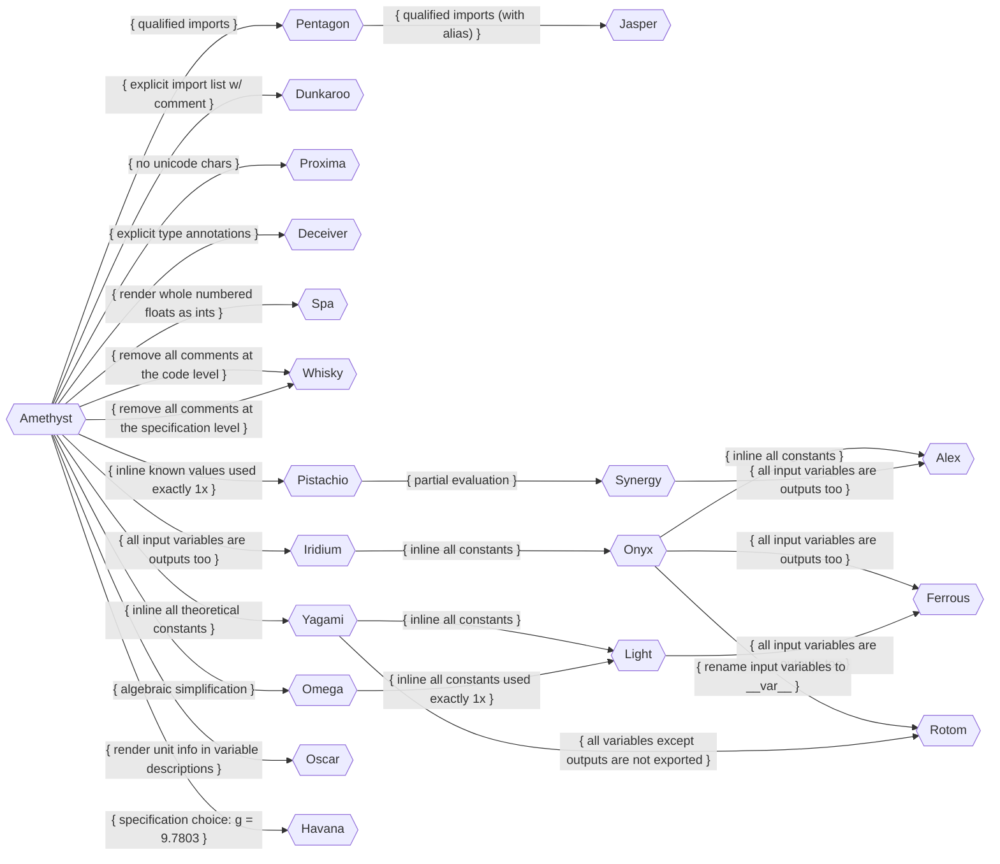

**Table of Contents**

1. [Graph View of Variants](#graph-view-of-variants)
2. [Variants](#variants)
   1. [*Amethyst*](#amethyst)
   2. [Imports-related Variants](#imports-related-variants)
      1. [*Pentagon*](#pentagon)
      2. [*Jasper*](#jasper)
      3. [*Dunkaroo*](#dunkaroo)
   3. [Last-mile "Code → Artifacts" Variants](#last-mile-code--artifacts-variants)
      1. [*Proxima*](#proxima)
      2. [*Deceiver*](#deceiver)
      3. [*Spa*](#spa)
      4. [*Whisky*](#whisky)
   4. ["ICO Program Requirements → Code" Variants](#ico-program-requirements--code-variants)
      1. [*Pistachio*](#pistachio)
      2. [*Synergy*](#synergy)
      3. [*Yagami*](#yagami)
      4. [*Light*](#light)
      5. [*Omega*](#omega)
      6. [*Iridium*](#iridium)
      7. [*Onyx*](#onyx)
      8. [*Alex*](#alex)
      9. [*Ferrous*](#ferrous)
      10. [*Rotom*](#rotom)
   5. ["Software Requirements → ICO Program Requirements" Choices](#software-requirements--ico-program-requirements-choices)
      1. [*Oscar*](#oscar)
   6. [Specification Choices](#specification-choices)
      1. [*Havana*](#havana)
3. [Old Variants](#old-variants)
   1. [En Route](#en-route)
   2. [Glider](#glider)
   3. [Octagon](#octagon)
   4. [Strike](#strike)
   5. [Iceberg](#iceberg)
   6. [Super Bowl](#super-bowl)
   7. [Crossroads](#crossroads)
   8. [Ricochet](#ricochet)
   9. [Commander](#commander)
   10. [Blockade](#blockade)
   11. [Invader](#invader)
   12. [Alert](#alert)
   13. [Focus](#focus)
   14. [Xenon](#xenon)
   15. [Genesis](#genesis)
   16. [Backhander](#backhander)
   17. [Scrappy](#scrappy)
   18. [Vicinity](#vicinity)
   19. [Universe](#universe)
   20. [Torch](#torch)
   21. [Edge](#edge)
   22. [Mad Hatter](#mad-hatter)
   23. [Foray](#foray)
   24. [Boxer](#boxer)
   25. [Pinball](#pinball)
   26. [Omega](#omega-1)
   27. [Sunset](#sunset)
   28. [Steamroller](#steamroller)
   29. [Volcano](#volcano)
   30. [Pinnacle](#pinnacle)
   31. [Starlight](#starlight)
   32. [Coffee](#coffee)
   33. [Paperclip](#paperclip)
   34. [Nexus](#nexus)
   35. [Brimstone](#brimstone)

## Graph View of Variants



**Legend**:

* Nodes are variants.
* Edges are transformations from one variant to another.

## Variants

### *Amethyst*

```python
from math import sin, cos

g = 9.8  # Acceleration due to gravity to 2 decimal places
π = 3.1415926535  # Approximation of π to 10 decimal places
Θ = π / 4  # Launch angle
s = 17.0  # Launch velocity
d = 2.0 * s ** 2.0 * sin(Θ) * cos(Θ) / g  # Horizontal distance travelled by the projectile
```

Amethyst is the “base” version of Projectile that has the following:

1. **Specification Choices**:
    1. Calculates the horizontal distance travelled of a projectile fired at $\theta{}\degree{}~($where $0 < \theta{} < \frac{\pi}{2}$$)$ from a position $(x,y)$ to a position $(x+d,y)$.
    2. Assumes **theoretical constant approximations:**
        1. Acceleration due to gravity constant is $9.8~m/s^2$ (gravity near Earth's surface), i.e., average approximation of $g$ to 2 decimal places.
        2. $\pi$ is approximated to 10 decimal places.
    3. Assumes **problem-specific constants**:
        1. Launch velocity: $s = 17~m/s$.
        2. Angle: $\theta = \frac{\pi}{4}~rad$.
    4. Uses formula: $d = \frac{2s^2 \sin{\theta} \cos{\theta}}{g}$.
2. **Software Requirements → ICO Program Requirements" Choices**:
    1. Naively extract a single linear system of equations from the problem description that calculates the outputs.
    Tags specification-level theoretical constants (e.g., $g$, $\pi$) as **generic** program-level constants.
    2. Tags specification-level problem-specific constants (e.g., launch velocity, angle) as **generic** program-level constants.
    3. Tags specification-level output variables as program-level **exports**.
    4. Drop specification-level variables that are not needed to calculate outputs.
3. **"ICO Program Requirements → Code" Choices**:
    1. Single-file layout, immediate mode (no, or minimal, functions), with single global scope.
        1. Export all variables (known, intermediate, unknown, e.g., `g`, `π`, `Θ`, `s`).
    4. Places all known values in variables at the top of the file, sorted alphabetically by descriptions, followed by all unknown variables, also sorted alphabetically by descriptions, up to dependencies.
4. **"Code → Artifacts" Choices**:
    1. Uses **Python** with Python-specific choices:
        1. Requires **snake_case** for variable names. Automated renaming policy:
            1. All lowercase.
            2. Spaces replaced with underscores.
            3. Non-alphanumeric characters (except underscores) removed.
            4. Duplicate symbols made unique by appending `_1`, `_2`, etc.
        2. Places **2 blank lines** before and after function definitions.
    2. Permits **Unicode** characters for variable names where appropriate (e.g., `Θ` for launch angle). Up to discretion of programming language support as well.
    3. Uses **4 spaces** for indentation.
    4. Uses **soft line length limit of 80 characters** (up to **85** characters before hard line breaks).
    5. Performs all **imports** at the **top of the file**.
    6. **Requires comments** for all **variable definitions**.
    7. **Requires comments** for all **assignments**. This is not highlighted in this snippet, but if we had mutation, it would be more clear.
    8. Places all statement comments on the same line.
    9. Explicit imports list (e.g., `from math import sin, cos, pi`) with language-specific formatting (e.g., alphabetical order for Python), no wildcard imports (e.g., `from math import *`), and using local unqualified imports (i.e., into local namespace).

### Imports-related Variants

#### *Pentagon*

```python
import math

g = 9.8  # Acceleration due to gravity to 2 decimal places
π = 3.1415926535  # Approximation of π to 10 decimal places
Θ = π / 4  # Launch angle
s = 17.0  # Launch velocity
d = 2.0 * s ** 2.0 * math.sin(Θ) * math.cos(Θ) / g  # Horizontal distance travelled by the projectile
```

Pentagon is an extension of [Amethyst](#amethyst) that removes locally pulled imports in favour of qualified imports.

#### *Jasper*

```python
import math as m

g = 9.8  # Acceleration due to gravity to 2 decimal places
π = 3.1415926535  # Approximation of π to 10 decimal places
Θ = π / 4  # Launch angle
s = 17.0  # Launch velocity
d = 2.0 * s ** 2.0 * m.sin(Θ) * m.cos(Θ) / g  # Horizontal distance travelled by the projectile
```

Jasper is an extension of [Pentagon](#pentagon) that qualifies imports with an alias.

#### *Dunkaroo*

```python
import math # sin, cos

g = 9.8  # Acceleration due to gravity to 2 decimal places
π = 3.1415926535  # Approximation of π to 10 decimal places
Θ = π / 4  # Launch angle
s = 17.0  # Launch velocity
d = 2.0 * s ** 2.0 * m.sin(Θ) * m.cos(Θ) / g  # Horizontal distance travelled by the projectile
```

Dunkaroo is an extension of [Amethyst](#amethyst) that lists imports in comments next to the `import` statement (where possible, restricting the import).

### Last-mile "Code → Artifacts" Variants

#### *Proxima*

```python
from math import sin, cos

g = 9.8  # Acceleration due to gravity to 2 decimal places
pi = 3.1415926535  # Approximation of π to 10 decimal places
theta = pi / 4  # Launch angle
s = 17.0  # Launch velocity
d = 2.0 * s ** 2.0 * sin(theta) * cos(theta) / g  # Horizontal distance travelled by the projectile
```

Proxima is an extension of [Amethyst](#amethyst) but does not permit unicode characters, using a dictionary of unicode characters to their ASCII equivalents. When no equivalent exists, the unicode character is replaced with a (manually created) descriptive name in snake_case. When name collisions occur, the same `_1`, `_2`, etc. suffix policy is used to avoid collisions.

#### *Deceiver*

```python
from math import sin, cos

g: float = 9.8  # Acceleration due to gravity to 2 decimal places
π: float = 3.1415926535  # Approximation of π to 10 decimal places
Θ: float = π / 4  # Launch angle
s: float = 17.0  # Launch velocity
d: float = 2.0 * s ** 2.0 * sin(Θ) * cos(Θ) / g  # Horizontal distance travelled by the projectile
```

Deceiver is an extension of [Amethyst](#amethyst) that adds type annotations to all variable definitions. Note that with Python, the majority of these are not as useful as in other languages and may be discarded. For example, if `s`' value were `17` instead of `17.0`, then the type annotation would not align with the type inferred by Python (an `int`):

```python
>>> a: float = 1
>>> type(a)
<class 'int'>
```

#### *Spa*

```python
from math import sin, cos

g = 9.8  # Acceleration due to gravity to 2 decimal places
π = 3.1415926535  # Approximation of π to 10 decimal places
Θ = π / 4  # Launch angle
s = 17  # Launch velocity
d = 2 * s ** 2 * sin(Θ) * cos(Θ) / g  # Horizontal distance travelled by the projectile
```

Spa is a variant of [Amethyst](#amethyst) that replaces whole numbered floats with integers. Note that this option is heavily tied to the language! This would not be allowed for Swift, which has a stricter type system.

#### *Whisky*

```python
from math import sin, cos

g = 9.8
π = 3.1415926535
Θ = π / 4
s = 17.0
d = 2.0 * s ** 2.0 * sin(Θ) * cos(Θ) / g
```

Whisky is an extension of [Amethyst](#amethyst) that removes any/all comments.

Whisky may also be viewed as an extension of [Amethyst](#amethyst) that strips all comments at the level of the ICO program requirements generation from the specification.

### "ICO Program Requirements → Code" Variants

#### *Pistachio*

```python
from math import sin, cos

Θ = 3.1415926535 / 4  # Launch angle
d = 2.0 * 17.0 ** 2.0 * sin(Θ) * cos(Θ) / 9.8  # Horizontal distance travelled by the projectile
```

Pistachio is an extension of [Amethyst](#amethyst) that inlines any known value whose symbol is only used once.

#### *Synergy*

```python
d = 29.489795918367346  # Horizontal distance travelled by the projectile
```

Synergy is an extension of [Pistachio](#pistachio) that performs partial evaluation.

#### *Yagami*

```python
from math import sin, cos

Θ = 3.1415926535 / 4  # Launch angle
s = 17.0  # Launch velocity
d = 2.0 * s ** 2.0 * sin(Θ) * cos(Θ) / 9.8  # Horizontal distance travelled by the projectile
```

Yagami is an extension of [Amethyst](#amethyst) that inlines all theoretical constant values.

#### *Light*

```python
from math import sin, cos

d = 2.0 * 17.0 ** 2.0 * sin(3.1415926535 / 4) * cos(3.1415926535 / 4) / 9.8  # Horizontal distance travelled by the projectile
```

Light is an extension of [Yagami](#yagami) that inlines all constants, both theoretical and problem-specific.

Light may also be viewed as an extension of [Omega](#omega) that inlines all constants used exactly once.

#### *Omega*

```python
from math import sin, cos

g = 9.8  # Acceleration due to gravity to 2 decimal places
π = 3.1415926535  # Approximation of π to 10 decimal places
Θ = π / 4  # Launch angle
s = 17.0  # Launch velocity
d = s ** 2.0 * sin(2.0 * Θ) / g  # Horizontal distance travelled by the projectile
```

Omega is an extension of [Amethyst](#amethyst) that uses the trigonometric identity $2\sin{(a)}\cos{(a)}=\sin{(2a)}$ to simplify the expression for horizontal distance travelled. More generally, it performs any algebraic simplifications that do not change the semantics of the program. The only simplification performed in this snippet is the trigonometric one.

#### *Iridium*

```python
from math import sin, cos

g = 9.8  # Acceleration due to gravity to 2 decimal places
π = 3.1415926535  # Approximation of π to 10 decimal places
Θ = π / 4  # Launch angle
s = 17.0  # Launch velocity
d = 2.0 * s ** 2.0 * sin(Θ) * cos(Θ) / g  # Horizontal distance travelled by the projectile
```

Iridium is an extension of [Amethyst](#amethyst) that marks all specification-level input variables as program outputs as well (i.e., inputs are re-iterated in outputs).

#### *Onyx*

```python
from math import sin, cos

Θ = 3.1415926535 / 4  # Launch angle
s = 17.0  # Launch velocity
d = 2.0 * s ** 2.0 * sin(Θ) * cos(Θ) / 9.8  # Horizontal distance travelled by the projectile
```

Onyx is a variant of [Iridium](#iridium) that inlines all constants, both theoretical and problem-specific, that are not explicitly marked as program inputs.

#### *Alex*

```python
from math import sin, cos

Θ = 0.785398163375  # Launch angle
s = 17.0  # Launch velocity
d = 29.489795918367346  # Horizontal distance travelled by the projectile
```

Alex is a residualized variant of [Onyx](#onyx).

Alex may also be viewed as a variant of [Synergy](#synergy) that exports all input variables as well.

#### *Ferrous*

```python
from math import sin, cos

Θ = 3.1415926535 / 4  # Launch angle
s = 17.0  # Launch velocity
d = 2.0 * 17.0 ** 2.0 * sin(3.1415926535 / 4) * cos(3.1415926535 / 4) / 9.8  # Horizontal distance travelled by the projectile
```

Ferrous is an extension of [Light](#light) that marks all specification-level input variables (knowns) as program outputs as well.

Ferrous may also be viewed as an extension of [Onyx](#onyx) that inlines all symbols used exactly once.


#### *Rotom*

```python
from math import sin, cos

__Θ__ = 3.1415926535 / 4  # Launch angle
__s__ = 17.0  # Launch velocity
d = 2.0 * __s__ ** 2.0 * sin(__Θ__) * cos(__Θ__) / 9.8  # Horizontal distance travelled by the projectile
```

Rotom is an extension of [Onyx](#onyx) replaces all input variable names with double-underscore wrapped versions.

Rotom may also be viewed as an extension of [Yagami](#yagami) that does not export any variable other than output variables by default. Note that this is only possible when the ICO problem is meant to be the "whole program" and not the structure of a function within a larger program.

### "Software Requirements → ICO Program Requirements" Choices

#### *Oscar*

```python
from math import sin, cos

g = 9.8  # Acceleration due to gravity near equator to 2 decimal places, m/s^2
π = 3.1415926535  # Approximation of π to 10 decimal places, unitless (ratio of circumference to diameter)
Θ = π / 4  # Launch angle, rad
s = 17.0  # Launch velocity, m/s
d = 2.0 * s ** 2.0 * sin(Θ) * cos(Θ) / g  # Horizontal distance travelled by the projectile, m
```

Oscar is an extension of [Amethyst](#amethyst) that renders unit information into variable descriptions of ICO program requirements.

### Specification Choices

#### *Havana*

```python
from math import sin, cos

g = 9.7803  # Acceleration due to gravity near equator to 2 decimal places
π = 3.1415926535  # Approximation of π to 10 decimal places
Θ = π / 4  # Launch angle
s = 17.0  # Launch velocity
d = 2.0 * s ** 2.0 * sin(Θ) * cos(Θ) / g  # Horizontal distance travelled by the projectile
```

Havana is an extension of [Amethyst](#amethyst) that changes the specification-level choice for the acceleration due to gravity constant to be $9.7803~m/s^2$ (gravity near the equator). Source: https://en.wikipedia.org/wiki/Standard_gravity#Gravity_on_Earth .

<!------------------------------------------------------------------------------
-- OLD VARIANTS
------------------------------------------------------------------------------->

## Old Variants

### En Route

Extension of [Offense](#offense).

Assume acceleration due to gravity constant is $0.162~m/s^2$ (gravity on Moon)

Source: https://en.wikipedia.org/wiki/Gravitation_of_the_Moon

```python
import math
d = 17.0 ** 2 * math.sin(math.pi / 4) * math.cos(math.pi / 4) / 0.0812
```

### Glider

Extension of [Offense](#offense).

> Assume acceleration due to gravity constant is $0.162~m/s^2$ (gravity on Moon)

Source: https://en.wikipedia.org/wiki/Gravitation_of_the_Moon

Extension of **Offense**.

```python
import math
d = 17.0 ** 2 * math.sin(math.pi / 4) * math.cos(math.pi / 4) * 12.3456
```

### Octagon

Extension of [Offense](#offense).

> Introduce simple inputs caching policy: don't inline repeated variable use

The new caching policy is to only cache if the variable needs to be used more than once.

```python
import math
Θ = math.pi / 4
d = 17.0 ** 2 * math.sin(Θ) * math.cos(Θ) / 4.9
```

### Strike

Extension of [Octagon](#octagon).

> Add a comment for `Θ`

```python
import math
Θ = math.pi / 4  # Launch angle
d = 17.0 ** 2 * math.sin(Θ) * math.cos(Θ) / 4.9
```

### Iceberg

```python
s = 17.0  # Launch velocity
import math
Θ = math.pi / 4  # Launch angle
d = s ** 2 * math.sin(Θ) * math.cos(Θ) / 4.9
```

Iceberg is one of the simplest versions of Projectile, placing known values in variables (**strict policy for all variables**). It calculates the horizontal distance travelled of a projectile fired at $\theta{}\degree{}~($where $0 < \theta{} < \frac{\pi}{2}$$)$ from a position $(x,y)$ to a position $(x+d,y)$.

<!-- Extension of [Strike](#strike).

> Strict input value caching policy -->

**Note**: `sin` appears before $\theta$ and after `s` in the `print` statement, so we generate `s` input assignment first, and then import `math`. The order of steps is approximately left-to-right including only what is strictly necessary above any particular step to reach the final output variable calculation.

### Super Bowl

Extension of [Iceberg](#iceberg).

> Rename `d` to `pl`

```python
s = 17.0  # Launch velocity
import math
Θ = math.pi / 4  # Launch angle
pl = s ** 2 * math.sin(Θ) * math.cos(Θ) / 4.9
```

### Crossroads

Extension of [Super Bowl](#super-bowl).

> Add comment explaining what `d` is

```python
s = 17.0  # Launch velocity
import math
Θ = math.pi / 4  # Launch angle
pl = s ** 2 * math.sin(Θ) * math.cos(Θ) / 4.9  # Landing position
```

### Ricochet

Extension of [Crossroads](#crossroads).

> Introduce a new variable: flight time

I will assume that the policy of caching expressions applies to all input and output variables. Not necessarily intermediate variables, which is not directly highlighted through this snippet.

```python
s = 17.0  # Launch velocity
import math
Θ = math.pi / 4  # Launch angle
pl = s ** 2 * math.sin(Θ) * math.cos(Θ) / 4.9  # Landing position
```

### Commander

Extension of [Ricochet](#ricochet).

> Designate "flight time" to be an output variable

With flight time designated as an output variable (or alternatively because it will be used more once), it is cached in a variable before being output.

```python
s = 17.0  # Launch velocity
import math
Θ = math.pi / 4  # Launch angle
t = s * math.sin(Θ) / 4.9  # Flight time
pl = s * t * math.cos(Θ)  # Landing position
```

### Blockade

Extension of [Commander](#commander).

> Introduce a whitespace policy: break code by key variables of interest (i.e., "outputs")

```python
s = 17.0  # Launch velocity
import math
Θ = math.pi / 4  # Launch angle

t = s * math.sin(Θ) / 4.9  # Flight time
pl = s * t * math.cos(Θ)  # Landing position
```

### Invader

Extension of [Blockade](#blockade).

> Introduce function for algorithm reuse

```python
def calc(s, Θ):
    # s: Launch velocity
    # Θ: Launch angle
    import math

    t = s * math.sin(Θ) / 4.9  # Flight time

    pl = s * t * math.cos(Θ)  # Landing position

    return (t, pl)


import math
t, pl = calc(17.0, math.pi / 4)  # (Flight time, Landing position)
```

### Alert

Extension of [Invader](#invader).

> Switch to [Google DocString Format](https://google.github.io/styleguide/pyguide.html) ([example](https://sphinxcontrib-napoleon.readthedocs.io/en/latest/example_google.html)) for function comments.

```python
def calc(s, Θ):
    """
    Args:
        s: Launch velocity
        Θ: Launch angle

    Returns:
        t: Flight time
        pl: Landing position
    """
    import math
    t = s * math.sin(Θ) / 4.9

    pl = s * t * math.cos(Θ)

    return (t, pl)


import math
t, pl = calc(17.0, math.pi / 4)  # (Flight time, Landing position)
```

### Focus

Extension of [Alert](#alert).

> De-duplicate imports

Unfortunately, Python's required 2 empty lines before/after function definitions become empty space spam in this document.

```python
import math


def calc(s, Θ):
    """
    Args:
        s: Launch velocity
        Θ: Launch angle

    Returns:
        t: Flight time
        pl: Landing position
    """
    t = s * math.sin(Θ) / 4.9

    pl = s * t * math.cos(Θ)

    return (t, pl)


t, pl = calc(17.0, math.pi / 4)  # (Flight time, Landing position)
```

### Xenon

Extension of [Focus](#focus).

> Don't break blocks by "output" variable calculations

I say "output" but I really mean "key variables of interest."

```python
import math


def calc(s, Θ):
    """
    Args:
        s: Launch velocity
        Θ: Launch angle

    Returns:
        t: Flight time
        pl: Landing position
    """
    t = s * math.sin(Θ) / 4.9
    pl = s * t * math.cos(Θ)
    return (t, pl)


t, pl = calc(17.0, math.pi / 4)  # (Flight time, Landing position)
```

### Genesis

Extension of [Xenon](#xenon).

> Impose soft sanity constraints on inputs

Soft because `assert` is disableable by passing `-O` to Python. Note that the constraints are intermixed with the steps (only executed just before first use of a variable, same lazy policy).

```python
import math


def calc(s, Θ):
    """
    Args:
        s: Launch velocity
        Θ: Launch angle

    Returns:
        t: Flight time
        pl: Landing position
    """

    assert s > 0.0, "Velocity > 0.0"
    assert 0.0 < Θ and Θ < math.pi / 2.0, "0.0 < Θ < π/2"
    t = s * math.sin(Θ) / 4.9
    pl = s * t * math.cos(Θ)
    return (t, pl)


t, pl = calc(17.0, math.pi / 4)  # (Flight time, Landing position)
```

### Backhander

Extension of [Genesis](#genesis).

> New code policy: input value assertions grouped together in function blocks

Soft because `assert` is disableable by passing `-O` to Python.

```python
import math


def calc(s, Θ):
    """
    Args:
        s: Launch velocity
        Θ: Launch angle

    Returns:
        t: Flight time
        pl: Landing position
    """
    assert s > 0.0, "Velocity > 0.0"
    assert 0.0 < Θ and Θ < math.pi / 2.0, "0.0 < Θ < π/2"

    t = s * math.sin(Θ) / 4.9
    pl = s * t * math.cos(Θ)
    return (t, pl)


t, pl = calc(17.0, math.pi / 4)  # (Flight time, Landing position)
```

### Scrappy

Extension of [Backhander](#backhander).

> Friendlier assertion messages

Soft because `assert` is disableable by passing `-O` to Python.

```python
import math


def calc(s, Θ):
    """
    Args:
        s: Launch velocity
        Θ: Launch angle

    Returns:
        t: Flight time
        pl: Landing position
    """
    assert s > 0.0, "Velocity must be greater 0.0."
    assert 0.0 < Θ and Θ < math.pi / 2.0, "Launch angle must be within (0, pi/2)"

    t = s * math.sin(Θ) / 4.9
    pl = s * t * math.cos(Θ)
    return (t, pl)


t, pl = calc(17.0, math.pi / 4)  # (Flight time, Landing position)
```

### Vicinity

Extension of [Scrappy](#scrappy).

> Switch to hard sanity constraints (written in the negative)

Note that single-line blocks use the compressed Python block style.

```python
import math


def calc(s, Θ):
    """
    Args:
        s: Launch velocity
        Θ: Launch angle

    Returns:
        t: Flight time
        pl: Landing position
    """
    if s <= 0.0: raise ValueError("Velocity must be greater 0.0.")
    if 0.0 >= Θ or Θ >= math.pi / 2.0: raise ValueError("Launch angle must be within (0, pi/2)")

    t = s * math.sin(Θ) / 4.9
    pl = s * t * math.cos(Θ)
    return (t, pl)


t, pl = calc(17.0, math.pi / 4)  # (Flight time, Landing position)
```

### Universe

Extension of [Vicinity](#vicinity).

> No constant folding (`... / 4.9` ~~> `2 * ... / 9.8`)

```python
import math


def calc(s, Θ):
    """
    Args:
        s: Launch velocity
        Θ: Launch angle

    Returns:
        t: Flight time
        pl: Landing position
    """
    if s <= 0.0: raise ValueError("Velocity must be greater 0.0.")
    if 0.0 >= Θ or Θ >= math.pi / 2.0: raise ValueError("Launch angle must be within (0, pi/2)")

    t = 2 * s * math.sin(Θ) / 9.8
    pl = s * t * math.cos(Θ)
    return (t, pl)


t, pl = calc(17.0, math.pi / 4)  # (Flight time, Landing position)
```

### Torch

Extension of [Universe](#universe).

> "Prominent" (for lack of better words) constants to variables

```python
import math


def calc(s, Θ):
    """
    Args:
        s: Launch velocity
        Θ: Launch angle

    Returns:
        t: Flight time
        pl: Landing position
    """
    if s <= 0.0: raise ValueError("Velocity must be greater 0.0.")
    if 0.0 >= Θ or Θ >= math.pi / 2.0: raise ValueError("Launch angle must be within (0, pi/2)")

    g = 9.8  # Gravity constant
    t = 2 * s * math.sin(Θ) / g
    pl = s * t * math.cos(Θ)
    return (t, pl)


t, pl = calc(17.0, math.pi / 4)  # (Flight time, Landing position)
```

### Edge

Extension of [Torch](#torch).

> Move constants to optional function inputs

```python
import math


def calc(s, Θ, g=9.8):
    """
    Args:
        s: Launch velocity
        Θ: Launch angle
        g (optional): Gravity constant

    Returns:
        t: Flight time
        pl: Landing position
    """
    if s <= 0.0: raise ValueError("Velocity must be greater 0.0.")
    if 0.0 >= Θ or Θ >= math.pi / 2.0: raise ValueError("Launch angle must be within (0, pi/2)")

    t = 2 * s * math.sin(Θ) / g
    pl = s * t * math.cos(Θ)
    return (t, pl)


t, pl = calc(17.0, math.pi / 4)  # (Flight time, Landing position)
```

### Mad Hatter

Extension of [Edge](#edge).

> Impose constraints on optional inputs

```python
import math


def calc(s, Θ, g=9.8):
    """
    Args:
        s: Launch velocity
        Θ: Launch angle
        g (optional): Gravity constant

    Returns:
        t: Flight time
        pl: Landing position
    """
    if s <= 0.0: raise ValueError("Velocity must be greater 0.0.")
    if 0.0 >= Θ or Θ >= math.pi / 2.0: raise ValueError("Launch angle must be within (0, pi/2)")
    if g <= 0.0: raise ValueError("Gravity constant must be strictly positive.")

    t = 2 * s * math.sin(Θ) / g
    pl = s * t * math.cos(Θ)
    return (t, pl)


t, pl = calc(17.0, math.pi / 4)  # (Flight time, Landing position)
```

### Foray

Extension of [Mad Hatter](#mad-hatter).

> Add function description to docstring

Note Google DocString format dictates hard wrapping docstrings at character 72.

```python
import math


def calc(s, Θ, g=9.8):
    """Calculates a projectile's landing position and flight time given an
    initial launch velocity and launch angle.

    Args:
        s: Launch velocity
        Θ: Launch angle
        g (optional): Gravity constant

    Returns:
        t: Flight time
        pl: Landing position
    """
    if s <= 0.0: raise ValueError("Velocity must be greater 0.0.")
    if 0.0 >= Θ or Θ >= math.pi / 2.0: raise ValueError("Launch angle must be within (0, pi/2)")
    if g <= 0.0: raise ValueError("Gravity constant must be strictly positive.")

    t = 2 * s * math.sin(Θ) / g
    pl = s * t * math.cos(Θ)
    return (t, pl)


t, pl = calc(17.0, math.pi / 4)  # (Flight time, Landing position)
```

### Boxer

Extension of [Foray](#foray).

> Clarify `pt`'s description

```python
import math


def calc(s, Θ, g=9.8):
    """Calculates a projectile's landing position and flight time given an
    initial launch velocity and launch angle.

    Args:
        s: Launch velocity
        Θ: Launch angle
        g (optional): Gravity constant

    Returns:
        t: Flight time
        pl: Landing position
    """
    if s <= 0.0: raise ValueError("Velocity must be greater 0.0.")
    if 0.0 >= Θ or Θ >= math.pi / 2.0: raise ValueError("Launch angle must be within (0, pi/2)")
    if g <= 0.0: raise ValueError("Gravity constant must be strictly positive.")

    t = 2 * s * math.sin(Θ) / g
    pl = s * t * math.cos(Θ)
    return (t, pl)


t, pl = calc(17.0, math.pi / 4)  # (Flight time, Landing position)
```

### Pinball

Extension of [Boxer](#boxer).

> Include unit information in docstring's Args/Returns sections

```python
import math


def calc(s, Θ, g=9.8):
    """Calculates a projectile's landing position and flight time given an
    initial launch velocity and launch angle.

    Args:
        s: Launch velocity (m)
        Θ: Launch angle (rad)
        g (optional): Gravity constant (m/s)

    Returns:
        t: Flight time (s)
        pl: Landing position (m)
    """
    if s <= 0.0: raise ValueError("Velocity must be greater 0.0.")
    if 0.0 >= Θ or Θ >= math.pi / 2.0: raise ValueError("Launch angle must be within (0, pi/2)")
    if g <= 0.0: raise ValueError("Gravity constant must be strictly positive.")

    t = 2 * s * math.sin(Θ) / g
    pl = s * t * math.cos(Θ)
    return (t, pl)


t, pl = calc(17.0, math.pi / 4)  # (Flight time, Landing position)
```

### Omega

Extension of [Pinball](#pinball).

> Include unit information in docstring's function description

```python
import math


def calc(s, Θ, g=9.8):
    """Calculates a projectile's landing position (m) and flight time (s)
    given an initial launch velocity (m/s) and launch angle (rad) of the
    projectile from a launcher on ground level.

    Args:
        s: Launch velocity (m)
        Θ: Launch angle (rad)
        g (optional): Gravity constant (m/s)

    Returns:
        t: Flight time (s)
        pl: Landing position (m)
    """
    if s <= 0.0: raise ValueError("Velocity must be greater 0.0.")
    if 0.0 >= Θ or Θ >= math.pi / 2.0: raise ValueError("Launch angle must be within (0, pi/2)")
    if g <= 0.0: raise ValueError("Gravity constant must be strictly positive.")

    t = 2 * s * math.sin(Θ) / g
    pl = s * t * math.cos(Θ)
    return (t, pl)


t, pl = calc(17.0, math.pi / 4)  # (Flight time, Landing position)
```

### Sunset

Extension of [Omega](#omega).

> Include type information in docstring

```python
import math


def calc(s, Θ, g=9.8):
    """Calculates a projectile's landing position (m) and flight time (s)
    given an initial launch velocity (m/s) and launch angle (rad) of the
    projectile from a launcher on ground level.

    Args:
        s (float): Launch velocity (m)
        Θ (float): Launch angle (rad)
        g (float, optional): Gravity constant (m/s)

    Returns:
        t (float): Flight time (s)
        pl (float): Landing position (m)
    """
    if s <= 0.0: raise ValueError("Velocity must be greater 0.0.")
    if 0.0 >= Θ or Θ >= math.pi / 2.0: raise ValueError("Launch angle must be within (0, pi/2)")
    if g <= 0.0: raise ValueError("Gravity constant must be strictly positive.")

    t = 2 * s * math.sin(Θ) / g
    pl = s * t * math.cos(Θ)
    return (t, pl)


t, pl = calc(17.0, math.pi / 4)  # (Flight time, Landing position)
```

### Steamroller

Extension of [Subset](#sunset).

> Add type hints on function inputs

```python
import math


def calc(s: float, Θ: float, g: float = 9.8):
    """Calculates a projectile's landing position (m) and flight time (s)
    given an initial launch velocity (m/s) and launch angle (rad) of the
    projectile from a launcher on ground level.

    Args:
        s (float): Launch velocity (m)
        Θ (float): Launch angle (rad)
        g (float, optional): Gravity constant (m/s)

    Returns:
        t (float): Flight time (s)
        pl (float): Landing position (m)
    """
    if s <= 0.0: raise ValueError("Velocity must be greater 0.0.")
    if 0.0 >= Θ or Θ >= math.pi / 2.0: raise ValueError("Launch angle must be within (0, pi/2)")
    if g <= 0.0: raise ValueError("Gravity constant must be strictly positive.")

    t = 2 * s * math.sin(Θ) / g
    pl = s * t * math.cos(Θ)
    return (t, pl)


t, pl = calc(17.0, math.pi / 4)  # (Flight time, Landing position)
```

### Volcano

Extension of [Steamroller](#steamroller).

> Add type hints on function outputs

```python
import math


def calc(s: float, Θ: float, float, g: float = 9.8) -> (float, float):
    """Calculates a projectile's landing position (m) and flight time (s)
    given an initial launch velocity (m/s) and launch angle (rad) of the
    projectile from a launcher on ground level.

    Args:
        s (float): Launch velocity (m)
        Θ (float): Launch angle (rad)
        g (float, optional): Gravity constant (m/s)

    Returns:
        t (float): Flight time (s)
        pl (float): Landing position (m)
    """
    if s <= 0.0: raise ValueError("Velocity must be greater 0.0.")
    if 0.0 >= Θ or Θ >= math.pi / 2.0: raise ValueError("Launch angle must be within (0, pi/2)")
    if g <= 0.0: raise ValueError("Gravity constant must be strictly positive.")

    t = 2 * s * math.sin(Θ) / g
    pl = s * t * math.cos(Θ)
    return (t, pl)


t, pl = calc(17.0, math.pi / 4)  # (Flight time, Landing position)
```

### Pinnacle

Extension of [Volcano](#volcano).

> Move constants to global variables

This maintains the previous variable description/comment scheme. Additionally, because it is now presumed to be an immutable "constant," we remove the assertion in `calc`.

```python
import math

g = 9.8  # Gravity constant, m/s


def calc(s: float, Θ: float) -> (float, float):
    """Calculates a projectile's landing position (m) and flight time (s)
    given an initial launch velocity (m/s) and launch angle (rad) of the
    projectile from a launcher on ground level.

    Args:
        s (float): Launch velocity (m)
        Θ (float): Launch angle (rad)

    Returns:
        t (float): Flight time (s)
        pl (float): Landing position (m)
    """
    if s <= 0.0: raise ValueError("Velocity must be greater 0.0.")
    if 0.0 >= Θ or Θ >= math.pi / 2.0: raise ValueError("Launch angle must be within (0, pi/2)")

    t = 2 * s * math.sin(Θ) / g
    pl = s * t * math.cos(Θ)
    return (t, pl)


t, pl = calc(17.0, math.pi / 4)  # (Flight time, Landing position)
```

### Starlight

Extension of [Pinnacle](#pinnacle).

> Introduce simple program metainformation at top of file

This is a "uniquely Python" [style](https://epydoc.sourceforge.net/manual-fields.html#module-metadata-variables).

```python
"""PROJECTILE MOTION

Approximate simple projectile motion.
"""
__authors__ = ["Samuel J. Crawford", "Brooks MacLachlan", "W. Spencer Smith"]
__contact__ = "{craw.., machl.., smiths}@mcmaster.ca"
__date__ = "January 1st, 2019"
__license__ = "GPLv3-or-later"

import math

g = 9.8  # Gravity constant, m/s


def calc(s: float, Θ: float) -> (float, float):
    """Calculates a projectile's landing position (m) and flight time (s)
    given an initial launch velocity (m/s) and launch angle (rad) of the
    projectile from a launcher on ground level.

    Args:
        s (float): Launch velocity (m)
        Θ (float): Launch angle (rad)

    Returns:
        t (float): Flight time (s)
        pl (float): Landing position (m)
    """
    if s <= 0.0: raise ValueError("Velocity must be greater 0.0.")
    if 0.0 >= Θ or Θ >= math.pi / 2.0: raise ValueError("Launch angle must be within (0, pi/2)")

    t = 2 * s * math.sin(Θ) / g
    pl = s * t * math.cos(Θ)
    return (t, pl)


t, pl = calc(17.0, math.pi / 4)  # (Flight time, Landing position)
```

### Coffee

Extension of [Starlight](#starlight).

> Comment-based headers for grouped code

There is a chasm of variations between the variation just before the introduction of functions and this one. This variation does not go to a function-based grouping, but simple comment-based organization within file (impromptu abstraction?).

```python
"""PROJECTILE MOTION

Approximate simple projectile motion.
"""
__authors__ = ["Samuel J. Crawford", "Brooks MacLachlan", "W. Spencer Smith"]
__contact__ = "{craw.., machl.., smiths}@mcmaster.ca"
__date__ = "January 1st, 2019"
__license__ = "GPLv3-or-later"

# Imports
import math

# Constants
g = 9.8  # Gravity constant, m/s^2 (float)

# Inputs
s = 17.0  # Launch velocity, m/s (float)
Θ = math.pi / 4  # Launch angle, rad (float)

# Verify inputs
if s <= 0.0: raise ValueError("Velocity must be greater 0.0.")
if 0.0 >= Θ or Θ >= math.pi / 2.0: raise ValueError("Launch angle must be within (0, pi/2)")

# Calculations
t = 2 * s * math.sin(Θ) / g  # Flight time, s (float)
pl = s * t * math.cos(Θ)  # Landing position, m (float)
```

### Paperclip

Extension of [Coffee](#coffee).

> More prominent comment-based headers for grouped code

```python
"""PROJECTILE MOTION

Approximate simple projectile motion.
"""
__authors__ = ["Samuel J. Crawford", "Brooks MacLachlan", "W. Spencer Smith"]
__contact__ = "{craw.., machl.., smiths}@mcmaster.ca"
__date__ = "January 1st, 2019"
__license__ = "GPLv3-or-later"

#-------------------------------------------------------------------------------
# IMPORTS
#-------------------------------------------------------------------------------

import math

#-------------------------------------------------------------------------------
# CONSTANTS
#-------------------------------------------------------------------------------

g = 9.8  # Gravity constant, m/s^2 (float)

#-------------------------------------------------------------------------------
# INPUTS
#-------------------------------------------------------------------------------

s = 17.0  # Launch velocity, m/s (float)
Θ = math.pi / 4  # Launch angle, rad (float)

#-------------------------------------------------------------------------------
# VERIFY INPUTS
#-------------------------------------------------------------------------------

if s <= 0.0: raise ValueError("Velocity must be greater 0.0.")
if 0.0 >= Θ or Θ >= math.pi / 2.0: raise ValueError("Launch angle must be within (0, pi/2)")

#-------------------------------------------------------------------------------
# CALCULATIONS
#-------------------------------------------------------------------------------
t = 2 * s * math.sin(Θ) / g  # Flight time, s (float)
pl = s * t * math.cos(Θ)  # Landing position, m (float)
```

### Nexus

Extension of [Paperclip](#paperclip).

> More comments about variables and calculations (almost spamming)

```python
"""PROJECTILE MOTION

Approximate simple projectile motion.
"""
__authors__ = ["Samuel J. Crawford", "Brooks MacLachlan", "W. Spencer Smith"]
__contact__ = "{craw.., machl.., smiths}@mcmaster.ca"
__date__ = "January 1st, 2019"
__license__ = "GPLv3-or-later"

#-------------------------------------------------------------------------------
# IMPORTS
#-------------------------------------------------------------------------------

import math

#-------------------------------------------------------------------------------
# CONSTANTS
#-------------------------------------------------------------------------------

g = 9.8  # Gravity constant (Gravity of Earth), m/s^2 (float)

#-------------------------------------------------------------------------------
# INPUTS
#-------------------------------------------------------------------------------

s = 17.0  # Launch velocity (initial velocity of the projectile), m/s (float)
Θ = math.pi / 4  # Launch angle (angle at which projectile launched from ground), rad (float)

#-------------------------------------------------------------------------------
# VERIFY INPUTS
#-------------------------------------------------------------------------------

if s <= 0.0: raise ValueError("Velocity must be greater 0.0.")
if 0.0 >= Θ or Θ >= math.pi / 2.0: raise ValueError("Launch angle must be within (0, pi/2)")

#-------------------------------------------------------------------------------
# CALCULATIONS
#-------------------------------------------------------------------------------
t = 2 * s * math.sin(Θ) / g  # Flight time (total time projectile in flight), s (float)
pl = s * t * math.cos(Θ)  # Landing position (total distance projectile travelled from launcher), m (float)
```

### Brimstone

Extension of [Nexus](#nexus).

> Clearer variable names

```python
"""PROJECTILE MOTION

Approximate simple projectile motion.
"""
__authors__ = ["Samuel J. Crawford", "Brooks MacLachlan", "W. Spencer Smith"]
__contact__ = "{craw.., machl.., smiths}@mcmaster.ca"
__date__ = "January 1st, 2019"
__license__ = "GPLv3-or-later"

#-------------------------------------------------------------------------------
# IMPORTS
#-------------------------------------------------------------------------------

import math

#-------------------------------------------------------------------------------
# CONSTANTS
#-------------------------------------------------------------------------------

g = 9.8  # Gravity constant, m/s^2 (float)

#-------------------------------------------------------------------------------
# INPUTS
#-------------------------------------------------------------------------------

v_launch = 17.0  # Launch velocity, m/s (float)
angle_launch = math.pi / 4  # Launch angle, rad (float)

#-------------------------------------------------------------------------------
# VERIFY INPUTS
#-------------------------------------------------------------------------------

if v_launch <= 0.0: raise ValueError("Velocity must be greater 0.0.")
if 0.0 >= angle_launch or angle_launch >= math.pi / 2.0: raise ValueError("Launch angle must be within (0, pi/2)")

#-------------------------------------------------------------------------------
# CALCULATIONS
#-------------------------------------------------------------------------------
t = 2 * v_launch * math.sin(angle_launch) / g  # Flight time, s (float)
landing_position = v_launch * t * math.cos(angle_launch)  # Landing position, m (float)
```
