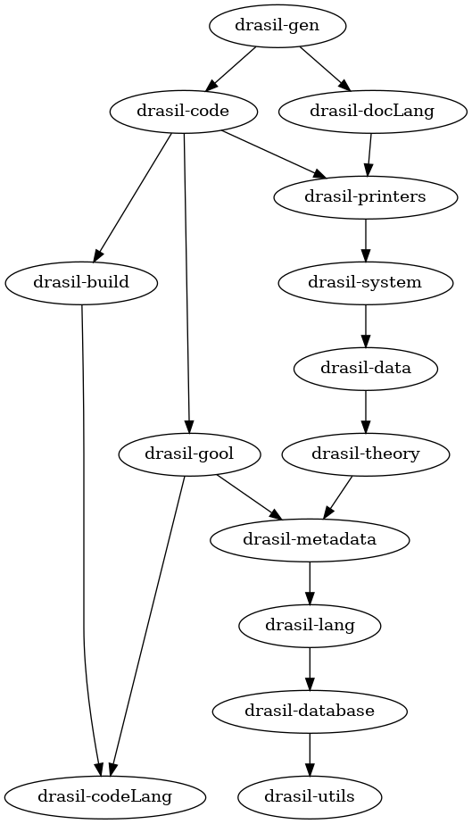

# Drasil's Inter-Package Dependencies

<div align="center">
    
</div>

## `drasil-codeLang`

`drasil-codeLang` contains exactly one thing, a type alias:

```haskell
type Comment = String 
```

It is used to make function type signatures indicate the expected meaning of a
`String`'s contents.

<details>

<summary>It is only used by <code>drasil-build</code> and <code>drasil-gool</code>.</summary>

```console
drasil-build/lib/Build/Drasil/Make/Print.hs
9:import Drasil.CodeLang (Comment)

drasil-build/lib/Build/Drasil/Make/AST.hs
4:import Drasil.CodeLang (Comment)

drasil-gool/lib/Drasil/Shared/InterfaceCommon.hs
27:import Drasil.CodeLang (Comment)
```

</details>

## `drasil-utils`

`drasil-utils` contains a variety of “extras” sitting atop `Prelude`,
`containers`, and `pretty`.

It is used by:

<details>

<summary><code>drasil-code</code></summary>

* For artifact-related generation (capitalizing `String`s).
* For checking sets of unknown variable requirements vs sets of known variables (`subsetOf`).
* For sanitizing strings for "friendly variable names" (i.e., "special"
  character-free names).

```
drasil-code/lib/Language/Drasil/Code/CodeGeneration.hs
18:import Utils.Drasil (createDirIfMissing)

drasil-code/lib/Language/Drasil/Code/Imperative/Build/Import.hs
21:import Utils.Drasil (capitalize)

drasil-code/lib/Language/Drasil/Code/Imperative/Descriptions.hs
19:import Utils.Drasil (stringList)

drasil-code/lib/Language/Drasil/Code/Imperative/Doxygen/Import.hs
5:import Utils.Drasil (blank)

drasil-code/lib/Language/Drasil/Code/Imperative/Generator.hs
45:import Utils.Drasil (createDirIfMissing)

drasil-code/lib/Language/Drasil/Code/Imperative/WriteInput.hs
5:import Utils.Drasil (blank)

drasil-code/lib/Language/Drasil/CodeSpec.hs
20:import Utils.Drasil (subsetOf)

drasil-code/lib/Language/Drasil/ICOSolutionSearch.hs
8:import Utils.Drasil (subsetOf)

drasil-code/lib/Language/Drasil/Mod.hs
15:import Utils.Drasil (toPlainName)

drasil-code/test/Main.hs
13:import Utils.Drasil (createDirIfMissing)
```

</details>

<details>

<summary><code>drasil-data</code></summary>

* For weaving together sentences.

```
drasil-data/lib/Data/Drasil/Concepts/Thermodynamics.hs
5:--import Utils.Drasil

drasil-data/lib/Data/Drasil/Theories/Physics.hs
5:import Utils.Drasil (weave)
```
</details>

<details>

<summary><code>drasil-database</code></summary>

* For inverting a map.

```
drasil-database/lib/Drasil/Database/ChunkDB.hs
35:import Utils.Drasil (invert)
```

</details>

<details>

<summary><code>drasil-docLang</code></summary>

* For inverting a map.
* For creating a table from a list of things.
* For merging a list of `String`s with "and" before the last item.

```
drasil-docLang/lib/Drasil/DocumentLanguage.hs
16:import Utils.Drasil (invert)

drasil-docLang/lib/Drasil/Sections/AuxiliaryConstants.hs
14:import Utils.Drasil (mkTable)

drasil-docLang/lib/Drasil/Sections/Requirements.hs
15:import Utils.Drasil (stringList, mkTable)

drasil-docLang/lib/Drasil/Sections/TableOfAbbAndAcronyms.hs
12:import Utils.Drasil (mkTable)

drasil-docLang/lib/Drasil/Sections/TableOfSymbols.hs
18:import Utils.Drasil (mkTable)

drasil-docLang/lib/Drasil/Sections/TableOfUnits.hs
11:import Utils.Drasil (mkTable)
```

</details>

<details>

<summary><code>drasil-examples</code></summary>

* For weaving together lists of items.
* For creating tables.

```
drasil-example/dblpend/lib/Drasil/DblPend/GenDefs.hs
11:import Utils.Drasil (weave)

drasil-example/dblpend/lib/Drasil/DblPend/IMods.hs
8:import Utils.Drasil (weave)

drasil-example/gamephysics/lib/Drasil/GamePhysics/DataDefs.hs
11:import Utils.Drasil (weave)

drasil-example/gamephysics/lib/Drasil/GamePhysics/GDefs.hs
10:import Utils.Drasil

drasil-example/gamephysics/lib/Drasil/GamePhysics/GenDefs.hs
7:import Utils.Drasil (weave)

drasil-example/gamephysics/lib/Drasil/GamePhysics/IMods.hs
8:import Utils.Drasil (weave)

drasil-example/pdcontroller/lib/Drasil/PDController/IModel.hs
9:import Utils.Drasil (weave)

drasil-example/projectile/lib/Drasil/Projectile/GenDefs.hs
8:import Utils.Drasil (weave)

drasil-example/projectile/lib/Drasil/Projectile/IMods.hs
8:import Utils.Drasil (weave)

drasil-example/projectile/lib/Drasil/Projectile/Lesson/CaseProb.hs
3:import Utils.Drasil (weave)

drasil-example/sglpend/lib/Drasil/SglPend/GenDefs.hs
11:import Utils.Drasil (weave)

drasil-example/sglpend/lib/Drasil/SglPend/IMods.hs
9:import Utils.Drasil (weave)

drasil-example/ssp/lib/Drasil/SSP/GenDefs.hs
33:import Utils.Drasil (weave)

drasil-example/ssp/lib/Drasil/SSP/IMods.hs
8:import Utils.Drasil (weave)

drasil-example/ssp/lib/Drasil/SSP/Requirements.hs
12:import Utils.Drasil (mkTable)

drasil-example/swhs/lib/Drasil/SWHS/GenDefs.hs
6:import Utils.Drasil (weave)

drasil-example/swhs/lib/Drasil/SWHS/IMods.hs
5:import Utils.Drasil (weave)

drasil-example/swhsnopcm/lib/Drasil/SWHSNoPCM/IMods.hs
7:import Utils.Drasil (weave)
```

</details>

<details>

<summary><code>drasil-gen</code></summary>

* For checking that a list carries at least two elements.
* For inverting a map (key-value -> value-key).
* For creating directories.

```
drasil-gen/lib/Drasil/Generator/ChunkDump.hs
16:import Utils.Drasil (invert, atLeast2, createDirIfMissing)

drasil-gen/lib/Drasil/Generator/Generate.hs
32:import Utils.Drasil (createDirIfMissing)

drasil-gool/lib/Drasil/GOOL/LanguageRenderer/CSharpRenderer.hs
10:import Utils.Drasil (indent)

drasil-gool/lib/Drasil/GOOL/LanguageRenderer/CppRenderer.hs
12:import Utils.Drasil (blank, indent, indentList)
```

</details>

<details>

<summary><code>drasil-gool</code></summary>

* For extra features over `pretty` (indent, blank).
* For merging together a list of items with "and" before the last item.

```
drasil-gool/lib/Drasil/GOOL/LanguageRenderer/JavaRenderer.hs
10:import Utils.Drasil (indent)

drasil-gool/lib/Drasil/GOOL/LanguageRenderer/PythonRenderer.hs
9:import Utils.Drasil (blank, indent)

drasil-gool/lib/Drasil/GOOL/LanguageRenderer/SwiftRenderer.hs
10:import Utils.Drasil (indent)

drasil-gool/lib/Drasil/GProc/LanguageRenderer/JuliaRenderer.hs
11:import Utils.Drasil (indent)

drasil-gool/lib/Drasil/Shared/Helpers.hs
8:import Utils.Drasil (blank)

drasil-gool/lib/Drasil/Shared/LanguageRenderer/CLike.hs
11:import Utils.Drasil (indent)

drasil-gool/lib/Drasil/Shared/LanguageRenderer/CommonPseudoOO.hs
16:import Utils.Drasil (indent, stringList)

drasil-gool/lib/Drasil/Shared/LanguageRenderer/LanguagePolymorphic.hs
22:import Utils.Drasil (indent)

drasil-gool/lib/Drasil/Shared/LanguageRenderer.hs
28:import Utils.Drasil (blank, capitalize, indent, indentList, stringList)

drasil-gool/lib/Drasil/Shared/State.hs
40:import Utils.Drasil (nubSort)
```

</details>

<details>

<summary><code>drasil-lang</code></summary>

* For replacing underscores with periods (`repUnd`).
* For converting rows of elements into a list of singleton lists ("columns").
* For more `fold` variants.

```
drasil-lang/lib/Language/Drasil/Chunk/CommonIdea.hs
15:import Utils.Drasil (repUnd)

drasil-lang/lib/Language/Drasil/Document.hs
8:import Utils.Drasil (repUnd)

drasil-lang/lib/Language/Drasil/Expr/Class.hs
15:import Utils.Drasil (toColumn)

drasil-lang/lib/Language/Drasil/Sentence/Fold.hs
24:import Utils.Drasil
```

</details>

<details>

<summary><code>drasil-printers</code></summary>

```
drasil-printers/lib/Language/Drasil/DOT/Print.hs
9:import Utils.Drasil (createDirIfMissing)

drasil-printers/lib/Language/Drasil/Markdown/Config.hs
11:import Utils.Drasil (makeCSV)

drasil-printers/lib/Language/Drasil/Markdown/CreateMd.hs
13:import Utils.Drasil

drasil-printers/lib/Language/Drasil/Plain/Print.hs
19:import Utils.Drasil (toPlainName)
```

</details>

<details>

<summary><code>drasil-system</code></summary>

```
drasil-system/lib/Drasil/System.hs
33:import Utils.Drasil (toPlainName)
```

</details>

## `drasil-build`

`drasil-build` carries an encoding of “build systems” (exclusively `Makefile`s
currently) and an artifact renderer for `Makefile`s.

It is used by:

<details>

<summary><code>drasil-code</code></summary>

* For generating `Makefile`s for building and running software artifacts.

```
drasil-code/lib/Language/Drasil/Code/Imperative/Build/AST.hs
2:import Build.Drasil (makeS, MakeString, mkImplicitVar, mkWindowsVar, mkOSVar,

drasil-code/lib/Language/Drasil/Code/Imperative/Build/Import.hs
12:import Build.Drasil (Annotation, (+:+), genMake, makeS, MakeString, mkFile, mkRule,
```

</details>

<details>

<summary><code>drasil-gen</code></summary>

* For generating `Makefile`s for building $\LaTeX{}$ and `mdBook` artifacts.
  **This involves secret knowledge that likely belongs to `drasil-docLang`
  (e.g., using lualatex and bibtex).**
  <!-- FIXME: File an issue about this and the more general issue of `drasil-gen` knowing too much of the generation needs of `drasil-docLang` (e.g., genDot, .drasil-requirements.csv, CSS, Makefiles) and `drasil-printers`. -->

```
drasil-gen/lib/Drasil/Generator/Formats.hs
11:import Build.Drasil ((+:+), Command, makeS, mkCheckedCommand, mkCommand, mkFreeVar,

drasil-gen/lib/Drasil/Generator/Generate.hs
20:import Build.Drasil (genMake)
```

</details>

## `drasil-database`

<details>

<summary><code>drasil-code</code></summary>

* For defining chunks.
* For retrieving `DefinedQuantityDict`s from the `ChunkDB`.
* For finding the `term`s associated with (type unknown) `UID`s.


```
drasil-code/lib/Data/Drasil/ExternalLibraries/ODELibraries.hs
16:import Drasil.Database (HasUID(..), (+++))

drasil-code/lib/Language/Drasil/Choices.hs
23:import Drasil.Database (UID, HasUID (..))

drasil-code/lib/Language/Drasil/Chunk/CodeBase.hs
3:import Drasil.Database (ChunkDB, findOrErr, UID)

drasil-code/lib/Language/Drasil/Chunk/CodeDefinition.hs
9:import Drasil.Database (HasUID (..))

drasil-code/lib/Language/Drasil/Chunk/ConstraintMap.hs
8:import Drasil.Database (UID, HasUID(..))

drasil-code/lib/Language/Drasil/Chunk/NamedArgument.hs
13:import Drasil.Database (HasUID(..))

drasil-code/lib/Language/Drasil/Chunk/Parameter.hs
8:import Drasil.Database (HasUID(..))

drasil-code/lib/Language/Drasil/Code/Imperative/Comments.hs
11:import Drasil.Database (HasUID(..))
12:import Drasil.Database.SearchTools (DomDefn (definition), defResolve')

drasil-code/lib/Language/Drasil/Code/Imperative/ConceptMatch.hs
10:import Drasil.Database (UID)

drasil-code/lib/Language/Drasil/Code/Imperative/Descriptions.hs
16:import Drasil.Database (HasUID(..))

drasil-code/lib/Language/Drasil/Code/Imperative/Helpers.hs
16:import Drasil.Database (UID, findOrErr)

drasil-code/lib/Language/Drasil/Code/Imperative/Import.hs
17:import Drasil.Database (UID, HasUID(..))

drasil-code/lib/Language/Drasil/Code/Imperative/Modules.hs
14:import Drasil.Database (HasUID(..))

drasil-code/lib/Language/Drasil/Code/Imperative/Parameters.hs
13:import Drasil.Database (HasUID(..))

drasil-code/lib/Language/Drasil/CodeSpec.hs
15:import Drasil.Database

drasil-code/lib/Language/Drasil/ICOSolutionSearch.hs
8:import Drasil.Database (ChunkDB, showUID, HasUID)

drasil-code/lib/Language/Drasil/Mod.hs
13:import Drasil.Database (ChunkDB)
```

</details>

<details>

<summary><code>drasil-docLang</code></summary>

* Finding all `ConceptInstance`s belonging to specific "single domains."
* Building `Sentence`-based references to rendered chunks.
* For finding what chunks depend on others (this is also in conjunction with
  reliance on `drasil-system`).
* For building “traceability matrix” table chunks.

```
drasil-docLang/lib/Drasil/DocDecl.hs
18:import Drasil.Database

drasil-docLang/lib/Drasil/DocumentLanguage/Core.hs
7:import Drasil.Database (UID)

drasil-docLang/lib/Drasil/DocumentLanguage/Definitions.hs
18:import Drasil.Database

drasil-docLang/lib/Drasil/DocumentLanguage/TraceabilityGraph.hs
6:import Drasil.Database
7:import Drasil.Database.SearchTools (termResolve', shortForm)

drasil-docLang/lib/Drasil/DocumentLanguage/TraceabilityMatrix.hs
9:import Drasil.Database (UID, HasUID(..))
10:import Drasil.Database.SearchTools (defResolve', findAllConcInsts, DomDefn(domain))

drasil-docLang/lib/Drasil/DocumentLanguage.hs
35:import Drasil.Database (findOrErr, ChunkDB, insertAll, UID, HasUID(..))
36:import Drasil.Database.SearchTools (findAllDataDefns, findAllGenDefns,

drasil-docLang/lib/Drasil/GetChunks.hs
11:import Drasil.Database (ChunkDB, findOrErr)
12:import Drasil.Database.SearchTools (defResolve', DomDefn(definition), findAllCitations)

drasil-docLang/lib/Drasil/SRSDocument.hs
39:import Drasil.Database

drasil-docLang/lib/Drasil/Sections/AuxiliaryConstants.hs
7:import Drasil.Database (HasUID(..))

drasil-docLang/lib/Drasil/Sections/Requirements.hs
20:import Drasil.Database (HasUID(..))

drasil-docLang/lib/Drasil/Sections/SpecificSystemDescription.hs
25:import Drasil.Database (UID, HasUID(..), showUID)

drasil-docLang/lib/Drasil/Sections/TableOfAbbAndAcronyms.hs
10:import Drasil.Database (HasUID(..))

drasil-docLang/lib/Drasil/Sections/TableOfSymbols.hs
10:import Drasil.Database (HasUID(..))

drasil-docLang/lib/Drasil/Sections/TraceabilityMandGs.hs
22:import Drasil.Database
23:import Drasil.Database.SearchTools

drasil-docLang/lib/Drasil/TraceTable.hs
10:import Drasil.Database (UID, HasUID(..))
```

</details>

<details>

<summary><code>drasil-example</code></summary>

* For building `Sentence`-building combinator functions.
* For re-using the `UID` of another chunk. **This is bad re-use.**
  <!-- FIXME: Bad re-use of a UID. -->

```
drasil-example/glassbr/lib/Drasil/GlassBR/DataDefs.hs
8:import Drasil.Database (HasUID(..))

drasil-example/glassbr/lib/Drasil/GlassBR/IMods.hs
6:import Drasil.Database (HasUID)

drasil-example/glassbr/lib/Drasil/GlassBR/ModuleDefs.hs
8:import Drasil.Database (HasUID)

drasil-example/projectile/lib/Drasil/Projectile/Lesson/Body.hs
5:import Drasil.Database (ChunkDB)

drasil-example/ssp/lib/Drasil/SSP/TMods.hs
9:import Drasil.Database (HasUID(..))
```

</details>

<details>

<summary><code>drasil-gen</code></summary>

* For creating a basic `ChunkDB` carrying all the metadata (chunks) needed to
  use the other `drasil-*` packages and generate artifacts with them.
* For finding all information on quantities in the `ChunkDB` and performing
  type-checking.

```
drasil-gen/lib/Drasil/Generator/BaseChunkDB.hs
6:import Drasil.Database (empty, insertAll, ChunkDB, insertAllOutOfOrder11)

drasil-gen/lib/Drasil/Generator/ChunkDump.hs
17:import Drasil.Database
19:import Drasil.Database.SearchTools (findAllIdeaDicts)

drasil-gen/lib/Drasil/Generator/TypeCheck.hs
13:import Drasil.Database (UID, HasUID(..))
14:import Drasil.Database.SearchTools (findAllDefinedQuantities)
```

</details>

<details>

<summary><code>drasil-lang</code></summary>

* For defining chunk types.
* For building chunk combinators (`IdeaDict`s and `ConceptChunk`s primarily).
* For using `UID`s to build reference addresses.

```
drasil-lang/lib/Drasil/Code/CodeExpr/Class.hs
5:import Drasil.Database (HasUID(..))

drasil-lang/lib/Drasil/Code/CodeExpr/Extract.hs
8:import Drasil.Database (UID)

drasil-lang/lib/Drasil/Code/CodeExpr/Lang.hs
7:import Drasil.Database (UID, HasUID(..))

drasil-lang/lib/Drasil/Code/CodeVar.hs
7:import Drasil.Database (HasUID(uid), (+++))

drasil-lang/lib/Language/Drasil/Chunk/Citation.hs
19:import Drasil.Database (HasChunkRefs(..), UID, HasUID(..), showUID, mkUid)

drasil-lang/lib/Language/Drasil/Chunk/CommonIdea.hs
14:import Drasil.Database (UID, HasUID(uid))

drasil-lang/lib/Language/Drasil/Chunk/Concept/Core.hs
13:import Drasil.Database (HasChunkRefs(..), UID, HasUID(..))

drasil-lang/lib/Language/Drasil/Chunk/Concept/NamedCombinators.hs
41:import Drasil.Database ((+++!))

drasil-lang/lib/Language/Drasil/Chunk/Concept.hs
12:import Drasil.Database (HasUID(uid), nsUid)

drasil-lang/lib/Language/Drasil/Chunk/Constrained.hs
11:import Drasil.Database (HasUID(..))

drasil-lang/lib/Language/Drasil/Chunk/DefinedQuantity.hs
15:import Drasil.Database (HasChunkRefs(..), HasUID(..))

drasil-lang/lib/Language/Drasil/Chunk/DifferentialModel.hs
17:import Drasil.Database (HasUID(uid))

drasil-lang/lib/Language/Drasil/Chunk/Eq.hs
16:import Drasil.Database (UID, HasUID(..))

drasil-lang/lib/Language/Drasil/Chunk/NamedIdea.hs
14:import Drasil.Database (mkUid, UID, HasUID(..), declareHasChunkRefs, Generically(..))

drasil-lang/lib/Language/Drasil/Chunk/Relation.hs
11:import Drasil.Database (HasUID(..))

drasil-lang/lib/Language/Drasil/Chunk/UncertainQuantity.hs
12:import Drasil.Database (HasUID(..))

drasil-lang/lib/Language/Drasil/Chunk/UnitDefn.hs
26:import Drasil.Database (HasChunkRefs(..), UID, HasUID(..), mkUid)

drasil-lang/lib/Language/Drasil/Chunk/Unital.hs
11:import Drasil.Database (HasUID(..))

drasil-lang/lib/Language/Drasil/Classes.hs
28:import Drasil.Database (UID)

drasil-lang/lib/Language/Drasil/DecoratedReference.hs
14:import Drasil.Database (HasUID(..))

drasil-lang/lib/Language/Drasil/Development/Sentence.hs
19:import Drasil.Database (HasUID(..))

drasil-lang/lib/Language/Drasil/Development.hs
19:import Drasil.Database (showUID)

drasil-lang/lib/Language/Drasil/Document/Combinators.hs
27:import Drasil.Database (HasUID)

drasil-lang/lib/Language/Drasil/Document/Core.hs
7:import Drasil.Database (HasChunkRefs(..), HasUID(..), UID)

drasil-lang/lib/Language/Drasil/Document.hs
7:import Drasil.Database (UID, HasUID(..), (+++.), mkUid, nsUid)

drasil-lang/lib/Language/Drasil/Expr/Class.hs
14:import Drasil.Database (HasUID(..))

drasil-lang/lib/Language/Drasil/Expr/Extract.hs
6:import Drasil.Database (UID)

drasil-lang/lib/Language/Drasil/Expr/Lang.hs
12:import Drasil.Database (UID)

drasil-lang/lib/Language/Drasil/Label/Type.hs
14:import Drasil.Database (UID, HasUID)

drasil-lang/lib/Language/Drasil/ModelExpr/Class.hs
7:import Drasil.Database (HasUID(..))

drasil-lang/lib/Language/Drasil/ModelExpr/Extract.hs
6:import Drasil.Database (UID)

drasil-lang/lib/Language/Drasil/ModelExpr/Lang.hs
8:import Drasil.Database (UID)

drasil-lang/lib/Language/Drasil/NounPhrase/Core.hs
9:import Drasil.Database (HasChunkRefs(..))

drasil-lang/lib/Language/Drasil/Reference.hs
14:import Drasil.Database (UID, HasUID(..), HasChunkRefs(..))

drasil-lang/lib/Language/Drasil/Sentence/Extract.hs
7:import Drasil.Database (UID)

drasil-lang/lib/Language/Drasil/Sentence.hs
19:import Drasil.Database (HasUID(..), UID)

drasil-lang/lib/Language/Drasil/WellTyped.hs
10:import Drasil.Database (UID)
```

</details>

<details>

<summary><code>drasil-printers</code></summary>

* For finding all chunks of a particular type.
* For defining functions that deal with `UID` references.
* For finding the terms and/or definitions of unityped chunks.
* For dumping chunks in a plain format.
* For creating traceability GraphViz dot graphs.

```
drasil-printers/lib/Drasil/Database/SearchTools.hs
5:import Drasil.Database

drasil-printers/lib/Language/Drasil/DOT/Print.hs
8:import Drasil.Database (UID)

drasil-printers/lib/Language/Drasil/Debug/Print.hs
14:import Drasil.Database (UID, showUID, IsChunk, findAll)

drasil-printers/lib/Language/Drasil/Markdown/Config.hs
13:import Drasil.Database.SearchTools (findAllLabelledContent)

drasil-printers/lib/Language/Drasil/Printing/Import/CodeExpr.hs
10:import Drasil.Database (UID)

drasil-printers/lib/Language/Drasil/Printing/Import/Document.hs
11:import Drasil.Database (showUID)

drasil-printers/lib/Language/Drasil/Printing/Import/Expr.hs
8:import Drasil.Database (UID)

drasil-printers/lib/Language/Drasil/Printing/Import/Helpers.hs
11:import Drasil.Database (UID, ChunkDB, findOrErr)
12:import Drasil.Database.SearchTools (termResolve', TermAbbr(..))

drasil-printers/lib/Language/Drasil/Printing/Import/ModelExpr.hs
7:import Drasil.Database (UID)

drasil-printers/lib/Language/Drasil/Printing/Import/Sentence.hs
9:import Drasil.Database.SearchTools (termResolve', TermAbbr(..))

drasil-printers/lib/Language/Drasil/Printing/PrintingInformation.hs
16:import Drasil.Database (UID)
```

</details>

<details>

<summary><code>drasil-system</code></summary>

* 

```
drasil-system/lib/Drasil/System.hs
28:import Drasil.Database (UID, HasUID(..), ChunkDB)
```

</details>

<details>

<summary><code>drasil-theory</code></summary>

* 


```
drasil-theory/lib/Theory/Drasil/ConstraintSet.hs
21:import Drasil.Database (HasUID(..))

drasil-theory/lib/Theory/Drasil/DataDefinition.hs
11:import Drasil.Database (UID, HasUID(..), showUID, HasChunkRefs(..), nsUid)

drasil-theory/lib/Theory/Drasil/GenDefn.hs
14:import Drasil.Database (HasUID(..), showUID, HasChunkRefs(..))

drasil-theory/lib/Theory/Drasil/InstanceModel.hs
13:import Drasil.Database (HasUID(..), showUID, HasChunkRefs(..))

drasil-theory/lib/Theory/Drasil/ModelKinds.hs
21:import Drasil.Database (UID, HasUID(..), mkUid, nsUid)

drasil-theory/lib/Theory/Drasil/MultiDefn.hs
18:import Drasil.Database (UID, HasUID(..), mkUid, showUID)

drasil-theory/lib/Theory/Drasil/Theory.hs
13:import Drasil.Database (HasUID(..), showUID, HasChunkRefs(..))
```

</details>

<details>

<summary><code>drasil-website</code></summary>

* 

```
drasil-website/lib/Drasil/Website/Body.hs
9:import Drasil.Database
```

</details>

## `drasil-lang`

<details>

<summary><code>drasil-</code></summary>

* 

```
drasil-code/lib/Data/Drasil/ExternalLibraries/ODELibraries.hs
17:import Language.Drasil (HasSymbol(symbol), MayHaveUnit(getUnit),
21:import Language.Drasil.Display (Symbol(Label, Concat))

drasil-code/lib/Language/Drasil/Choices.hs
19:import Language.Drasil hiding (None)

drasil-code/lib/Language/Drasil/Chunk/Code.hs
17:import Drasil.Code.CodeVar (CodeChunk(..), CodeIdea(..), VarOrFunc(..),

drasil-code/lib/Language/Drasil/Chunk/CodeBase.hs
5:import Drasil.Code.CodeVar (CodeChunk(..), VarOrFunc(..), CodeFuncChunk(..),

drasil-code/lib/Language/Drasil/Chunk/CodeDefinition.hs
8:import Drasil.Code.CodeExpr.Development (CodeExpr, expr, CanGenCode(..))

drasil-code/lib/Language/Drasil/Chunk/ConstraintMap.hs
9:import Drasil.Code.CodeExpr.Development (CodeExpr, constraint)
10:import Language.Drasil (Constraint, Constrained(..), isPhysC, isSfwrC)

drasil-code/lib/Language/Drasil/Chunk/NamedArgument.hs
11:import Drasil.Code.Classes (IsArgumentName)
14:import Language.Drasil (HasSpace(..), HasSymbol(..),

drasil-code/lib/Language/Drasil/Chunk/Parameter.hs
9:import Language.Drasil hiding (Ref)

drasil-code/lib/Language/Drasil/Code/ExtLibImport.hs
7:import Drasil.Code.CodeExpr (CodeExpr, ($&&), applyWithNamedArgs,
9:import Language.Drasil (HasSpace(typ), getActorName)

drasil-code/lib/Language/Drasil/Code/ExternalLibrary.hs
19:import Language.Drasil (Space, HasSpace(typ))

drasil-code/lib/Language/Drasil/Code/ExternalLibraryCall.hs
17:import Drasil.Code.CodeExpr (CodeExpr)

drasil-code/lib/Language/Drasil/Code/Imperative/Comments.hs
10:import Drasil.Code.CodeVar (CodeIdea(..))

drasil-code/lib/Language/Drasil/Code/Imperative/ConceptMatch.hs
11:import Language.Drasil (Sentence(S), (+:+), (+:+.))

drasil-code/lib/Language/Drasil/Code/Imperative/Descriptions.hs
21:import Drasil.Code.CodeVar (CodeIdea(..))

drasil-code/lib/Language/Drasil/Code/Imperative/DrasilState.hs
15:import Language.Drasil (Space, Expr)
21:import Drasil.Code.CodeVar (CodeIdea(..))

drasil-code/lib/Language/Drasil/Code/Imperative/GOOL/ClassInterface.hs
15:import Language.Drasil (Expr)

drasil-code/lib/Language/Drasil/Code/Imperative/GOOL/LanguageRenderer/LanguagePolymorphic.hs
7:import Language.Drasil (Expr)

drasil-code/lib/Language/Drasil/Code/Imperative/GenODE.hs
5:import Language.Drasil (Sentence(..), (+:+.))

drasil-code/lib/Language/Drasil/Code/Imperative/GenerateGOOL.hs
7:import Language.Drasil hiding (List)

drasil-code/lib/Language/Drasil/Code/Imperative/Helpers.hs
6:import Language.Drasil (DefinedQuantityDict)

drasil-code/lib/Language/Drasil/Code/Imperative/Import.hs
11:import Drasil.Code.CodeExpr (sy, ($<), ($>), ($<=), ($>=), ($&&), in')
13:import Drasil.Code.CodeExpr.Development (CodeExpr(..), ArithBinOp(..),
18:import Language.Drasil (HasSymbol, HasSpace(..),

drasil-code/lib/Language/Drasil/Code/Imperative/Modules.hs
15:import Language.Drasil (Constraint(..), RealInterval(..))
53:import Language.Drasil.Expr.Development (Completeness(..))

drasil-code/lib/Language/Drasil/Code/Imperative/Parameters.hs
12:import Drasil.Code.CodeVar (CodeIdea(..), DefiningCodeExpr(..), CodeVarChunk)
15:import Language.Drasil hiding (isIn)

drasil-code/lib/Language/Drasil/Code/Imperative/ReadInput.hs
6:import Language.Drasil hiding (Data, Matrix)
10:import Language.Drasil.Expr.Development (Expr(Matrix))

drasil-code/lib/Language/Drasil/Code/Imperative/WriteInput.hs
6:import Language.Drasil hiding (space, Matrix)
9:import Language.Drasil.Expr.Development (Expr(Matrix))

drasil-code/lib/Language/Drasil/Code.hs
98:import Drasil.Code.CodeExpr (field)

drasil-code/lib/Language/Drasil/CodeSpec.hs
13:import Language.Drasil hiding (None)
14:import Language.Drasil.Display (Symbol(Variable))
16:import Drasil.Code.CodeExpr.Development (expr, eNamesRI, eDep)
22:import Drasil.Code.CodeVar (CodeChunk, CodeIdea(codeChunk), CodeVarChunk)

drasil-code/lib/Language/Drasil/Data/ODEInfo.hs
8:import Language.Drasil(makeAODESolverFormat, formEquations,

drasil-code/lib/Language/Drasil/ICOSolutionSearch.hs
10:import Drasil.Code.CodeVar (DefiningCodeExpr(..), CodeVarChunk)

drasil-code/lib/Language/Drasil/Mod.hs
12:import Language.Drasil (Space, MayHaveUnit, Quantity, LiteralC(int), Concept)
17:import Drasil.Code.CodeExpr (CodeExpr)
```

</details>

<details>

<summary><code>drasil-</code></summary>

* 

```
drasil-data/lib/Data/Drasil/Citations.hs
4:import Language.Drasil --(S,(:+:),(+:+),sC,phrase,F,Accent(..),Citation(..),CiteField(..))

drasil-data/lib/Data/Drasil/Concepts/Computation.hs
4:import Language.Drasil (dcc, nc, cn', commonIdeaWithDict, Sentence,

drasil-data/lib/Data/Drasil/Concepts/Documentation.hs
11:import Language.Drasil hiding (organization, year, label, variable)
12:import Language.Drasil.Development (NPStruct)

drasil-data/lib/Data/Drasil/Concepts/Education.hs
4:import Language.Drasil hiding (year)

drasil-data/lib/Data/Drasil/Concepts/Math.hs
4:import Language.Drasil hiding (number, norm, matrix, Sentence(P, S, (:+:)))
6:import Language.Drasil.Development (NPStruct(P, S, (:-:)))
7:import Language.Drasil.ShortHands (lX, lY, lZ)

drasil-data/lib/Data/Drasil/Concepts/Physics.hs
5:import Language.Drasil hiding (space)

drasil-data/lib/Data/Drasil/Equations/Defining/Derivations.hs
3:import Language.Drasil (ExprC(..), LiteralC(..), ModelExpr, vec2D)

drasil-data/lib/Data/Drasil/People.hs
4:import Language.Drasil (Person, person, person', personWM, personWM', mononym)

drasil-data/lib/Data/Drasil/Quantities/PhysicalProperties.hs
5:import Language.Drasil.ShortHands (lM, cL, cV, lGamma, lRho)

drasil-data/lib/Data/Drasil/Quantities/SolidMechanics.hs
5:import Language.Drasil.ShortHands (cE, cS, cP, cK, lSigma, lNu)

drasil-data/lib/Data/Drasil/Quantities/Thermodynamics.hs
5:import Language.Drasil.ShortHands (cT, cC, lQ, cQ, cE)

drasil-data/lib/Data/Drasil/SI_Units.hs
6:import Language.Drasil.ShortHands (cOmega)

drasil-data/lib/Data/Drasil/Units/PhysicalProperties.hs
5:import Language.Drasil (UnitDefn, newUnit, (/:))

drasil-data/lib/Data/Drasil/Units/Physics.hs
6:import Language.Drasil (cn, dcc, newUnit, UnitDefn, (/:), (/$), (*:), makeDerU)

drasil-data/lib/Data/Drasil/Units/SolidMechanics.hs
5:import Language.Drasil (UnitDefn, newUnit, (/:))

drasil-data/lib/Data/Drasil/Units/Thermodynamics.hs
4:import Language.Drasil (dccWDS, cnIES, cn, cn', cn'', dcc, Sentence(S),
```

</details>

<details>

<summary><code>drasil-</code></summary>

* 

```
drasil-docLang/lib/Drasil/DocDecl.hs
20:import Language.Drasil hiding (sec)

drasil-docLang/lib/Drasil/DocumentLanguage/Core.hs
8:import Language.Drasil hiding (Manual, Verb) -- Manual - Citation name conflict. FIXME: Move to different namespace

drasil-docLang/lib/Drasil/DocumentLanguage/Units.hs
4:import Language.Drasil (Sentence(S, Sy), usymb, MayHaveUnit(getUnit))

drasil-docLang/lib/Drasil/DocumentLanguage.hs
33:import Language.Drasil.Display (compsy)

drasil-docLang/lib/Drasil/ExtractDocDesc.hs
9:import Language.Drasil hiding (Manual, Verb)

drasil-docLang/lib/Drasil/GetChunks.hs
10:import Language.Drasil.ModelExpr.Development (meDep)

drasil-docLang/lib/Drasil/Sections/ReferenceMaterial.hs
9:import Language.Drasil.Sentence.Combinators (are, is)

drasil-docLang/lib/Drasil/Sections/SpecificSystemDescription.hs
26:import Language.Drasil hiding (variable)

drasil-docLang/lib/Drasil/Sections/TableOfSymbols.hs
14:import Language.Drasil hiding (Manual, Verb) -- Manual - Citation name conflict. FIXME: Move to different namespace

drasil-docLang/lib/Drasil/Sections/TraceabilityMandGs.hs
26:import Language.Drasil.Chunk.Concept.NamedCombinators as NC
28:import Language.Drasil.Sentence.Combinators as S

drasil-docLang/lib/Drasil/TraceTable.hs
12:import Language.Drasil.Development (lnames')
```

</details>

<details>

<summary><code>drasil-</code></summary>

* 

```
drasil-example/dblpend/lib/Drasil/DblPend/Body.hs
7:import Language.Drasil hiding (organization, section)

drasil-example/dblpend/lib/Drasil/DblPend/Concepts.hs
5:import Language.Drasil.Chunk.Concept.NamedCombinators (compoundNC)

drasil-example/dblpend/lib/Drasil/DblPend/Derivations.hs
6:import Language.Drasil (ModelExprC(..), ExprC(..),

drasil-example/dblpend/lib/Drasil/DblPend/ODEs.hs
3:import Language.Drasil (ExprC(..), LiteralC(int, exactDbl, dbl), square)

drasil-example/dblpend/lib/Drasil/DblPend/Unitals.hs
7:import Language.Drasil.Display (Symbol(..))

drasil-example/gamephysics/lib/Drasil/GamePhysics/Assumptions.hs
3:import Language.Drasil hiding (organization)

drasil-example/gamephysics/lib/Drasil/GamePhysics/Body.hs
3:import Language.Drasil hiding (organization, section)

drasil-example/gamephysics/lib/Drasil/GamePhysics/Choices.hs
3:-- import Language.Drasil (QDefinition)

drasil-example/gamephysics/lib/Drasil/GamePhysics/Derivations.hs
3:import Language.Drasil (eqSymb, ModelExprC(..), ExprC(..), ModelExpr, LiteralC(..))

drasil-example/gamephysics/lib/Drasil/GamePhysics/IMods.hs
6:import Language.Drasil.ShortHands (lJ)

drasil-example/gamephysics/lib/Drasil/GamePhysics/LabelledContent.hs
5:import Language.Drasil hiding (organization, section)

drasil-example/gamephysics/lib/Drasil/GamePhysics/Requirements.hs
4:import Language.Drasil hiding (organization)

drasil-example/gamephysics/lib/Drasil/GamePhysics/Unitals.hs
6:import Language.Drasil.Display (Symbol(..), Decoration(Magnitude))

drasil-example/glassbr/lib/Drasil/GlassBR/Assumptions.hs
5:import Language.Drasil hiding (organization)

drasil-example/glassbr/lib/Drasil/GlassBR/Body.hs
6:import Language.Drasil hiding (organization, section, variable)

drasil-example/glassbr/lib/Drasil/GlassBR/Changes.hs
5:import Language.Drasil hiding (variable)

drasil-example/glassbr/lib/Drasil/GlassBR/ModuleDefs.hs
7:import Drasil.Code.CodeExpr (CodeExpr, LiteralC(int))
9:import Language.Drasil (Space(..), nounPhraseSP,
11:import Language.Drasil.Display (Symbol(..))

drasil-example/glassbr/lib/Drasil/GlassBR/Symbols.hs
3:import Language.Drasil (DefinedQuantityDict, dqdWr, cnstrw')

drasil-example/glassbr/lib/Drasil/GlassBR/Unitals.hs
4:import Language.Drasil.Display (Symbol(..))
5:import Language.Drasil.NounPhrase.Combinators (parensNP)

drasil-example/glassbr/lib/Drasil/GlassBR/Units.hs
3:import Language.Drasil (UnitDefn, newUnit, (^$), (^:))

drasil-example/hghc/lib/Drasil/HGHC/Body.hs
3:import Language.Drasil hiding (Manual) -- Citation name conflict. FIXME: Move to different namespace

drasil-example/hghc/lib/Drasil/HGHC/Choices.hs
3:-- import Language.Drasil (QDefinition)

drasil-example/pdcontroller/lib/Drasil/PDController/ODEs.hs
3:import Language.Drasil (LiteralC(exactDbl), ExprC(sy), InitialValueProblem, makeAIVP)

drasil-example/projectile/lib/Drasil/Projectile/Choices.hs
4:import Language.Drasil (Space(..))

drasil-example/projectile/lib/Drasil/Projectile/Derivations.hs
10:import Language.Drasil (eqSymb, LiteralC(..), ModelExprC(..), ExprC(..),

drasil-example/projectile/lib/Drasil/Projectile/LabelledContent.hs
6:import Language.Drasil.Chunk.Concept.NamedCombinators (the)

drasil-example/projectile/lib/Drasil/Projectile/Lesson/Body.hs
4:import Language.Drasil hiding (Notebook)

drasil-example/projectile/lib/Drasil/Projectile/Lesson/Example.hs
6:import Language.Drasil.ShortHands (cR, lG)

drasil-example/projectile/lib/Drasil/Projectile/Lesson/Figures.hs
4:import Language.Drasil.Chunk.Concept.NamedCombinators (the)

drasil-example/projectile/lib/Drasil/Projectile/Unitals.hs
4:import Language.Drasil.Display (Symbol(..))
5:import Language.Drasil.ShortHands (lD, lTheta, lV, lP, lT, vEpsilon)

drasil-example/sglpend/lib/Drasil/SglPend/Assumptions.hs
4:import Language.Drasil (ConceptInstance)

drasil-example/sglpend/lib/Drasil/SglPend/Body.hs
7:import Language.Drasil hiding (organization, section)
13:import Language.Drasil.Chunk.Concept.NamedCombinators (the)

drasil-example/ssp/lib/Drasil/SSP/Body.hs
6:import Language.Drasil hiding (Verb, number, organization, section, variable)

drasil-example/ssp/lib/Drasil/SSP/Choices.hs
3:-- import Language.Drasil (QDefinition)

drasil-example/ssp/lib/Drasil/SSP/Defs.hs
11:import Language.Drasil.ShortHands (lX,lY)

drasil-example/ssp/lib/Drasil/SSP/Unitals.hs
6:import Language.Drasil.Display (Symbol(..))

drasil-example/swhs/lib/Drasil/SWHS/Body.hs
6:import Language.Drasil hiding (organization, section, variable)

drasil-example/swhs/lib/Drasil/SWHS/Choices.hs
3:-- import Language.Drasil (QDefinition)

drasil-example/swhs/lib/Drasil/SWHS/Derivations.hs
9:import Language.Drasil (ModelExprC(deriv), ExprC(..), ModelExpr, recip_)

drasil-example/swhs/lib/Drasil/SWHS/LabelledContent.hs
5:import Language.Drasil hiding (organization, section, variable)

drasil-example/swhs/lib/Drasil/SWHS/Unitals.hs
5:import Language.Drasil.Display (Symbol(Atop), Decoration(Delta))

drasil-example/swhsnopcm/lib/Drasil/SWHSNoPCM/Body.hs
5:import Language.Drasil hiding (section)

drasil-example/swhsnopcm/lib/Drasil/SWHSNoPCM/Derivations.hs
5:import Language.Drasil (ExprC(..), ModelExprC(..), ModelExpr, recip_)

drasil-example/swhsnopcm/lib/Drasil/SWHSNoPCM/ODEs.hs
3:import Language.Drasil (ExprC(sy),LiteralC(exactDbl), InitialValueProblem, makeAIVP)
```

</details>

<details>

<summary><code>drasil-</code></summary>

* 

```
drasil-gen/lib/Drasil/Generator/BaseChunkDB.hs
7:import Language.Drasil (IdeaDict, nw, Citation, ConceptChunk, ConceptInstance,

drasil-gen/lib/Drasil/Generator/Generate.hs
24:import Language.Drasil (Stage(Equational), Document, Space(..))
```

</details>

<details>

<summary><code>drasil-</code></summary>

* 

```
drasil-lang/lib/Drasil/Code/CodeExpr/Class.hs
7:import Drasil.Code.Classes (IsArgumentName, Callable)
9:import Drasil.Code.CodeVar (CodeIdea, CodeVarChunk)

drasil-lang/lib/Drasil/Code/CodeVar.hs
9:import Drasil.Code.Classes (Callable)
```

</details>

<details>

<summary><code>drasil-</code></summary>

* 

```
drasil-metadata/lib/Drasil/Metadata/Domains.hs
4:import Language.Drasil (IdeaDict, mkIdea, cn')

drasil-metadata/lib/Drasil/Metadata/SupportedSoftware.hs
7:import Language.Drasil (IdeaDict, cn, nc, mkIdea)

drasil-metadata/lib/Drasil/Metadata/TheoryConcepts.hs
4:import Language.Drasil (cn', CI, commonIdeaWithDict)
```

</details>

<details>

<summary><code>drasil-</code></summary>

* 

```
drasil-printers/lib/Language/Drasil/HTML/CSS.hs
6:import Language.Drasil hiding (Expr)

drasil-printers/lib/Language/Drasil/HTML/Helpers.hs
9:import Language.Drasil hiding (Expr, Title)

drasil-printers/lib/Language/Drasil/JSON/Helpers.hs
9:import Language.Drasil (MaxWidthPercent)

drasil-printers/lib/Language/Drasil/Markdown/Config.hs
8:import Language.Drasil (Document(Document), LabelledContent(LblC, _ctype),

drasil-printers/lib/Language/Drasil/Plain/Print.hs
17:import Language.Drasil (Sentence, Special(..), Stage(..), Symbol, USymb(..))

drasil-printers/lib/Language/Drasil/Printing/AST.hs
4:import Language.Drasil (Special)

drasil-printers/lib/Language/Drasil/Printing/Citation.hs
4:import Language.Drasil hiding (CiteField, HP, Citation)

drasil-printers/lib/Language/Drasil/Printing/Import/CodeExpr.hs
11:import Language.Drasil (DomainDesc(..), Inclusive(..),

drasil-printers/lib/Language/Drasil/Printing/Import/Document.hs
8:import Language.Drasil hiding (neg, sec, symbol, isIn)
9:import Drasil.Code.CodeExpr.Development (expr)

drasil-printers/lib/Language/Drasil/Printing/Import/Expr.hs
9:import Language.Drasil hiding (neg, sec, symbol, isIn, Matrix, Set)
11:import Language.Drasil.Expr.Development (ArithBinOp(..), AssocArithOper(..),
15:import Language.Drasil.Literal.Development (Literal(..))

drasil-printers/lib/Language/Drasil/Printing/Import/Helpers.hs
7:import Language.Drasil (Stage(..), codeSymb, eqSymb, NounPhrase(..), Sentence(S),
10:import Language.Drasil.Development (toSent)

drasil-printers/lib/Language/Drasil/Printing/Import/Literal.hs
3:import Language.Drasil hiding (neg, sec, symbol, isIn)
4:import Language.Drasil.Literal.Development (Literal(..))

drasil-printers/lib/Language/Drasil/Printing/Import/ModelExpr.hs
8:import Language.Drasil (DomainDesc(..), RealInterval(..), Inclusive(..),
11:import Language.Drasil.Literal.Development (Literal(..))

drasil-printers/lib/Language/Drasil/Printing/Import/Sentence.hs
7:import Language.Drasil hiding (neg, sec, symbol, isIn)
8:import Language.Drasil.Development (toSent)

drasil-printers/lib/Language/Drasil/Printing/Import/Space.hs
4:import Language.Drasil (Space(..))

drasil-printers/lib/Language/Drasil/Printing/Import/Symbol.hs
4:import Language.Drasil (USymb(..))
5:import Language.Drasil.ShortHands (cDelta)
6:import Language.Drasil.Display (Decoration(..), Symbol(..))

drasil-printers/lib/Language/Drasil/Printing/LayoutObj.hs
6:import Language.Drasil hiding (ListType, Contents, BibRef, Document)

drasil-printers/lib/Language/Drasil/Printing/PrintingInformation.hs
17:import Language.Drasil (Stage(..), Reference)

drasil-printers/lib/Language/Drasil/TeX/Helpers.hs
7:import Language.Drasil (MaxWidthPercent)
```

</details>

<details>

<summary><code>drasil-</code></summary>

* 

```
drasil-system/lib/Drasil/System.hs
29:import Language.Drasil (Quantity, MayHaveUnit, Sentence, Concept,
```

</details>

<details>

<summary><code>drasil-</code></summary>

* 

```
drasil-theory/lib/Theory/Drasil/ModelKinds.hs
22:import Language.Drasil (NamedIdea(..), NP, QDefinition, Expr,

drasil-theory/lib/Theory/Drasil/MultiDefn.hs
19:import Language.Drasil hiding (DefiningExpr)
```

</details>

<details>

<summary><code>drasil-</code></summary>

* 

```
drasil-website/app/Main.hs
9:import Language.Drasil (Document(Document), ShowTableOfContents(NoToC),

drasil-website/lib/Drasil/Website/CaseStudy.hs
6:import Language.Drasil hiding (E)

drasil-website/lib/Drasil/Website/Example.hs
8:import Language.Drasil hiding (E)
```

</details>

## `drasil-metadata`

<details>

<summary><code>drasil-</code></summary>

* 

```
drasil-code/lib/Language/Drasil/Code/Imperative/Build/Import.hs
22:import Drasil.Metadata (watermark)
```

</details>

<details>

<summary><code>drasil-</code></summary>

* 

```
drasil-data/lib/Data/Drasil/Concepts/Computation.hs
11:import Drasil.Metadata (compScience)

drasil-data/lib/Data/Drasil/Concepts/Documentation.hs
15:import Drasil.Metadata (documentc, softEng, dataDefn, genDefn, inModel, thModel)

drasil-data/lib/Data/Drasil/Concepts/Math.hs
8:import Drasil.Metadata (mathematics)

drasil-data/lib/Data/Drasil/Concepts/Physics.hs
9:import Drasil.Metadata (mathematics, physics)

drasil-data/lib/Data/Drasil/Software/Products.hs
10:import Drasil.Metadata (progLanguage)
```

</details>

<details>

<summary><code>drasil-</code></summary>

* 

```
drasil-docLang/lib/Drasil/Sections/Introduction.hs
22:import Drasil.Metadata (inModel, thModel)

drasil-docLang/lib/Drasil/Sections/SpecificSystemDescription.hs
42:import Drasil.Metadata (inModel, thModel, dataDefn, genDefn)

drasil-docLang/lib/Drasil/Sections/TableOfContents.hs
8:import Drasil.Metadata (dataDefn, genDefn, inModel, thModel)

drasil-docLang/lib/Drasil/Sections/TraceabilityMandGs.hs
21:import Drasil.Metadata (dataDefn, genDefn, inModel, thModel)
```

</details>

<details>

<summary><code>drasil-</code></summary>

* 

```
drasil-example/dblpend/lib/Drasil/DblPend/Body.hs
6:import Drasil.Metadata (inModel)

drasil-example/dblpend/lib/Drasil/DblPend/MetaConcepts.hs
3:import Drasil.Metadata (physics)

drasil-example/dblpend/lib/Drasil/DblPend/Unitals.hs
3:import Drasil.Metadata (dataDefn, genDefn, inModel, thModel)

drasil-example/gamephysics/lib/Drasil/GamePhysics/Body.hs
4:import Drasil.Metadata (dataDefn, inModel)

drasil-example/gamephysics/lib/Drasil/GamePhysics/Concepts.hs
3:import Drasil.Metadata (physics, dataDefn, genDefn, inModel, thModel)

drasil-example/gamephysics/lib/Drasil/GamePhysics/IMods.hs
4:import Drasil.Metadata (inModel)

drasil-example/gamephysics/lib/Drasil/GamePhysics/MetaConcepts.hs
4:import Drasil.Metadata (physics)

drasil-example/glassbr/lib/Drasil/GlassBR/Body.hs
9:import Drasil.Metadata as M (dataDefn, inModel, thModel)

drasil-example/glassbr/lib/Drasil/GlassBR/Concepts.hs
9:import Drasil.Metadata (dataDefn, inModel, thModel)

drasil-example/pdcontroller/lib/Drasil/PDController/Body.hs
4:import Drasil.Metadata (dataDefn)

drasil-example/projectile/lib/Drasil/Projectile/Body.hs
3:import Drasil.Metadata (dataDefn, genDefn, inModel, thModel)

drasil-example/sglpend/lib/Drasil/SglPend/Body.hs
6:import Drasil.Metadata (inModel)

drasil-example/sglpend/lib/Drasil/SglPend/MetaConcepts.hs
4:import Drasil.Metadata (physics)

drasil-example/ssp/lib/Drasil/SSP/Body.hs
12:import Drasil.Metadata (inModel)

drasil-example/ssp/lib/Drasil/SSP/Defs.hs
5:import Drasil.Metadata (dataDefn, genDefn, inModel, thModel)

drasil-example/ssp/lib/Drasil/SSP/MetaConcepts.hs
4:import Drasil.Metadata (civilEng)

drasil-example/swhs/lib/Drasil/SWHS/Body.hs
17:import Drasil.Metadata (inModel)

drasil-example/swhs/lib/Drasil/SWHS/Concepts.hs
11:import Drasil.Metadata (materialEng, dataDefn, genDefn, inModel, thModel)

drasil-example/swhs/lib/Drasil/SWHS/MetaConcepts.hs
4:import Drasil.Metadata (materialEng)

drasil-example/swhsnopcm/lib/Drasil/SWHSNoPCM/Body.hs
11:import Drasil.Metadata (inModel)

drasil-example/swhsnopcm/lib/Drasil/SWHSNoPCM/MetaConcepts.hs
5:import Drasil.Metadata (materialEng)
```

</details>

<details>

<summary><code>drasil-</code></summary>

* 

```
drasil-gen/lib/Drasil/Generator/Formats.hs
14:import Drasil.Metadata (watermark)
```

</details>

<details>

<summary><code>drasil-</code></summary>

* 

```
drasil-gool/lib/Drasil/Shared/LanguageRenderer/CommonPseudoOO.hs
89:import Drasil.Metadata (watermark)

drasil-gool/lib/Drasil/Shared/LanguageRenderer.hs
52:import Drasil.Metadata (watermark)
```

</details>

<details>

<summary><code>drasil-</code></summary>

* 

```
drasil-system/lib/Drasil/System.hs
32:import Drasil.Metadata (runnableSoftware, website)
```

</details>

<details>

<summary><code>drasil-</code></summary>

* 

```
drasil-theory/lib/Theory/Drasil/DataDefinition.hs
13:import Drasil.Metadata (dataDefn)

drasil-theory/lib/Theory/Drasil/GenDefn.hs
16:import Drasil.Metadata (genDefn)

drasil-theory/lib/Theory/Drasil/InstanceModel.hs
16:import Drasil.Metadata (inModel)

drasil-theory/lib/Theory/Drasil/Theory.hs
15:import Drasil.Metadata (thModel)
```

</details>


</details>

<details>

<summary><code>drasil-</code></summary>

* 

```
drasil-code/lib/Language/Drasil/Choices.hs
18:import Drasil.GOOL (CodeType)

drasil-code/lib/Language/Drasil/Code/Code.hs
9:import Drasil.GOOL (CodeType(..))

drasil-code/lib/Language/Drasil/Code/CodeGeneration.hs
12:import Drasil.GOOL (FileData(..), ModData(modDoc))

drasil-code/lib/Language/Drasil/Code/Imperative/Build/Import.hs
9:import Drasil.GOOL (FileData(..), ProgData(..), GOOLState(..), headers, sources,

drasil-code/lib/Language/Drasil/Code/Imperative/ConceptMatch.hs
12:import Drasil.GOOL (SValue, SharedProg, MathConstant(..))

drasil-code/lib/Language/Drasil/Code/Imperative/Doxygen/Import.hs
7:import Drasil.GOOL (GOOLState, headers, mainMod)

drasil-code/lib/Language/Drasil/Code/Imperative/DrasilState.hs
17:import Drasil.GOOL (VisibilityTag(..), CodeType)

drasil-code/lib/Language/Drasil/Code/Imperative/FunctionCalls.hs
23:import Drasil.GOOL (VSType, SValue, MSStatement, SharedProg, OOProg,

drasil-code/lib/Language/Drasil/Code/Imperative/GOOL/ClassInterface.hs
12:import Drasil.GOOL (ProgData, GOOLState)

drasil-code/lib/Language/Drasil/Code/Imperative/GOOL/Data.hs
6:import Drasil.GOOL (ProgData)

drasil-code/lib/Language/Drasil/Code/Imperative/GOOL/LanguageRenderer/CSharpRenderer.hs
22:import Drasil.GOOL (onCodeList, csName, csVersion)

drasil-code/lib/Language/Drasil/Code/Imperative/GOOL/LanguageRenderer/CppRenderer.hs
23:import Drasil.GOOL (onCodeList, cppName, cppVersion)

drasil-code/lib/Language/Drasil/Code/Imperative/GOOL/LanguageRenderer/JavaRenderer.hs
23:import Drasil.GOOL (onCodeList, jName, jVersion)

drasil-code/lib/Language/Drasil/Code/Imperative/GOOL/LanguageRenderer/JuliaRenderer.hs
17:import Drasil.GProc (onCodeList, jlName, jlVersion)

drasil-code/lib/Language/Drasil/Code/Imperative/GOOL/LanguageRenderer/LanguagePolymorphic.hs
9:import Drasil.GOOL (ProgData, GOOLState)

drasil-code/lib/Language/Drasil/Code/Imperative/GOOL/LanguageRenderer/PythonRenderer.hs
20:import Drasil.GOOL (onCodeList, pyName, pyVersion)

drasil-code/lib/Language/Drasil/Code/Imperative/GOOL/LanguageRenderer/SwiftRenderer.hs
20:import Drasil.GOOL (onCodeList, swiftName, swiftVersion)

drasil-code/lib/Language/Drasil/Code/Imperative/GenerateGOOL.hs
15:import Drasil.GOOL (VSType, SVariable, SValue, MSStatement, SMethod,
22:import Drasil.GProc (ProcProg)

drasil-code/lib/Language/Drasil/Code/Imperative/Generator.hs
38:import Drasil.GOOL (OOProg, VisibilityTag(..),
41:import Drasil.GProc (ProcProg)

drasil-code/lib/Language/Drasil/Code/Imperative/Helpers.hs
10:import Drasil.GOOL (SharedProg, ScopeSym(..))

drasil-code/lib/Language/Drasil/Code/Imperative/Import.hs
44:import Drasil.GOOL (Label, MSBody, MSBlock, VSType, SVariable, SValue,
59:import Drasil.GProc (ProcProg)

drasil-code/lib/Language/Drasil/Code/Imperative/Logging.hs
8:import Drasil.GOOL (Label, MSBody, MSBlock, SVariable, SValue, MSStatement,

drasil-code/lib/Language/Drasil/Code/Imperative/Modules.hs
56:import Drasil.GOOL (MSBody, MSBlock, SVariable, SValue, MSStatement,
67:import Drasil.GProc (ProcProg)

drasil-code/lib/Language/Drasil/Code/Imperative/SpaceMatch.hs
11:import Drasil.GOOL (CodeType(..))

drasil-code/lib/Language/Drasil/Mod.hs
14:import Drasil.GOOL (VisibilityTag(..))

drasil-code/test/FileTests.hs
5:import Drasil.GOOL (MSBlock, MSStatement, SMethod, SharedProg, OOProg,
11:import Drasil.GProc (ProcProg)

drasil-code/test/GOOL/Observer.hs
4:import Drasil.GOOL (SFile, SVariable, SMethod, SClass, OOProg, FileSym(..),

drasil-code/test/GOOL/PatternTest.hs
5:import Drasil.GOOL (GSProgram, VSType, SVariable, SValue, SMethod, OOProg,

drasil-code/test/HelloWorld.hs
6:import Drasil.GOOL (MSBody, MSBlock, MSStatement, SMethod, SVariable,
16:import Drasil.GProc (ProcProg)

drasil-code/test/Helper.hs
4:import Drasil.GOOL (SMethod, SharedProg, OOProg, bodyStatements, TypeSym(..),
9:import Drasil.GProc (ProcProg)

drasil-code/test/Main.hs
4:import Drasil.GOOL (Label, OOProg, unJC, unPC, unCSC,
7:import Drasil.GProc (ProcProg, unJLC)

drasil-code/test/NameGenTest.hs
3:import Drasil.GOOL (SMethod, SharedProg, OOProg, BodySym(..), BlockSym(..),
9:import Drasil.GProc (ProcProg)

drasil-code/test/VectorTest.hs
3:import Drasil.GOOL (SVariable, SMethod, SharedProg, OOProg, BodySym(..),
10:import Drasil.GProc (ProcProg)
```

</details>

<details>

<summary><code>drasil-</code></summary>

* 

```
drasil-example/projectile/lib/Drasil/Projectile/Choices.hs
12:import Drasil.GOOL (CodeType(..))
```

</details>

<details>

<summary><code>drasil-</code></summary>

* 

```
drasil-gen/lib/Drasil/Generator/Generate.hs
22:import Drasil.GOOL (unJC, unPC, unCSC, unCPPC, unSC, CodeType(..))
23:import Drasil.GProc (unJLC)
```

</details>

<details>

<summary><code>drasil-</code></summary>

* 

```
drasil-website/lib/Drasil/Website/CaseStudy.hs
10:import Drasil.GOOL (CodeType(..))
```

</details>

## `drasil-theory`

<details>

<summary><code>drasil-</code></summary>

* 

```
drasil-code/lib/Language/Drasil/CodeSpec.hs
19:import Theory.Drasil (DataDefinition, qdEFromDD, getEqModQdsFromIm)

drasil-docLang/lib/Drasil/DocumentLanguage/Core.hs
9:import Theory.Drasil (DataDefinition, GenDefn, InstanceModel, TheoryModel)

drasil-docLang/lib/Drasil/DocumentLanguage/Definitions.hs
23:import Theory.Drasil (DataDefinition, GenDefn, InstanceModel, Theory(..),

drasil-docLang/lib/Drasil/Sections/Requirements.hs
26:import Theory.Drasil (HasOutput(output))

drasil-docLang/lib/Drasil/TraceTable.hs
13:import Theory.Drasil (Theory(..))
```

</details>

<details>

<summary><code>drasil-</code></summary>

* 

```
drasil-example/dblpend/lib/Drasil/DblPend/Body.hs
9:import Theory.Drasil (TheoryModel, output)

drasil-example/dblpend/lib/Drasil/DblPend/DataDefs.hs
9:import Theory.Drasil (DataDefinition, ddENoRefs, ddMENoRefs)

drasil-example/gamephysics/lib/Drasil/GamePhysics/GenDefs.hs
6:import Theory.Drasil (GenDefn, gd, equationalModel')

drasil-example/glassbr/lib/Drasil/GlassBR/DataDefs.hs
10:import Theory.Drasil (DataDefinition, ddE)

drasil-example/glassbr/lib/Drasil/GlassBR/IMods.hs
11:import Theory.Drasil (InstanceModel, imNoDeriv, qwC, qwUC, equationalModelN, output)

drasil-example/glassbr/lib/Drasil/GlassBR/Requirements.hs
24:import Theory.Drasil (DataDefinition)

drasil-example/glassbr/lib/Drasil/GlassBR/TMods.hs
4:import Theory.Drasil (TheoryModel, tm, equationalModel')

drasil-example/hghc/lib/Drasil/HGHC/HeatTransfer.hs
5:import Theory.Drasil (DataDefinition, ddENoRefs)

drasil-example/pdcontroller/lib/Drasil/PDController/DataDefs.hs
11:import Theory.Drasil (DataDefinition, ddE)

drasil-example/pdcontroller/lib/Drasil/PDController/GenDefs.hs
13:import Theory.Drasil (GenDefn, gd, othModel')

drasil-example/pdcontroller/lib/Drasil/PDController/IModel.hs
13:import Theory.Drasil (InstanceModel, im, qwC, newDEModel')

drasil-example/pdcontroller/lib/Drasil/PDController/TModel.hs
17:import Theory.Drasil (TheoryModel, tm, othModel')

drasil-example/projectile/lib/Drasil/Projectile/Body.hs
50:import Theory.Drasil (TheoryModel)

drasil-example/projectile/lib/Drasil/Projectile/DataDefs.hs
7:import Theory.Drasil (DataDefinition, ddENoRefs)

drasil-example/projectile/lib/Drasil/Projectile/GenDefs.hs
7:import Theory.Drasil (GenDefn, TheoryModel, gd, gdNoRefs, equationalModel')

drasil-example/projectile/lib/Drasil/Projectile/IMods.hs
7:import Theory.Drasil (InstanceModel, imNoDerivNoRefs, imNoRefs, qwC, equationalModelN)

drasil-example/sglpend/lib/Drasil/SglPend/Body.hs
9:import Theory.Drasil (TheoryModel, output)

drasil-example/sglpend/lib/Drasil/SglPend/DataDefs.hs
8:import Theory.Drasil (DataDefinition, ddENoRefs)

drasil-example/sglpend/lib/Drasil/SglPend/GenDefs.hs
16:import Theory.Drasil (GenDefn, gdNoRefs,

drasil-example/ssp/lib/Drasil/SSP/DataDefs.hs
8:import Theory.Drasil (DataDefinition, ddE)

drasil-example/swhs/lib/Drasil/SWHS/Body.hs
10:import Theory.Drasil (GenDefn, InstanceModel)

drasil-example/swhs/lib/Drasil/SWHS/DataDefs.hs
18:import Theory.Drasil (DataDefinition, ddE, ddENoRefs)

drasil-example/swhs/lib/Drasil/SWHS/GenDefs.hs
20:import Theory.Drasil (GenDefn, gd, gdNoRefs, deModel', equationalModel')

drasil-example/swhs/lib/Drasil/SWHS/IMods.hs
6:import Theory.Drasil (InstanceModel, im, imNoDeriv, qwC, qwUC, deModel',

drasil-example/swhs/lib/Drasil/SWHS/Requirements.hs
8:import Theory.Drasil (InstanceModel, HasOutput(output))

drasil-example/swhs/lib/Drasil/SWHS/TMods.hs
25:import Theory.Drasil (ConstraintSet, mkConstraintSet,

drasil-example/swhsnopcm/lib/Drasil/SWHSNoPCM/Body.hs
35:import Theory.Drasil (TheoryModel)

drasil-example/swhsnopcm/lib/Drasil/SWHSNoPCM/DataDefs.hs
4:import Theory.Drasil (DataDefinition, ddENoRefs)

drasil-example/swhsnopcm/lib/Drasil/SWHSNoPCM/GenDefs.hs
6:import Theory.Drasil (GenDefn, gdNoRefs, othModel')

drasil-example/swhsnopcm/lib/Drasil/SWHSNoPCM/IMods.hs
6:import Theory.Drasil (InstanceModel, im, qwC, qwUC, newDEModel')

drasil-example/swhsnopcm/lib/Drasil/SWHSNoPCM/Requirements.hs
13:import Theory.Drasil (InstanceModel)

drasil-example/template/lib/Drasil/Template/Body.hs
14:import Theory.Drasil (DataDefinition, GenDefn, InstanceModel, TheoryModel)
```

</details>

<details>

<summary><code>drasil-</code></summary>

* 

```
drasil-gen/lib/Drasil/Generator/BaseChunkDB.hs
17:import Theory.Drasil (DataDefinition, InstanceModel, TheoryModel, GenDefn)
```

</details>

<details>

<summary><code>drasil-</code></summary>

* 

```
drasil-system/lib/Drasil/System.hs
31:import Theory.Drasil (TheoryModel, GenDefn, DataDefinition, InstanceModel)
```

</details>

## `drasil-data`

<details>

<summary><code>drasil-</code></summary>

* 

```
drasil-data/lib/Data/Drasil/Citations.hs
5:import Data.Drasil.People (dParnas, jRalyte, lLai, nKoothoor, nKraiem,

drasil-data/lib/Data/Drasil/Concepts/Computation.hs
8:import Data.Drasil.Concepts.Documentation (datum, input_, literacy, output_,
10:import Data.Drasil.Concepts.Math (parameter)

drasil-data/lib/Data/Drasil/Concepts/Documentation.hs
17:import Data.Drasil.Concepts.Math (graph, unit_)

drasil-data/lib/Data/Drasil/Concepts/Education.hs
7:import Data.Drasil.Concepts.Documentation (first, physics, physical,
9:import Data.Drasil.Concepts.PhysicalProperties (solid)

drasil-data/lib/Data/Drasil/Concepts/Math.hs
9:import Data.Drasil.Citations (cartesianWiki, lineSource, pointSource)

drasil-data/lib/Data/Drasil/Concepts/PhysicalProperties.hs
7:import Data.Drasil.Concepts.Documentation (material_, property)
8:import Data.Drasil.Concepts.Math (centre)

drasil-data/lib/Data/Drasil/Concepts/Physics.hs
10:import Data.Drasil.Concepts.Documentation (property, value)
11:import Data.Drasil.Concepts.Math (xComp, xDir, yComp, yDir, point, axis, cartesian)
14:import Data.Drasil.Citations (dampingSource)
15:import Data.Drasil.Concepts.Education (mechanics)

drasil-data/lib/Data/Drasil/Concepts/Software.hs
7:import Data.Drasil.Concepts.Computation (algorithm, dataStruct, inParam)
8:import Data.Drasil.Concepts.Documentation (input_, physical, physicalConstraint,
10:import Data.Drasil.Concepts.Math (equation)

drasil-data/lib/Data/Drasil/Concepts/SolidMechanics.hs
5:import Data.Drasil.Concepts.Physics (force, strain, stress)

drasil-data/lib/Data/Drasil/Concepts/Thermodynamics.hs
8:import Data.Drasil.Concepts.Documentation (source, theory)
9:import Data.Drasil.Concepts.Physics (energy)

drasil-data/lib/Data/Drasil/Equations/Defining/Physics.hs
10:import Data.Drasil.Concepts.Documentation (body, constant)

drasil-data/lib/Data/Drasil/Quantities/Math.hs
10:import Data.Drasil.SI_Units (metre, m_2, radian)

drasil-data/lib/Data/Drasil/Quantities/PhysicalProperties.hs
9:import Data.Drasil.SI_Units (kilogram, metre, m_3, specificWeight)
10:import Data.Drasil.Units.PhysicalProperties (densityU)

drasil-data/lib/Data/Drasil/Quantities/Physics.hs
17:import Data.Drasil.SI_Units (joule, metre, newton, pascal, radian, second, hertz)
18:import Data.Drasil.Units.Physics (accelU, angAccelU, angVelU, gravConstU,

drasil-data/lib/Data/Drasil/Quantities/SolidMechanics.hs
7:import Data.Drasil.Concepts.SolidMechanics as CSM (elastMod, mobShear, nrmStrss,
9:import Data.Drasil.SI_Units (newton, pascal)
10:import Data.Drasil.Units.SolidMechanics (stiffnessU)

drasil-data/lib/Data/Drasil/Quantities/Thermodynamics.hs
7:import Data.Drasil.SI_Units (centigrade, joule)

drasil-data/lib/Data/Drasil/Software/Products.hs
7:import Data.Drasil.Concepts.Documentation (game, video, open, source)
8:import Data.Drasil.Concepts.Computation (computer)
9:import Data.Drasil.Concepts.Software (program)

drasil-data/lib/Data/Drasil/Theories/Physics.hs
9:import Data.Drasil.Citations (velocityWiki, accelerationWiki)
10:import Data.Drasil.Concepts.Documentation (component, material_, value, constant)
11:import Data.Drasil.Concepts.Math (cartesian, equation, vector)
12:import Data.Drasil.Concepts.Physics (gravity, twoD, rigidBody)

drasil-data/lib/Data/Drasil/Units/PhysicalProperties.hs
4:import Data.Drasil.SI_Units (kilogram, m_3)

drasil-data/lib/Data/Drasil/Units/Physics.hs
4:import Data.Drasil.SI_Units (metre, radian, s_2, second, newton, kilogram,

drasil-data/lib/Data/Drasil/Units/SolidMechanics.hs
4:import Data.Drasil.SI_Units (metre, newton, pascal)

drasil-data/lib/Data/Drasil/Units/Thermodynamics.hs
7:import Data.Drasil.SI_Units (centigrade, joule, kilogram, watt, m_2, m_3)
```

</details>

<details>

<summary><code>drasil-</code></summary>

* 

```
drasil-docLang/lib/Drasil/DocDecl.hs
22:import Data.Drasil.Concepts.Documentation (assumpDom, funcReqDom, goalStmtDom,

drasil-docLang/lib/Drasil/DocumentLanguage/TraceabilityGraph.hs
18:import Data.Drasil.Concepts.Math (graph)
19:import Data.Drasil.Concepts.Documentation (traceyGraph, component, dependency, reference, purpose, traceyMatrix)

drasil-docLang/lib/Drasil/DocumentLanguage/TraceabilityMatrix.hs
14:import Data.Drasil.Concepts.Documentation (purpose, component, dependency,

drasil-docLang/lib/Drasil/Sections/AuxiliaryConstants.hs
11:import Data.Drasil.Concepts.Documentation (value, description, symbol_, tAuxConsts)

drasil-docLang/lib/Drasil/Sections/GeneralSystDesc.hs
8:import Data.Drasil.Concepts.Documentation (interface, system, environment,

drasil-docLang/lib/Drasil/Sections/Introduction.hs
15:import Data.Drasil.Concepts.Computation (algorithm)
16:import Data.Drasil.Concepts.Documentation as Doc (assumption, characteristic,
23:import Data.Drasil.Citations (parnasClements1986, smithEtAl2007,

drasil-docLang/lib/Drasil/Sections/Requirements.hs
28:import Data.Drasil.Concepts.Documentation (description, funcReqDom, nonFuncReqDom,
31:import Data.Drasil.Concepts.Math (unit_)

drasil-docLang/lib/Drasil/Sections/SpecificSystemDescription.hs
33:import Data.Drasil.Concepts.Documentation (assumption, column, constraint,
41:import Data.Drasil.Concepts.Math (equation, parameter)

drasil-docLang/lib/Drasil/Sections/Stakeholders.hs
10:import Data.Drasil.Concepts.Documentation (client, customer, endUser, interest,

drasil-docLang/lib/Drasil/Sections/TableOfAbbAndAcronyms.hs
9:import Data.Drasil.Concepts.Documentation (abbreviation, fullForm, abbAcc)

drasil-docLang/lib/Drasil/Sections/TableOfSymbols.hs
12:import Data.Drasil.Concepts.Documentation (symbol_, description, tOfSymb)
13:import Data.Drasil.Concepts.Math (unit_)

drasil-docLang/lib/Drasil/Sections/TableOfUnits.hs
8:import Data.Drasil.Concepts.Documentation (symbol_, description, tOfUnit)
10:import Data.Drasil.Concepts.Math (unit_)

drasil-docLang/lib/Drasil/Sections/TraceabilityMandGs.hs
18:import Data.Drasil.Concepts.Documentation (assumption, assumpDom, chgProbDom,
```

</details>

<details>

<summary><code>drasil-</code></summary>

* 

```
drasil-example/dblpend/lib/Drasil/DblPend/Assumptions.hs
10:import Data.Drasil.Concepts.Documentation (assumpDom)
11:import Data.Drasil.Concepts.Math (cartesian, xAxis, yAxis, direction, positive)
12:import Data.Drasil.Concepts.Physics (gravity, twoD)

drasil-example/dblpend/lib/Drasil/DblPend/Body.hs
19:import Data.Drasil.People (dong)
20:import Data.Drasil.Concepts.Computation (inDatum)
22:import Data.Drasil.Concepts.Documentation (assumption, condition, endUser,
26:import Data.Drasil.Concepts.Education (highSchoolPhysics, highSchoolCalculus, calculus, undergraduate)
27:import Data.Drasil.Concepts.Math (cartesian, ode, mathcon', graph)
28:import Data.Drasil.Concepts.Physics (gravity, physicCon', pendulum, twoD, motion, angAccel, angular, angVelo, gravitationalConst)
29:import Data.Drasil.Concepts.PhysicalProperties (mass, physicalcon)
30:import Data.Drasil.Quantities.PhysicalProperties (len)
31:import Data.Drasil.Concepts.Software (program)
32:import Data.Drasil.Theories.Physics (newtonSL, accelerationTM, velocityTM)

drasil-example/dblpend/lib/Drasil/DblPend/Concepts.hs
4:import Data.Drasil.Concepts.Documentation (first, second_, object)
6:import Data.Drasil.Concepts.Physics (pendulum, motion, position, velocity, force, acceleration)

drasil-example/dblpend/lib/Drasil/DblPend/DataDefs.hs
14:import Data.Drasil.Quantities.Physics (velocity, position, time, acceleration, force)
15:import Data.Drasil.Quantities.PhysicalProperties (mass)

drasil-example/dblpend/lib/Drasil/DblPend/Derivations.hs
9:import Data.Drasil.Quantities.Physics(velocity, acceleration, gravitationalMagnitude, time)

drasil-example/dblpend/lib/Drasil/DblPend/Expressions.hs
6:import Data.Drasil.Quantities.Physics (gravitationalAccel, gravitationalMagnitude)

drasil-example/dblpend/lib/Drasil/DblPend/GenDefs.hs
16:import Data.Drasil.Concepts.Math (xComp, yComp)
17:import Data.Drasil.Quantities.Physics (velocity, acceleration, force)

drasil-example/dblpend/lib/Drasil/DblPend/Goals.hs
10:import Data.Drasil.Concepts.Documentation (goalStmtDom)
12:import Data.Drasil.Concepts.Physics (gravitationalConst, motion)
13:import Data.Drasil.Concepts.Math (iAngle)

drasil-example/dblpend/lib/Drasil/DblPend/IMods.hs
11:import Data.Drasil.Concepts.Documentation (condition)
12:import Data.Drasil.Concepts.Math (ode)

drasil-example/dblpend/lib/Drasil/DblPend/LabelledContent.hs
9:import Data.Drasil.Concepts.Documentation (physicalSystem, sysCont)

drasil-example/dblpend/lib/Drasil/DblPend/ODEs.hs
7:import Data.Drasil.Quantities.Physics (time)

drasil-example/dblpend/lib/Drasil/DblPend/References.hs
5:import Data.Drasil.Citations (cartesianWiki, accelerationWiki, velocityWiki,

drasil-example/dblpend/lib/Drasil/DblPend/Requirements.hs
8:import Data.Drasil.Concepts.Computation (inValue)
9:import Data.Drasil.Concepts.Documentation (datumConstraint, funcReqDom,
13:import Data.Drasil.Concepts.Math (calculation)
14:import Data.Drasil.Concepts.Software (errMsg)

drasil-example/dblpend/lib/Drasil/DblPend/Unitals.hs
11:import Data.Drasil.Constraints (gtZeroConstr)
12:import Data.Drasil.Concepts.Documentation (assumption, goalStmt, physSyst,
14:import Data.Drasil.Quantities.PhysicalProperties as QPP (len, mass)
15:import Data.Drasil.SI_Units (metre, radian, kilogram, newton)
18:import Data.Drasil.Concepts.Physics (twoD)
19:import Data.Drasil.Concepts.Math as CM (angle, xDir, yDir)
20:import Data.Drasil.Quantities.Math as QM (unitVect, pi_)
23:import Data.Drasil.Units.Physics (velU, accelU, angVelU, angAccelU)
24:import Data.Drasil.Quantities.Physics (gravitationalAccelConst)

drasil-example/gamephysics/lib/Drasil/GamePhysics/Assumptions.hs
5:import Data.Drasil.Concepts.Documentation as Doc (simulation, assumpDom)

drasil-example/gamephysics/lib/Drasil/GamePhysics/Body.hs
13:import Data.Drasil.Concepts.Documentation as Doc (assumption, concept,
19:import Data.Drasil.Concepts.Education (frstYr, highSchoolCalculus,
21:import Data.Drasil.Concepts.Software (physLib, softwarecon)
22:import Data.Drasil.People (alex, luthfi, olu)
23:import Data.Drasil.Software.Products (openSource, videoGame)
30:import Data.Drasil.Quantities.Math (normalVect, perpVect, surface)

drasil-example/gamephysics/lib/Drasil/GamePhysics/Changes.hs
9:import Data.Drasil.Concepts.Documentation as Doc (library, likeChgDom, unlikeChgDom)
11:import Data.Drasil.Concepts.Computation (algorithm)

drasil-example/gamephysics/lib/Drasil/GamePhysics/Concepts.hs
7:import Data.Drasil.Concepts.Documentation (assumption, goalStmt, likelyChg,
9:import Data.Drasil.Concepts.Math (ode)
10:import Data.Drasil.Concepts.PhysicalProperties (ctrOfMass)
11:import Data.Drasil.Concepts.Physics (threeD, twoD)

drasil-example/gamephysics/lib/Drasil/GamePhysics/DataDefs.hs
22:import Data.Drasil.Concepts.Math (rightHand)
23:import Data.Drasil.Concepts.Physics (rigidBody, twoD)
30:import Data.Drasil.Theories.Physics (torqueDD)

drasil-example/gamephysics/lib/Drasil/GamePhysics/Expressions.hs
6:import Data.Drasil.Quantities.Physics (time, momentOfInertia,

drasil-example/gamephysics/lib/Drasil/GamePhysics/GDefs.hs
13:import Data.Drasil.Concepts.Physics (rigidBody)
14:import Data.Drasil.Quantities.PhysicalProperties (mass)

drasil-example/gamephysics/lib/Drasil/GamePhysics/GenDefs.hs
16:import Data.Drasil.Concepts.Math as CM (line, cartesian)

drasil-example/gamephysics/lib/Drasil/GamePhysics/Goals.hs
5:import Data.Drasil.Concepts.Documentation (goalStmtDom)
6:import Data.Drasil.Concepts.Physics (time)

drasil-example/gamephysics/lib/Drasil/GamePhysics/IMods.hs
25:import Data.Drasil.Concepts.Documentation (condition, goal, output_)
26:import Data.Drasil.Concepts.Math (equation, ode)
27:import Data.Drasil.Concepts.Physics (rigidBody, motion)
28:import Data.Drasil.Quantities.Math (orientation)
29:import Data.Drasil.Quantities.Physics (acceleration, angularAccel, angularVelocity,

drasil-example/gamephysics/lib/Drasil/GamePhysics/LabelledContent.hs
7:import Data.Drasil.Concepts.Documentation as Doc (sysCont)

drasil-example/gamephysics/lib/Drasil/GamePhysics/References.hs
5:import Data.Drasil.Citations (cartesianWiki, koothoor2013,
8:import Data.Drasil.People (bWaugh, cTitus, dParnas, daAruliah, epWhite, gWilson,

drasil-example/gamephysics/lib/Drasil/GamePhysics/Requirements.hs
11:import Data.Drasil.Concepts.Documentation as Doc (body, funcReqDom, input_,

drasil-example/gamephysics/lib/Drasil/GamePhysics/TMods.hs
14:import Data.Drasil.Concepts.Documentation (constant)
15:import Data.Drasil.Concepts.Physics (rigidBody, twoD)
16:import Data.Drasil.Quantities.PhysicalProperties (mass)
17:import Data.Drasil.Quantities.Physics (angularAccel,
19:import Data.Drasil.Theories.Physics (newtonSL)

drasil-example/gamephysics/lib/Drasil/GamePhysics/Unitals.hs
9:import Data.Drasil.SI_Units(kilogram, metre, m_2, newton, second)
21:import Data.Drasil.Units.Physics (accelU, angVelU, impulseU, momtInertU,
25:import Data.Drasil.Constraints (gtZeroConstr)

drasil-example/glassbr/lib/Drasil/GlassBR/Assumptions.hs
12:import Data.Drasil.Concepts.Documentation as Doc (assumpDom, condition,
14:import Data.Drasil.Concepts.Math (calculation, surface, shape)
15:import Data.Drasil.Concepts.PhysicalProperties (materialProprty)

drasil-example/glassbr/lib/Drasil/GlassBR/Body.hs
18:import Data.Drasil.Concepts.Computation (computerApp, inDatum)
19:import Data.Drasil.Concepts.Documentation as Doc (appendix, assumption,
24:import Data.Drasil.Concepts.Education as Edu (civilEng, scndYrCalculus, structuralMechanics)
25:import Data.Drasil.Concepts.Math (graph, mathcon')
26:import Data.Drasil.Concepts.PhysicalProperties (dimension, physicalcon, materialProprty)
27:import Data.Drasil.Concepts.Physics (distance)
28:import Data.Drasil.Concepts.Software (correctness, verifiability,
30:import Data.Drasil.Quantities.Math (mathquants, mathunitals)
31:import Data.Drasil.Quantities.PhysicalProperties (physicalquants)
33:import Data.Drasil.People (mCampidelli, nikitha, spencerSmith)

drasil-example/glassbr/lib/Drasil/GlassBR/Changes.hs
9:import Data.Drasil.Concepts.Documentation (condition, goal, input_, likeChgDom,
11:import Data.Drasil.Concepts.Math (calculation)
12:import Data.Drasil.Concepts.PhysicalProperties (flexure)

drasil-example/glassbr/lib/Drasil/GlassBR/Concepts.hs
6:import Data.Drasil.Concepts.Documentation (assumption, goalStmt, likelyChg,

drasil-example/glassbr/lib/Drasil/GlassBR/DataDefs.hs
13:import Data.Drasil.Concepts.Math (parameter)
14:import Data.Drasil.Concepts.PhysicalProperties (dimension)

drasil-example/glassbr/lib/Drasil/GlassBR/Goals.hs
6:import Data.Drasil.Concepts.Documentation (goalStmtDom, userInput)
10:import Data.Drasil.Concepts.Education (degree_)

drasil-example/glassbr/lib/Drasil/GlassBR/IMods.hs
13:import Data.Drasil.Citations (campidelli)
14:import Data.Drasil.Concepts.Documentation (goal, user, datum)

drasil-example/glassbr/lib/Drasil/GlassBR/LabelledContent.hs
10:import Data.Drasil.Concepts.Documentation (assumption, item, physicalSystem,

drasil-example/glassbr/lib/Drasil/GlassBR/References.hs
5:import Data.Drasil.Citations (campidelli, koothoor2013, smithEtAl2007,
7:import Data.Drasil.People (jmBracci, tlKohutek, wlBeason)

drasil-example/glassbr/lib/Drasil/GlassBR/Requirements.hs
11:import Data.Drasil.Concepts.Computation (inValue)
12:import Data.Drasil.Concepts.Documentation (characteristic, condition,
15:import Data.Drasil.Concepts.Math (calculation)
16:import Data.Drasil.Concepts.PhysicalProperties (dimension)
17:import Data.Drasil.Concepts.Software (errMsg)

drasil-example/glassbr/lib/Drasil/GlassBR/Unitals.hs
12:import Data.Drasil.Concepts.Math (xComp, yComp, zComp)
13:import Data.Drasil.Constraints (gtZeroConstr, probConstr)
14:import Data.Drasil.Quantities.Physics (subMax, subMin, subX, subY, subZ)
15:import Data.Drasil.SI_Units (kilogram, metre, millimetre, pascal, second)

drasil-example/glassbr/lib/Drasil/GlassBR/Units.hs
4:import Data.Drasil.SI_Units (metre, newton)

drasil-example/hghc/lib/Drasil/HGHC/Body.hs
12:import Data.Drasil.People (spencerSmith)
13:import Data.Drasil.Concepts.Thermodynamics as CT (heatTrans)

drasil-example/hghc/lib/Drasil/HGHC/HeatTransfer.hs
7:import Data.Drasil.Units.Thermodynamics (heatTransferCoef)

drasil-example/pdcontroller/lib/Drasil/PDController/Assumptions.hs
8:import Data.Drasil.Concepts.Documentation (assumpDom)
10:import Data.Drasil.Concepts.PhysicalProperties (mass)
11:import Data.Drasil.SI_Units (kilogram)

drasil-example/pdcontroller/lib/Drasil/PDController/Body.hs
11:import Data.Drasil.Concepts.Math (mathcon', ode)
15:import Data.Drasil.Quantities.Physics (physicscon)
16:import Data.Drasil.Concepts.PhysicalProperties (physicalcon)
17:import Data.Drasil.Concepts.Physics (angular, linear) -- FIXME: should not be needed?
18:import Data.Drasil.Quantities.PhysicalProperties (mass)
19:import Data.Drasil.Quantities.Math (posInf, negInf)

drasil-example/pdcontroller/lib/Drasil/PDController/Changes.hs
7:import Data.Drasil.Concepts.Documentation (likeChgDom)
8:import Data.Drasil.Concepts.PhysicalProperties (mass)

drasil-example/pdcontroller/lib/Drasil/PDController/DataDefs.hs
9:import Data.Drasil.Concepts.Math (equation)

drasil-example/pdcontroller/lib/Drasil/PDController/GenDefs.hs
9:import Data.Drasil.Citations ( pidWiki )
10:import Data.Drasil.Quantities.PhysicalProperties (mass)
11:import Data.Drasil.Concepts.Math (equation)

drasil-example/pdcontroller/lib/Drasil/PDController/IModel.hs
11:import Data.Drasil.Quantities.Physics (time)

drasil-example/pdcontroller/lib/Drasil/PDController/LabelledContent.hs
9:import Data.Drasil.Concepts.Documentation (sysCont, physicalSystem)

drasil-example/pdcontroller/lib/Drasil/PDController/References.hs
2:import Data.Drasil.Citations (smithEtAl2007, smithLai2005,

drasil-example/pdcontroller/lib/Drasil/PDController/Requirements.hs
3:import Data.Drasil.Concepts.Documentation (funcReqDom, datumConstraint)

drasil-example/pdcontroller/lib/Drasil/PDController/SpSysDesc.hs
7:import Data.Drasil.Concepts.Documentation (goalStmtDom)

drasil-example/pdcontroller/lib/Drasil/PDController/TModel.hs
12:import Data.Drasil.Citations(laplaceWiki)
13:import Data.Drasil.Quantities.PhysicalProperties (mass)
14:import Data.Drasil.Quantities.Physics (time)
15:import Data.Drasil.Quantities.Math (posInf, negInf)

drasil-example/pdcontroller/lib/Drasil/PDController/Unitals.hs
3:import Data.Drasil.Constraints (gtZeroConstr)
4:import Data.Drasil.SI_Units (second)

drasil-example/projectile/lib/Drasil/Projectile/Assumptions.hs
14:import Data.Drasil.Concepts.Documentation (assumpDom, value, consVals)
15:import Data.Drasil.Concepts.Math (cartesian, xAxis, xDir, yAxis, yDir, direction, positive)
16:import Data.Drasil.Concepts.PhysicalProperties (mass)
17:import Data.Drasil.Concepts.Physics (acceleration, collision, distance, gravity, time, twoD)

drasil-example/projectile/lib/Drasil/Projectile/Body.hs
14:import Data.Drasil.Concepts.Computation (inDatum)
15:import Data.Drasil.Concepts.Documentation (analysis, physics,
21:import Data.Drasil.Concepts.Math (cartesian)
22:import Data.Drasil.Concepts.PhysicalProperties (mass)
23:import Data.Drasil.Concepts.Physics (gravity, physicCon',
25:import Data.Drasil.Concepts.Software (program)
27:import Data.Drasil.Quantities.Math (pi_, piConst)
28:import Data.Drasil.Quantities.Physics (acceleration, constAccel,
33:import Data.Drasil.People (brooks, samCrawford, spencerSmith)
34:import Data.Drasil.Theories.Physics (accelerationTM, velocityTM)
35:import Data.Drasil.Concepts.Education(calculus, undergraduate,

drasil-example/projectile/lib/Drasil/Projectile/Choices.hs
13:import Data.Drasil.Quantities.Math (piConst)

drasil-example/projectile/lib/Drasil/Projectile/Concepts.hs
8:import Data.Drasil.Concepts.Documentation (constant)
9:import Data.Drasil.Concepts.Math (angle)
10:import Data.Drasil.Concepts.Physics (oneD, position, speed, motion, distance, iSpeed, time,

drasil-example/projectile/lib/Drasil/Projectile/DataDefs.hs
9:import Data.Drasil.Quantities.Physics (iSpeed, ixVel, iyVel)
10:import Data.Drasil.Theories.Physics (vecMag)

drasil-example/projectile/lib/Drasil/Projectile/Derivations.hs
13:import Data.Drasil.Quantities.Physics (gravitationalAccelConst, iPos, ixVel, iyVel, scalarPos, speed, time, xPos, yPos)

drasil-example/projectile/lib/Drasil/Projectile/Expressions.hs
12:import Data.Drasil.Quantities.Physics (gravitationalAccel, gravitationalAccelConst,

drasil-example/projectile/lib/Drasil/Projectile/GenDefs.hs
12:import Data.Drasil.Concepts.Documentation (coordinate, symbol_)
13:import Data.Drasil.Concepts.Math (cartesian, equation, vector)
14:import Data.Drasil.Concepts.Physics (oneD, rectilinear, twoD, motion)
16:import Data.Drasil.Quantities.Physics (acceleration, constAccelV, iPos, iSpeed,
20:import Data.Drasil.Theories.Physics (accelerationTM, velocityTM)
26:import Data.Drasil.Citations (hibbeler2004)

drasil-example/projectile/lib/Drasil/Projectile/Goals.hs
5:import Data.Drasil.Concepts.Documentation (goalStmtDom)

drasil-example/projectile/lib/Drasil/Projectile/IMods.hs
12:import Data.Drasil.Concepts.Documentation (value)
13:import Data.Drasil.Concepts.Math (constraint, equation, xAxis)
15:import Data.Drasil.Quantities.Math (pi_)
16:import Data.Drasil.Quantities.Physics (gravitationalAccelConst, iSpeed, ixPos,

drasil-example/projectile/lib/Drasil/Projectile/LabelledContent.hs
9:import Data.Drasil.Concepts.Documentation (physicalSystem, sysCont)

drasil-example/projectile/lib/Drasil/Projectile/Lesson/Body.hs
19:import Data.Drasil.People (spencerSmith)

drasil-example/projectile/lib/Drasil/Projectile/Lesson/CaseProb.hs
5:import Data.Drasil.Concepts.Physics (motion, acceleration, velocity, force, time,
7:import Data.Drasil.Units.Physics (accelU)
8:import Data.Drasil.Concepts.Math (component, direction, equation, xDir, yAxis)
15:import Data.Drasil.Concepts.Documentation (coordinate, procedure)
19:import Data.Drasil.SI_Units (s_2)

drasil-example/projectile/lib/Drasil/Projectile/Lesson/Example.hs
3:import Data.Drasil.Concepts.Physics (velocity, height, time, acceleration, gravity, horizontalMotion)
5:import Data.Drasil.Units.Physics (velU)

drasil-example/projectile/lib/Drasil/Projectile/Lesson/Figures.hs
7:import Data.Drasil.Concepts.Documentation (coordinateSystem)

drasil-example/projectile/lib/Drasil/Projectile/Lesson/LearnObj.hs
3:import Data.Drasil.Concepts.Physics (motion)
4:import Data.Drasil.Concepts.Math (cartesian, equation)

drasil-example/projectile/lib/Drasil/Projectile/Lesson/Review.hs
3:import Data.Drasil.Concepts.Physics (motion, position, time, velocity)
4:import Data.Drasil.Concepts.Math (equation)

drasil-example/projectile/lib/Drasil/Projectile/References.hs
4:import Data.Drasil.Citations (cartesianWiki, accelerationWiki, velocityWiki,

drasil-example/projectile/lib/Drasil/Projectile/Requirements.hs
11:import Data.Drasil.Concepts.Computation (inValue)
12:import Data.Drasil.Concepts.Documentation (datumConstraint,
14:import Data.Drasil.Concepts.Math (calculation)
15:import Data.Drasil.Concepts.Software (errMsg)

drasil-example/projectile/lib/Drasil/Projectile/Unitals.hs
7:import Data.Drasil.Quantities.Math (pi_)
9:import Data.Drasil.Constraints (gtZeroConstr)
10:import Data.Drasil.SI_Units (radian, metre, second)
11:import Data.Drasil.Units.Physics (velU)

drasil-example/sglpend/lib/Drasil/SglPend/Body.hs
17:import Data.Drasil.People (olu)
18:import Data.Drasil.Concepts.Math (mathcon')
19:import Data.Drasil.Concepts.Physics (physicCon', motion, pendulum, angular, displacement, iPos, gravitationalConst, gravity, rigidBody, weight, shm)
20:import Data.Drasil.Concepts.PhysicalProperties (mass, physicalcon)
21:import Data.Drasil.Quantities.PhysicalProperties (len)
22:import Data.Drasil.Theories.Physics (newtonSLR)

drasil-example/sglpend/lib/Drasil/SglPend/DataDefs.hs
7:import Data.Drasil.SI_Units (second)
13:--import Data.Drasil.Concepts.Physics (pendulum)

drasil-example/sglpend/lib/Drasil/SglPend/Derivations.hs
7:import Data.Drasil.Quantities.Physics (acceleration, angularAccel, angularFrequency,
10:import Data.Drasil.Quantities.PhysicalProperties (mass)

drasil-example/sglpend/lib/Drasil/SglPend/Expressions.hs
6:import Data.Drasil.Quantities.Physics (angularAccel, angularFrequency, angularVelocity,
8:import Data.Drasil.Quantities.PhysicalProperties (mass)

drasil-example/sglpend/lib/Drasil/SglPend/GenDefs.hs
20:-- import Data.Drasil.Concepts.Documentation (coordinate, symbol_)
21:import Data.Drasil.Concepts.Math (xComp, yComp, equation, component, direction, angle)
22:import Data.Drasil.Quantities.Physics (velocity, acceleration, force,
25:import Data.Drasil.Concepts.Physics (pendulum, weight, shm)
26:import Data.Drasil.Quantities.PhysicalProperties (mass, len)
27:import Data.Drasil.Theories.Physics (newtonSLR)

drasil-example/sglpend/lib/Drasil/SglPend/Goals.hs
10:import Data.Drasil.Concepts.Documentation (goalStmtDom)
12:import Data.Drasil.Concepts.Physics (gravitationalConst, motion)
13:import Data.Drasil.Concepts.Math (iAngle)

drasil-example/sglpend/lib/Drasil/SglPend/IMods.hs
13:import Data.Drasil.Quantities.Physics (gravitationalAccel,
16:import Data.Drasil.Concepts.Math (constraint, equation, amplitude, iAngle, angle)
17:import Data.Drasil.Concepts.Physics (pendulum, motion, shm)
18:import Data.Drasil.Theories.Physics (newtonSLR)

drasil-example/sglpend/lib/Drasil/SglPend/LabelledContent.hs
9:import Data.Drasil.Concepts.Documentation (physicalSystem, sysCont)

drasil-example/sglpend/lib/Drasil/SglPend/Requirements.hs
8:import Data.Drasil.Concepts.Documentation (funcReqDom, output_, value)
11:import Data.Drasil.Quantities.Physics (angularDisplacement)

drasil-example/sglpend/lib/Drasil/SglPend/Unitals.hs
8:import Data.Drasil.Constraints (gtZeroConstr)
9:import Data.Drasil.Quantities.PhysicalProperties as QPP (len, mass)
10:import Data.Drasil.SI_Units (metre, radian)
15:import Data.Drasil.Concepts.Physics (pendulum)
16:import Data.Drasil.Concepts.Math as CM (angle, iAngle)
17:import Data.Drasil.Quantities.Math as QM (unitVect, pi_)

drasil-example/ssp/lib/Drasil/SSP/Assumptions.hs
17:import Data.Drasil.Concepts.Documentation (analysis, assumpDom, assumption,
19:import Data.Drasil.Concepts.Physics (force, position, stress, twoD)
20:import Data.Drasil.Concepts.Math (surface, unit_)

drasil-example/ssp/lib/Drasil/SSP/Body.hs
19:import Data.Drasil.Concepts.Documentation as Doc (analysis, assumption,
23:import Data.Drasil.Concepts.Education (solidMechanics, undergraduate)
24:import Data.Drasil.Concepts.Math (equation, shape, surface, mathcon',
26:import Data.Drasil.Concepts.PhysicalProperties (dimension, mass, physicalcon)
27:import Data.Drasil.Quantities.PhysicalProperties (len)
28:import Data.Drasil.Concepts.Physics (cohesion, fbd, force, gravity, isotropy,
30:import Data.Drasil.Concepts.Software (program, softwarecon)
31:import Data.Drasil.Concepts.SolidMechanics (mobShear, normForce, shearForce,
33:import Data.Drasil.Theories.Physics (weightSrc, hsPressureSrc)
35:import Data.Drasil.People (brooks, henryFrankis)
36:import Data.Drasil.SI_Units (degree)

drasil-example/ssp/lib/Drasil/SSP/Changes.hs
10:import Data.Drasil.Concepts.Documentation (analysis, likeChgDom, model, system, unlikeChgDom)
11:import Data.Drasil.Concepts.Math (calculation, zDir)
12:import Data.Drasil.Concepts.Physics (force, stress, threeD, twoD)

drasil-example/ssp/lib/Drasil/SSP/DataDefs.hs
11:import Data.Drasil.Concepts.Documentation (assumption)
12:import Data.Drasil.Concepts.Math (equation)
13:import Data.Drasil.Quantities.Math as QM (pi_)
14:import Data.Drasil.Theories.Physics (torqueDD)

drasil-example/ssp/lib/Drasil/SSP/Defs.hs
13:import Data.Drasil.Concepts.Documentation (analysis, assumption, goalStmt,
16:import Data.Drasil.Concepts.Education (mechanics)
17:import Data.Drasil.Concepts.Math (surface)
18:import Data.Drasil.Concepts.Physics (twoD, threeD, force, stress)
19:import Data.Drasil.Concepts.PhysicalProperties (dimension, len)
20:import Data.Drasil.Concepts.SolidMechanics (mobShear, normForce, nrmStrss,shearRes)

drasil-example/ssp/lib/Drasil/SSP/Figures.hs
4:import Data.Drasil.Concepts.Physics (force)

drasil-example/ssp/lib/Drasil/SSP/GenDefs.hs
19:import Data.Drasil.SI_Units (metre, newton)
20:import Data.Drasil.Concepts.Documentation (analysis, assumption, component,
22:import Data.Drasil.Concepts.Math (area, equation, zDir)
23:import Data.Drasil.Concepts.PhysicalProperties (len)
24:import Data.Drasil.Concepts.Physics (twoD, weight)
25:import Data.Drasil.Concepts.SolidMechanics (normForce, shearForce)
26:import Data.Drasil.Quantities.PhysicalProperties (specWeight)
27:import Data.Drasil.Quantities.Physics (displacement, force, height,
29:import Data.Drasil.Theories.Physics (weightGD, hsPressureGD, torqueDD)

drasil-example/ssp/lib/Drasil/SSP/Goals.hs
9:import Data.Drasil.Concepts.Documentation (goalStmtDom)

drasil-example/ssp/lib/Drasil/SSP/IMods.hs
15:import Data.Drasil.Concepts.Documentation (analysis, assumption, constraint,
17:import Data.Drasil.Concepts.Math (angle, equation, leftSide)
18:import Data.Drasil.Concepts.PhysicalProperties (mass)
19:import Data.Drasil.Concepts.Physics (force)

drasil-example/ssp/lib/Drasil/SSP/References.hs
5:import Data.Drasil.Citations (jnlCGJ, koothoor2013, parnasClements1986,
7:import Data.Drasil.People (bKarchewski, cfLee, dgFredlund, dStolle, dyZhu,

drasil-example/ssp/lib/Drasil/SSP/Requirements.hs
14:import Data.Drasil.Concepts.Computation (inDatum)
15:import Data.Drasil.Concepts.Documentation (datum, funcReqDom, input_, name_,
17:import Data.Drasil.Concepts.Physics (twoD)

drasil-example/ssp/lib/Drasil/SSP/TMods.hs
16:import Data.Drasil.Quantities.Physics (distance, force)
18:import Data.Drasil.Concepts.Documentation (model)
19:import Data.Drasil.Concepts.Physics (friction, linear)
20:import Data.Drasil.Theories.Physics (newtonSL)

drasil-example/ssp/lib/Drasil/SSP/Unitals.hs
15:import Data.Drasil.Constraints (gtZeroConstr)
16:import Data.Drasil.SI_Units (degree, metre, m_3, newton, pascal, specificWeight)
18:import Data.Drasil.Units.Physics (forcePerMeterU)
20:import Data.Drasil.Concepts.Math (cartesian, xCoord, xDir, yCoord, yDir,
22:import Data.Drasil.Concepts.Physics (gravity)
24:import Data.Drasil.Quantities.Math (area, pi_, unitVectj)
25:import Data.Drasil.Quantities.PhysicalProperties (density, mass, specWeight,
27:import Data.Drasil.Quantities.Physics (acceleration, displacement, distance,

drasil-example/swhs/lib/Drasil/SWHS/Assumptions.hs
11:import Data.Drasil.Concepts.Documentation (system, simulation, model,
14:import Data.Drasil.Quantities.PhysicalProperties (vol)
15:import Data.Drasil.Quantities.Physics (energy, time)
16:import Data.Drasil.Quantities.Thermodynamics (boilPt, meltPt, temp)
18:import Data.Drasil.Concepts.Thermodynamics as CT (heat, melting,
20:import Data.Drasil.Concepts.PhysicalProperties (solid, liquid, gaseous)
21:import Data.Drasil.Concepts.Math (change)
22:import Data.Drasil.Concepts.Physics (mechEnergy)

drasil-example/swhs/lib/Drasil/SWHS/Body.hs
18:import Data.Drasil.Concepts.Documentation as Doc (assumption, column,
22:import Data.Drasil.Concepts.Education (calculus, engineering)
23:import Data.Drasil.Concepts.Math (de, equation, ode, rightSide, unit_, mathcon')
24:import Data.Drasil.Concepts.PhysicalProperties (materialProprty, physicalcon)
26:import Data.Drasil.Concepts.Software (program, softwarecon)
27:import Data.Drasil.Concepts.Thermodynamics (enerSrc, heatTrans, htFlux,
30:import Data.Drasil.Quantities.Math (surArea, surface, uNormalVect, area)
31:import Data.Drasil.Quantities.PhysicalProperties (vol)
32:import Data.Drasil.Quantities.Physics (energy, time)
33:import Data.Drasil.Quantities.Thermodynamics (heatCapSpec, latentHeat)
35:import Data.Drasil.People (brooks, spencerSmith, thulasi)

drasil-example/swhs/lib/Drasil/SWHS/Changes.hs
9:import Data.Drasil.Concepts.Documentation (assumption, value, simulation,
18:import Data.Drasil.Concepts.Thermodynamics as CT (heat,
20:import Data.Drasil.Quantities.Physics (energy)

drasil-example/swhs/lib/Drasil/SWHS/Concepts.hs
8:import Data.Drasil.Concepts.Documentation (assumption, goalStmt,
10:import Data.Drasil.Concepts.Math (ode, parameter, rightSide)

drasil-example/swhs/lib/Drasil/SWHS/DataDefs.hs
8:import Data.Drasil.Citations (koothoor2013)
10:import Data.Drasil.Concepts.Documentation (value)
11:import Data.Drasil.Concepts.Thermodynamics (heat)
13:import Data.Drasil.Quantities.Math (pi_)
14:import Data.Drasil.Quantities.Physics (energy, pressure)
15:import Data.Drasil.Quantities.PhysicalProperties (mass)
16:import Data.Drasil.Quantities.Thermodynamics (latentHeat)

drasil-example/swhs/lib/Drasil/SWHS/Derivations.hs
3:import Data.Drasil.Quantities.Physics (time)

drasil-example/swhs/lib/Drasil/SWHS/GenDefs.hs
10:import Data.Drasil.Citations (koothoor2013)
12:import Data.Drasil.Concepts.Math (rOfChng, unit_)
13:import Data.Drasil.Concepts.Thermodynamics (lawConvCooling)
15:import Data.Drasil.Quantities.Math (uNormalVect, surface, gradient)
16:import Data.Drasil.Quantities.PhysicalProperties as QPP (vol, mass, density)
17:import Data.Drasil.Quantities.Physics as QP (time)
18:import Data.Drasil.Quantities.Thermodynamics as QT (heatCapSpec, temp)

drasil-example/swhs/lib/Drasil/SWHS/Goals.hs
6:import Data.Drasil.Concepts.Documentation (goalStmtDom)
7:import Data.Drasil.Concepts.Physics (time)

drasil-example/swhs/lib/Drasil/SWHS/IMods.hs
16:import Data.Drasil.Concepts.Documentation (assumption, condition, constraint,
18:import Data.Drasil.Concepts.Math (change, equation, ode, rightSide, rOfChng, surArea)
19:import Data.Drasil.Concepts.PhysicalProperties (liquid, mass, solid, vol)
20:import Data.Drasil.Concepts.Thermodynamics (boilPt, boiling, heat, heatCapSpec,
22:import Data.Drasil.Quantities.Physics (energy, time)

drasil-example/swhs/lib/Drasil/SWHS/LabelledContent.hs
8:import Data.Drasil.Concepts.Documentation as Doc (sysCont)

drasil-example/swhs/lib/Drasil/SWHS/References.hs
5:import Data.Drasil.People (jBueche, fIncropera, dDewitt, tBergman, aLavine,
8:import Data.Drasil.Citations (koothoor2013, parnasClements1986,

drasil-example/swhs/lib/Drasil/SWHS/Requirements.hs
14:import Data.Drasil.Concepts.Computation (inValue)
15:import Data.Drasil.Concepts.Documentation (condition, funcReqDom, input_, output_,
17:import Data.Drasil.Concepts.Math (parameter)
18:import Data.Drasil.Concepts.PhysicalProperties (materialProprty)
19:import Data.Drasil.Concepts.Thermodynamics as CT (lawConsEnergy, melting)
21:import Data.Drasil.Quantities.PhysicalProperties (mass)
22:import Data.Drasil.Quantities.Physics (energy, time)

drasil-example/swhs/lib/Drasil/SWHS/TMods.hs
13:import Data.Drasil.Concepts.Documentation (system)
14:import Data.Drasil.Concepts.Math (equation, rate, rOfChng)
15:import Data.Drasil.Concepts.Physics (mechEnergy)
16:import Data.Drasil.Concepts.Thermodynamics (heatTrans, lawConsEnergy,
19:import Data.Drasil.Quantities.Math (gradient)
20:import Data.Drasil.Quantities.PhysicalProperties (density, mass)
21:import Data.Drasil.Quantities.Physics (energy, time)
22:import Data.Drasil.Quantities.Thermodynamics (boilPt, heatCapSpec,

drasil-example/swhs/lib/Drasil/SWHS/Unitals.hs
9:import Data.Drasil.Concepts.Documentation (simulation)
10:import Data.Drasil.Constraints (gtZeroConstr)
11:import Data.Drasil.Quantities.Math (gradient, pi_, surArea, surface, uNormalVect)
12:import Data.Drasil.Quantities.PhysicalProperties (mass, density, vol)
13:import Data.Drasil.Quantities.Physics (subMax, subMin, supMax, supMin, time)
14:import Data.Drasil.Quantities.Thermodynamics (sensHeat, temp, meltPt,
16:import Data.Drasil.SI_Units (m_2, second, kilogram, metre, joule,
18:import Data.Drasil.Units.PhysicalProperties (densityU)

drasil-example/swhsnopcm/lib/Drasil/SWHSNoPCM/Assumptions.hs
10:import Data.Drasil.Concepts.Documentation (model, assumpDom, material_)
12:import Data.Drasil.Quantities.PhysicalProperties (vol)
13:import Data.Drasil.Quantities.Physics (pressure)
14:import Data.Drasil.Quantities.Thermodynamics (boilPt, meltPt)
16:import Data.Drasil.Concepts.Thermodynamics as CT (heat)

drasil-example/swhsnopcm/lib/Drasil/SWHSNoPCM/Body.hs
15:import Data.Drasil.People (thulasi)
17:import Data.Drasil.Concepts.Documentation as Doc (material_)
18:import Data.Drasil.Concepts.Math (mathcon', ode)
19:import Data.Drasil.Concepts.PhysicalProperties (materialProprty, physicalcon)
21:import Data.Drasil.Concepts.Software (softwarecon)
22:import Data.Drasil.Concepts.Thermodynamics (heatCapSpec, htFlux, phaseChange,
30:import Data.Drasil.Quantities.Math (gradient, pi_, piConst, surface,
32:import Data.Drasil.Quantities.PhysicalProperties (vol, mass, density)
33:import Data.Drasil.Quantities.Physics (time, energy)

drasil-example/swhsnopcm/lib/Drasil/SWHSNoPCM/Changes.hs
9:import Data.Drasil.Concepts.Documentation (model, likeChgDom, unlikeChgDom)
10:import Data.Drasil.Concepts.Thermodynamics (temp)

drasil-example/swhsnopcm/lib/Drasil/SWHSNoPCM/Derivations.hs
7:import Data.Drasil.Quantities.Physics (time)

drasil-example/swhsnopcm/lib/Drasil/SWHSNoPCM/IMods.hs
12:import Data.Drasil.Citations (koothoor2013)
13:import Data.Drasil.Concepts.Documentation (goal)
14:import Data.Drasil.Concepts.Math (equation)
15:import Data.Drasil.Concepts.PhysicalProperties (liquid)
16:import Data.Drasil.Concepts.Thermodynamics (melting, boilPt)
18:import Data.Drasil.Quantities.Physics (energy, time)

drasil-example/swhsnopcm/lib/Drasil/SWHSNoPCM/LabelledContent.hs
8:import Data.Drasil.Concepts.Documentation as Doc (sysCont)
9:import Data.Drasil.Concepts.Thermodynamics (htFlux)

drasil-example/swhsnopcm/lib/Drasil/SWHSNoPCM/References.hs
5:import Data.Drasil.Citations (koothoor2013, parnasClements1986, smithEtAl2007,

drasil-example/swhsnopcm/lib/Drasil/SWHSNoPCM/Requirements.hs
15:import Data.Drasil.Concepts.Documentation (value)
16:import Data.Drasil.Quantities.PhysicalProperties (mass)

drasil-example/swhsnopcm/lib/Drasil/SWHSNoPCM/Unitals.hs
5:import Data.Drasil.SI_Units (centigrade)
6:import Data.Drasil.Quantities.Thermodynamics (temp)
```

</details>

<details>

<summary><code>drasil-</code></summary>

* 

```
drasil-gen/lib/Drasil/Generator/BaseChunkDB.hs
9:import Data.Drasil.Concepts.Documentation (doccon, doccon', srsDomains)
10:import Data.Drasil.Software.Products (prodtcon)
11:import Data.Drasil.Concepts.Education (educon)
12:import Data.Drasil.Concepts.Computation (compcon, algorithm)
13:import Data.Drasil.Concepts.Software (errMsg, program)
14:import Data.Drasil.Concepts.Math (mathcon)
16:import Data.Drasil.SI_Units (siUnits)
```

</details>

<details>

<summary><code>drasil-</code></summary>

* 

```
drasil-website/lib/Drasil/Website/Body.hs
22:import Data.Drasil.Concepts.Physics (pendulum, motion, rigidBody, twoD)
25:import Data.Drasil.Concepts.Thermodynamics (heatTrans)
30:import Data.Drasil.Concepts.SolidMechanics (shearForce, normForce)
```

</details>

## `drasil-system`

<details>

<summary><code>drasil-</code></summary>

*

```
drasil-code/lib/Language/Drasil/Code/Imperative/Descriptions.hs
18:import Drasil.System hiding (systemdb)

drasil-code/lib/Language/Drasil/Code/Imperative/Generator.hs
43:import Drasil.System hiding (systemdb)

drasil-code/lib/Language/Drasil/CodeSpec.hs
18:import Drasil.System (HasSystem(..), programName)
```

</details>

<details>

<summary><code>drasil-</code></summary>

* 

```
drasil-docLang/lib/Drasil/DocDecl.hs
19:import Drasil.System

drasil-docLang/lib/Drasil/DocumentLanguage/Definitions.hs
20:import Drasil.System (System(_systemdb), systemdb, refbyLookup)

drasil-docLang/lib/Drasil/DocumentLanguage/Notebook/DocumentLanguage.hs
12:import Drasil.System (System(SI), _authors, whatsTheBigIdea, sysName)

drasil-docLang/lib/Drasil/DocumentLanguage/Notebook/LsnDecl.hs
7:import Drasil.System (System)

drasil-docLang/lib/Drasil/DocumentLanguage/TraceabilityGraph.hs
8:import Drasil.System hiding (purpose)

drasil-docLang/lib/Drasil/DocumentLanguage/TraceabilityMatrix.hs
12:import Drasil.System hiding (purpose)

drasil-docLang/lib/Drasil/DocumentLanguage.hs
39:import Drasil.System (System(SI), whatsTheBigIdea, _systemdb, _quants,

drasil-docLang/lib/Drasil/GetChunks.hs
13:import Drasil.System (System, systemdb)

drasil-docLang/lib/Drasil/SRSDocument.hs
40:import Drasil.System

drasil-docLang/lib/Drasil/Sections/SpecificSystemDescription.hs
43:import Drasil.System (System)

drasil-docLang/lib/Drasil/Sections/TraceabilityMandGs.hs
24:import Drasil.System
```

</details>

<details>

<summary><code>drasil-</code></summary>

* 

```
drasil-example/dblpend/lib/Drasil/DblPend/Body.hs
13:import Drasil.System (SystemKind(Specification), mkSystem)

drasil-example/gamephysics/lib/Drasil/GamePhysics/Body.hs
11:import Drasil.System (SystemKind(Specification), mkSystem)

drasil-example/glassbr/lib/Drasil/GlassBR/Body.hs
16:import Drasil.System (SystemKind(Specification), mkSystem)

drasil-example/hghc/lib/Drasil/HGHC/Body.hs
6:import Drasil.System (mkSystem, SystemKind(Specification))

drasil-example/pdcontroller/lib/Drasil/PDController/Body.hs
9:import Drasil.System (SystemKind(Specification), mkSystem)

drasil-example/projectile/lib/Drasil/Projectile/Body.hs
12:import Drasil.System (SystemKind(Specification), mkSystem)

drasil-example/projectile/lib/Drasil/Projectile/Lesson/Body.hs
7:import Drasil.System (System, mkSystem, SystemKind(Notebook))

drasil-example/sglpend/lib/Drasil/SglPend/Body.hs
15:import Drasil.System (SystemKind(Specification), mkSystem)

drasil-example/ssp/lib/Drasil/SSP/Body.hs
13:import Drasil.System (SystemKind(Specification), mkSystem)

drasil-example/swhs/lib/Drasil/SWHS/Body.hs
15:import Drasil.System (SystemKind(Specification), mkSystem)

drasil-example/swhsnopcm/lib/Drasil/SWHSNoPCM/Body.hs
9:import Drasil.System (SystemKind(Specification), mkSystem)

drasil-example/template/lib/Drasil/Template/Body.hs
8:import Drasil.System (SystemKind(Specification), mkSystem)
```

```
drasil-gen/lib/Drasil/Generator/ChunkDump.hs
18:import Drasil.System (System, systemdb, traceTable, refbyTable)

drasil-gen/lib/Drasil/Generator/Generate.hs
31:import Drasil.System (System, programName)

drasil-gen/lib/Drasil/Generator/TypeCheck.hs
16:import Drasil.System (System, HasSystem (instModels, dataDefns, systemdb))
```

</details>

<details>

<summary><code>drasil-</code></summary>

* 

```
drasil-printers/lib/Language/Drasil/Debug/Print.hs
16:import Drasil.System (systemdb, refbyTable, traceTable)

drasil-printers/lib/Language/Drasil/Markdown/Config.hs
10:import Drasil.System (systemdb)

drasil-printers/lib/Language/Drasil/Printing/Import/Helpers.hs
13:import Drasil.System (systemdb)

drasil-printers/lib/Language/Drasil/Printing/Import/Sentence.hs
10:import Drasil.System (systemdb)

drasil-printers/lib/Language/Drasil/Printing/PrintingInformation.hs
18:import Drasil.System (System, refTable)
```

</details>

<details>

<summary><code>drasil-</code></summary>

* 

```
drasil-website/lib/Drasil/Website/Body.hs
11:import Drasil.System

drasil-website/lib/Drasil/Website/CaseStudy.hs
8:import Drasil.System

drasil-website/lib/Drasil/Website/Example.hs
9:import Drasil.System (System(..), programName, sysName)
```

</details>

## `drasil-printers`

<details>

<summary><code>drasil-</code></summary>

* 

```
drasil-code/lib/Language/Drasil/Chunk/Code.hs
15:import Language.Drasil.Printers (symbolDoc)

drasil-code/lib/Language/Drasil/Code/Imperative/Comments.hs
12:import Drasil.Database.SearchTools (DomDefn (definition), defResolve')
16:import Language.Drasil.Printers (SingleLine(OneLine), sentenceDoc, unitDoc)

drasil-code/lib/Language/Drasil/Code/Imperative/Descriptions.hs
29:import Language.Drasil.Printers (SingleLine(OneLine), sentenceDoc)

drasil-code/lib/Language/Drasil/Code/Imperative/DrasilState.hs
16:import Language.Drasil.Printers (PrintingInformation)

drasil-code/lib/Language/Drasil/Code/Imperative/GOOL/ClassInterface.hs
13:import Language.Drasil.Printers (PrintingInformation)

drasil-code/lib/Language/Drasil/Code/Imperative/GOOL/LanguageRenderer/LanguagePolymorphic.hs
24:import Language.Drasil.Printers (PrintingInformation)

drasil-code/lib/Language/Drasil/Code/Imperative/Generator.hs
36:import Language.Drasil.Printers (SingleLine(OneLine), sentenceDoc, piSys, plainConfiguration)

drasil-code/lib/Language/Drasil/Code/Imperative/Import.hs
42:import Language.Drasil.Printers (showHasSymbImpl)

drasil-code/lib/Language/Drasil/Code/Imperative/Modules.hs
54:import Language.Drasil.Printers (SingleLine(OneLine), codeExprDoc, showHasSymbImpl, PrintingInformation)

drasil-code/lib/Language/Drasil/Code/Imperative/WriteInput.hs
10:import Language.Drasil.Printers (SingleLine(OneLine), exprDoc, sentenceDoc,

drasil-code/lib/Language/Drasil/Code/Imperative/WriteReadMe.hs
6:import Language.Drasil.Printers (makeMd, introInfo, verInfo, unsupOS,
```

</details>

<details>

<summary><code>drasil-</code></summary>

* 

```
drasil-docLang/lib/Drasil/DocumentLanguage/TraceabilityGraph.hs
7:import Drasil.Database.SearchTools (termResolve', shortForm)
16:import Language.Drasil.Printers (GraphInfo(..), NodeFamily(..))

drasil-docLang/lib/Drasil/DocumentLanguage/TraceabilityMatrix.hs
10:import Drasil.Database.SearchTools (defResolve', findAllConcInsts, DomDefn(domain))

drasil-docLang/lib/Drasil/DocumentLanguage.hs
36:import Drasil.Database.SearchTools (findAllDataDefns, findAllGenDefns,

drasil-docLang/lib/Drasil/GetChunks.hs
12:import Drasil.Database.SearchTools (defResolve', DomDefn(definition), findAllCitations)

drasil-docLang/lib/Drasil/SRSDocument.hs
38:import Language.Drasil.Printers (PrintingInformation, defaultConfiguration, piSys)

drasil-docLang/lib/Drasil/Sections/TableOfSymbols.hs
16:import Language.Drasil.Printers (symbolDoc)
```

</details>

<details>

<summary><code>drasil-</code></summary>

* 

```
drasil-gen/lib/Drasil/Generator/ChunkDump.hs
15:import Language.Drasil.Printers (PrintingInformation, printAllDebugInfo)
19:import Drasil.Database.SearchTools (findAllIdeaDicts)

drasil-gen/lib/Drasil/Generator/Formats.hs
13:import Language.Drasil.Printers (DocType(..), Format(TeX, MDBook))

drasil-gen/lib/Drasil/Generator/Generate.hs
27:import Language.Drasil.Printers (DocType(..), makeCSS, Format(..),

drasil-gen/lib/Drasil/Generator/TypeCheck.hs
14:import Drasil.Database.SearchTools (findAllDefinedQuantities)
```

</details>

<details>

<summary><code>drasil-</code></summary>

* 

```
drasil-printers/lib/Language/Drasil/Markdown/Config.hs
13:import Drasil.Database.SearchTools (findAllLabelledContent)

drasil-printers/lib/Language/Drasil/Printing/Import/Helpers.hs
12:import Drasil.Database.SearchTools (termResolve', TermAbbr(..))

drasil-printers/lib/Language/Drasil/Printing/Import/Sentence.hs
9:import Drasil.Database.SearchTools (termResolve', TermAbbr(..))
```

</details>

<details>

<summary><code>drasil-</code></summary>

* 

```
drasil-website/lib/Drasil/Website/Example.hs
12:import Language.Drasil.Printers (Format(..))
```

</details>

## `drasil-docLang`

<!-- FIXME: `drasil-docLang` needs its exported modules list tightened. -->

<details>

<summary><code>drasil-</code></summary>

* 

```
drasil-docLang/lib/Drasil/DocLang.hs
91:import Drasil.DocumentLanguage.TraceabilityGraph (mkGraphInfo, traceyGraphGetRefs)

drasil-docLang/lib/Drasil/DocumentLanguage/Definitions.hs
26:import Drasil.DocumentLanguage.Units (toSentenceUnitless)

drasil-docLang/lib/Drasil/DocumentLanguage.hs
67:import Drasil.DocumentLanguage.TraceabilityGraph (traceyGraphGetRefs, genTraceGraphLabCons)

drasil-docLang/lib/Drasil/SRSDocument.hs
41:import Drasil.DocLang (

drasil-docLang/lib/Drasil/Sections/AuxiliaryConstants.hs
10:import Drasil.DocumentLanguage.Units (toSentence)

drasil-docLang/lib/Drasil/Sections/Requirements.hs
34:import Drasil.DocumentLanguage.Units (toSentence)

drasil-docLang/lib/Drasil/Sections/TableOfSymbols.hs
11:import Drasil.DocumentLanguage.Units (toSentence)
```

</details>

<details>

<summary><code>drasil-</code></summary>

*

```
drasil-example/dblpend/lib/Drasil/DblPend/Requirements.hs
4:import Drasil.DocLang.SRS (datCon)
5:import Drasil.DocLang (mkPortableNFR, mkCorrectNFR, inReqWTab)

drasil-example/gamephysics/lib/Drasil/GamePhysics/Requirements.hs
10:import Drasil.DocLang (mkMaintainableNFR)

drasil-example/glassbr/lib/Drasil/GlassBR/Body.hs
11:import Drasil.DocLang (auxSpecSent, termDefnF')

drasil-example/glassbr/lib/Drasil/GlassBR/Requirements.hs
19:import Drasil.DocLang (inReqWTab, mkQRTuple, mkQRTupleRef, mkValsSourceTable,
22:import Drasil.DocLang.SRS (datCon)

drasil-example/pdcontroller/lib/Drasil/PDController/Requirements.hs
4:import Drasil.DocLang.SRS (datCon)
5:import Drasil.DocLang (mkMaintainableNFR, mkPortableNFR, mkVerifiableNFR,

drasil-example/projectile/lib/Drasil/Projectile/Lesson/Body.hs
10:import Drasil.DocLang (LsnDecl, LsnChapter(BibSec, LearnObj, Review, CaseProb, Example),

drasil-example/projectile/lib/Drasil/Projectile/Requirements.hs
6:import Drasil.DocLang.SRS (datCon)
8:import Drasil.DocLang (mkMaintainableNFR, mkPortableNFR, mkCorrectNFR,

drasil-example/sglpend/lib/Drasil/SglPend/Requirements.hs
7:import Drasil.DocLang (inReqWTab)

drasil-example/ssp/lib/Drasil/SSP/GenDefs.hs
17:import Drasil.DocLang.SRS as SRS (physSyst)

drasil-example/ssp/lib/Drasil/SSP/IMods.hs
12:import Drasil.DocLang.SRS (propCorSol)

drasil-example/ssp/lib/Drasil/SSP/Requirements.hs
8:import Drasil.DocLang (mkInputPropsTable, mkMaintainableNFR, mkCorrectNFR,
10:import Drasil.DocLang.SRS (datCon, propCorSol)

drasil-example/swhs/lib/Drasil/SWHS/Requirements.hs
10:import Drasil.DocLang (mkMaintainableNFR, mkCorrectNFR, mkVerifiableNFR,
12:import Drasil.DocLang.SRS (datCon, propCorSol)

drasil-example/swhsnopcm/lib/Drasil/SWHSNoPCM/Requirements.hs
11:import Drasil.DocLang (inReqWTab)

drasil-example/template/lib/Drasil/Template/Body.hs
12:import Drasil.DocLang (tunitNone)
```

</details>

<details>

<summary><code>drasil-</code></summary>

* 

```
drasil-gen/lib/Drasil/Generator/Generate.hs
21:import Drasil.DocLang (mkGraphInfo, LsnDecl, mkNb)
29:import Drasil.SRSDocument (SRSDecl, defaultConfiguration, piSys,
```

</details>

<details>

<summary><code>drasil-</code></summary>

* 

```
drasil-website/lib/Drasil/Website/Body.hs
13:import Drasil.DocLang (findAllRefs)
```

</details>

## `drasil-code`

<details>

<summary><code>drasil-</code></summary>

* 

```
drasil-code/lib/Data/Drasil/ExternalLibraries/ODELibraries.hs
23:import Language.Drasil.Code (Lang(..), ExternalLibrary, Step, Argument,

drasil-code/test/Main.hs
10:import Language.Drasil.Code (PackageSym(..), AuxiliarySym(..), AuxData(..),
```

</details>

<details>

<summary><code>drasil-</code></summary>

* 

```
drasil-example/dblpend/lib/Drasil/DblPend/Body.hs
46:import Data.Drasil.ExternalLibraries.ODELibraries (scipyODESymbols,

drasil-example/dblpend/lib/Drasil/DblPend/Choices.hs
3:import Language.Drasil.Code (Choices(..), Comments(..), ExtLib(..),
8:import Data.Drasil.ExternalLibraries.ODELibraries (scipyODEPckg, osloPckg,

drasil-example/dblpend/lib/Drasil/DblPend/ODEs.hs
4:import Language.Drasil.Code (odeInfo, odeOptions, quantvar, ODEInfo,

drasil-example/gamephysics/lib/Drasil/GamePhysics/Choices.hs
4:-- import Language.Drasil.Code (Choices(..), CodeSpec, codeSpec, Comments(..),

drasil-example/glassbr/lib/Drasil/GlassBR/Choices.hs
3:import Language.Drasil.Code (Choices(..), defaultChoices, Comments(..),

drasil-example/glassbr/lib/Drasil/GlassBR/ModuleDefs.hs
13:import Language.Drasil.Code (($:=), Func, FuncStmt(..), Mod,

drasil-example/glassbr/lib/Drasil/GlassBR/Symbols.hs
4:import Language.Drasil.Code (Mod(Mod), asVC)

drasil-example/hghc/lib/Drasil/HGHC/Choices.hs
4:-- import Language.Drasil.Code (Choices(..), CodeSpec, codeSpec, Comments(..),

drasil-example/pdcontroller/lib/Drasil/PDController/Body.hs
12:import Data.Drasil.ExternalLibraries.ODELibraries

drasil-example/pdcontroller/lib/Drasil/PDController/Choices.hs
3:import Language.Drasil.Code (AuxFile(..), Choices(..), Comments(..),
9:import Data.Drasil.ExternalLibraries.ODELibraries (scipyODEPckg, osloPckg,

drasil-example/pdcontroller/lib/Drasil/PDController/ODEs.hs
4:import Language.Drasil.Code (odeInfo', odeOptions, quantvar, ODEInfo,

drasil-example/projectile/lib/Drasil/Projectile/Choices.hs
5:import Language.Drasil.Code (Choices(..), Comments(..), Mod,

drasil-example/ssp/lib/Drasil/SSP/Choices.hs
4:-- import Language.Drasil.Code (Choices(..), CodeSpec, codeSpec, Comments(..),

drasil-example/swhs/lib/Drasil/SWHS/Choices.hs
4:-- import Language.Drasil.Code (Choices(..), CodeSpec, codeSpec, Comments(..),

drasil-example/swhsnopcm/lib/Drasil/SWHSNoPCM/Body.hs
25:import Data.Drasil.ExternalLibraries.ODELibraries (scipyODESymbols, osloSymbols,

drasil-example/swhsnopcm/lib/Drasil/SWHSNoPCM/Choices.hs
3:import Language.Drasil.Code (Choices(..), Comments(..), ExtLib(..),
9:import Data.Drasil.ExternalLibraries.ODELibraries (scipyODEPckg, osloPckg,

drasil-example/swhsnopcm/lib/Drasil/SWHSNoPCM/ODEs.hs
4:import Language.Drasil.Code (odeInfo', odeOptions, quantvar, ODEInfo,
```

</details>

<details>

<summary><code>drasil-</code></summary>

* 

```
drasil-gen/lib/Drasil/Generator/BaseChunkDB.hs
18:import Language.Drasil.Code (codeDQDs)
```

</details>

<details>

<summary><code>drasil-</code></summary>

* 

```
drasil-website/lib/Drasil/Website/CaseStudy.hs
7:import Language.Drasil.Code hiding (CS)

drasil-website/lib/Drasil/Website/Example.hs
10:import Language.Drasil.Code (Choices(..), Lang(..))
```

</details>

## `drasil-gen`


<!--

</details>

<details>

<summary><code>drasil-</code></summary>

* 

```
```

</details>

-->
